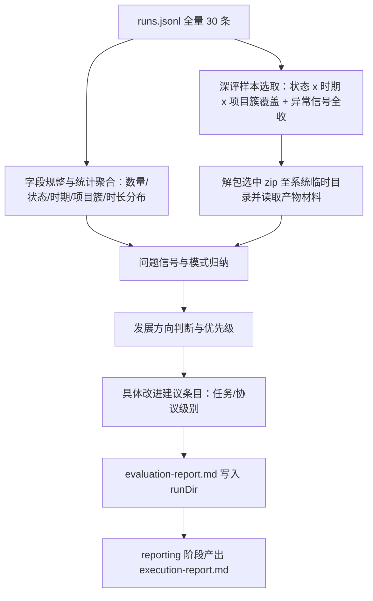

# 历史评估 Plan

> revision 1 · single 模式。基于已确认 spec（历史评估与发展方向，B 深度）的技术 Plan。

---

## 执行摘要

本 run 不修改仓库代码，交付物是一份评估报告：解析 `~/.ddo/history` 的全量运行记录与归档材料，执行量化统计与代表性 case 深评，产出 ddo-code-flow 的发展方向结论（方向判断＋优先级＋依据＋任务/协议级具体改进建议条目，不含排期）。关键结论：数据源已探明且充足——`runs.jsonl` 共 30 条结束记录（27 done / 3 aborted，2026-09-24 至 2026-10-04），19 个 zip 含单 run 全部产物材料；另有 10 个空目录残留，作为归档一致性信号纳入评估发现。分析以会话内轻量命令聚合执行，不新增持久脚本；报告为单文档 `evaluation-report.md`。文档模式 single（草稿约 7k 字符，低于 12000 阈值），revision 1。

---

## 范围与非目标

| 事项 | 说明 | AI 索引 |
|---|---|---|
| 范围 | 只读解析 `~/.ddo/history`（runs.jsonl 全量 + 选中 zip 解包）；统计、深评、方向分析全部在 coding 阶段会话内完成；报告写入 runDir | DEC-1 |
| 非目标 | 不修改 CLI / atom-tasks / 任何仓库代码；不写 `~/.ddo/history`；不做分期排期；不做看板或持续监控（spec Non-goals） | — |
| 生效目录 | 所有新建文件仅落 runDir 与系统临时解包区；不触碰主工作树 | — |

---

## 现有设计与复用基线

| 能力 | 文件路径 | 符号 | 证据类型 | 采用方式 | 适用边界 | AI 索引 |
|---|---|---|---|---|---|---|
| 历史记录清单 | `~/.ddo/history/runs.jsonl` | `history.append` 写入（JSONL） | Repository Fact | 复用现有实现 | 字段：runId / title / git / startedAt / endedAt / finalStatus / statePath；无 type 字段，从 statePath 的 `.ddo/runs/<type>/` 段派生 | DEC-1 |
| 单 run 全材料归档 | `~/.ddo/history/<runId>.zip`（19 个） | `history.archiveRunZip`（zipDir 打包 runDir） | Repository Fact | 复用现有实现 | 实测含 .state.json、requirement.md、spec.md、plan.md、execution-report.md 等；深评数据源，仅解包到系统临时目录 | DEC-1 |
| history 模块 | `tools/lib/history.js:16,32` | `append` / `archiveRunZip` | Repository Fact | 复用现有实现 | 只读引用其记录格式；不调用任何写入函数 | DEC-1 |
| 报告产物约定 | `atom-tasks/reporting/prompt.md` | execution-report.md | Repository Fact | 新增实现 | reporting 阶段产 run 收尾报告；本次评估主报告为 coding 阶段新增文档，命名 evaluation-report.md（若 coding 契约另有规定以其为准）——现有能力不覆盖「跨 run 评估」这一产物形态 | DEC-3 |
| 空目录残留 | `~/.ddo/history/<runId>/`（10 个，内容为空） | — | Repository Fact | 不适用 | 不作数据源；作为归档一致性信号记录进报告发现 | R-3 |

---

## 整体架构与流程

异常流程：zip 损坏或材料缺失时标注 coverage 限制并顺延下一候选，不中断整体评估；字段无法派生（如 statePath 无类型段）时按 unknown 分组如实呈现。

---

## 技术选型与方案对比

| 方案 | 来源 | 仓库适配性 | 代价与风险 | 状态 | 结论 | AI 索引 |
|---|---|---|---|---|---|---|
| 一次性 node/jq 命令解析 runs.jsonl + 选中 zip 解包深评 | 初始 Plan | 无依赖，与数据源实测结构匹配 | 解包留在临时目录，需记得清理；风险低 | accepted | 数据获取与深评的主路径 | DEC-1 |
| 仅用 runs.jsonl 做概览统计 | 初始 Plan | 可行但材料不足 | 深评需要 zip 内 requirement/spec/plan/execution-report；结论会失去 case 级证据 | rejected | 不满足 AC-1 的可追溯深评要求 | DEC-1 |
| 为 CLI 新增 history 读取命令 | 初始 Plan | 与仓库演进方向可能一致 | 违反 spec Non-goal（本次不改代码）；样本量 30 不值得 | rejected | 留给后续改进条目评估，不在本 run 实施 | DEC-1 |
| 会话内轻量命令即算即用 | 初始 Plan | 适配，无新增文件 | 结果不沉淀为脚本；样本小可接受 | accepted | 统计执行方式 | DEC-2 |
| 编写可复用分析脚本入库 | 初始 Plan | 需改仓库，超出本次范围 | 违反 spec Non-goal | rejected | 若评估周期化，可作为后续改进条目 | DEC-2 |
| 报告单文档 evaluation-report.md | 初始 Plan | runDir 产物管理成熟，rollback 可回退 | 预计体量 1-2 万字符，单文档可控 | accepted | PD-2 答案；split 阈值约束不适用于报告（非 plan 产物） | DEC-3 |
| 全量统计 + 覆盖性抽样深评 | 初始 Plan | 30 条规模下全量统计零成本 | 深评控制在 6-10 个 case，防止体量失控 | accepted | PD-1 答案：覆盖每种 finalStatus、每个时期（9 月/10 月）、每个项目簇，异常信号样本全收 | DEC-4 |

---

## 数据模型设计

### 实体与字段

无新数据库实体。评估数据集口径（实读自 runs.jsonl）：`runId`（标识）、`title`（意图线索）、`git.mainBranch`、`startedAt`/`endedAt`（ISO 时间，派生时长）、`finalStatus`（done / aborted）、`statePath`（项目归属与 run 类型派生源，存在相对/绝对混用）。派生字段：`时长` = endedAt − startedAt；`项目簇` = statePath 前缀归类（Ddo-Code-Flow 自身 / duji / bhtc / ddo-web / eval）；`类型` = statePath 中 `.ddo/runs/<type>/` 段；`时期` = startedAt 日期（9 月 / 10 月）。报告信息结构：数据总览 → 分布统计 → 深评 case 记录 → 问题信号归纳 → 发展方向与优先级 → 具体改进建议条目。

### schema 与 DDL（如适用）

不适用——本次无任何数据库或 schema 变更。

### 状态与不变量

全程对 `~/.ddo/history` 只读：不修改、不删除、不解包覆盖既有路径；zip 仅解到系统临时目录且用后清理。报告中的每条统计数字必须可由 runs.jsonl 复核。

### 迁移、兼容与回滚

不适用——无迁移。报告文档的修订回退走 ddo 自身 `rollback` 机制（旧产物移入 `_del/rollback-<n>/`）。

---

## API 接口设计

| 接口/入口 | 请求 | 响应 | 错误与幂等 | 复用标准 | 实现职责 | AI 索引 |
|---|---|---|---|---|---|---|
| 无外部 API——本任务为本地文档产出，不新增也不调用任何接口 | — | — | 解包失败重试一次，仍失败则标注跳过 | 不适用 | coding 阶段内完成 | DEC-1 |

---

## 算法设计

仅两处非平凡逻辑，均不写逐行实现：

1. **统计聚合**：输入 30 条 JSONL 记录；按 finalStatus、派生类型、项目簇、时期、时长分桶计数；输出分布表。不变量：每个桶的计数可手工复核；无法派生字段入 unknown 桶并注明。复杂度 O(n)，n=30，无性能考量。
2. **深评样本选取**：确定性规则——状态 × 时期 × 项目簇的覆盖性选取，叠加异常信号全收（aborted run、显著超长 run、同名 runId 多次重试如 visualizer-v2beta 系列）；预计 6-10 个 case。输出：选中 runId 清单与每条选取理由。不变量：选取理由可追溯到记录字段。

---

## 文件变更计划

| 文件/目录 | 变更职责 | 复用或依赖 | AI 索引 |
|---|---|---|---|
| `runDir/evaluation-report.md` | 新增：评估报告主体（coding 产物；命名若与 coding 契约冲突以其为准） | 依赖 runs.jsonl 全量记录与选中 zip 解包材料 | DEC-3 |
| `runDir/requirement.md`、`spec.md`、`plan.md` | 不变更 | 已有产物 | — |
| 仓库代码与 `atom-tasks/` | 不变更（spec Non-goal：本次不实施改进） | — | — |
| 系统临时目录解包区 | 临时文件，评估完成后清理 | `history.archiveRunZip` 产物 zip | DEC-1 |

---

## 兼容、稳定性与回滚

| 关注点 | 适用性 | 设计/理由 | 回滚信号 | AI 索引 |
|---|---|---|---|---|
| 归档数据只读 | 适用 | 评估全程不写 `~/.ddo/history`；唯一写动作是 runDir 内报告与 state | 发现任何写入归档的行为立即停止并报告 | R-1 |
| 字段口径混杂 | 适用 | statePath 相对/绝对混用、无 type 字段：派生规则在报告中显式记录，派生失败标 unknown | 统计数字与手工复核不符 | DEC-4 |
| 材料缺失或 zip 损坏 | 适用 | 标注 coverage 限制，不中断；深评候选顺延 | 同类失败连续 ≥2 次 | R-2 |
| 报告修订 | 适用 | 修订走 ddo rollback，报告内注记 revision | 用户「修改」反馈 | — |

---

## Verification Anchor

| 需验证契约 | 可观察结果 | 证据位置 | AI 索引 |
|---|---|---|---|
| AC-1 结论可追溯 | 报告中每个实质性结论附 runId 引用或明确标注「全量统计」 | `runDir/evaluation-report.md` 对照 `~/.ddo/history/runs.jsonl` | AC-1 |
| AC-2 方向结论达 B 深度 | 报告含方向判断、优先级、依据与任务/协议级改进条目，且无排期章节 | `runDir/evaluation-report.md` | AC-2 |
| AC-3 文档留存 | evaluation-report.md 存在于 runDir，正常模式 finish 后随 zip 归档留存 | runDir 与 `~/.ddo/history/<本 runId>.zip` | AC-3 |
| 范围一致 | 报告内容不超出 spec In Scope、不落入 Non-goals | `runDir/spec.md` | — |

---

## 开放问题与 Spec 对应

| 问题 | 确定答案或阻塞原因 | 解决位置 | AI 索引 |
|---|---|---|---|
| spec BQ-1：发展方向分析深度 | 已由用户解决：B——方向层＋具体改进条目，不排期 | spec.md 对齐变化摘要 | BQ-1 |
| PD-1：抽样与统计口径 | 已确定：全量统计＋覆盖性抽样＋异常信号全收 | 本 Plan 技术选型 DEC-4 | PD-1 |
| PD-2：报告文件组织 | 已确定：单文档 evaluation-report.md | 本 Plan 技术选型 DEC-3 | PD-2 |

---

## 风险与下游交接

- **样本偏差**：30 条中 ddo-code-flow 自身开发 run 占比高，外部项目（duji、bhtc）样本较少。缓解：报告按项目簇分层呈现，区分「流水线自身演进信号」与「外部项目使用信号」，方向结论注明证据侧重。
- **早期记录信息量低**：早期 run（eval 相对路径等）字段口径不一。缓解：缺失即标注，不臆测补齐。
- **归档一致性未知问题**：10 个空目录残留提示历史版本 finish 行为可能有残留路径。缓解：作为评估发现记录，本 run 不修复；列入改进条目候选。
- **下游交接**：coding 阶段读取本 plan.md 全文（single 模式，无分册）与 spec.md；按 DEC-1/DEC-4 执行取数与抽样，产出 evaluation-report.md。若 `~/.ddo/history` 实际结构与「现有设计与复用基线」记录不符（如记录数、字段变化），停止并报告事实失效，不得自行更改已批准契约。reporting 阶段按 Verification Anchor 汇总验证结果。

---

## 用户确认

- **同意**：批准本 Plan，进入 coding 阶段。
- **修改：<反馈>**：按反馈修订本 Plan，展示变化后重新确认。
- **提问：<问题>**：仅答疑，不修改 Plan。
- **归档**：列出 `atom-tasks/plan/references/` 下可用模板名，不产出文档。
- **归档：<模板名>**：按模板生成 tech-design.md（不改变确认状态；Plan revision 变化后归档文档视为过期）。
