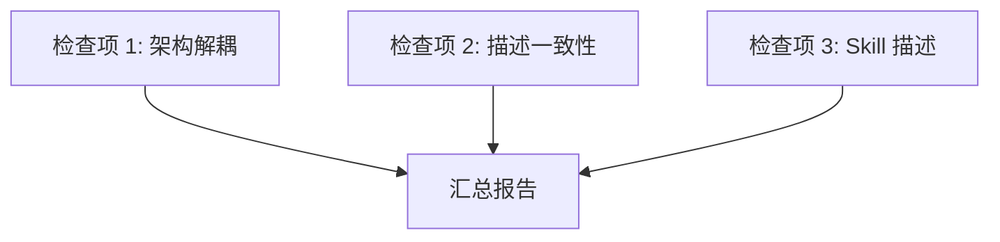

# Ddo-Code-Flow 项目架构检查 技术 Plan

> 以仓库事实、技术决策和实现契约指导 Test-Planning、Tasking、Coding、Verification 与 Review。

**文档模式**: single | **Revision**: 1

---

## 执行摘要

本次任务对 Ddo-Code-Flow 项目进行三项架构检查：层间解耦性、全局描述一致性和 skill 描述质量。这是一次只读审计，不产生代码变更。检查结果以结构化报告形式输出，列出发现的问题和改进建议。

---

## 范围与非目标

| 事项 | 说明 | AI 索引 |
|---|---|---|
| 架构解耦检查 | 验证 atom-task、workflow、config 三层无直接依赖 | FR-ARCH-1, FR-ARCH-2 |
| 描述一致性检查 | 跨文件描述一致 | FR-DESC-1 |
| Skill 描述检查 | SKILL.md 清晰度和触发逻辑 | FR-SKILL-1, FR-SKILL-2 |
| 不修改代码 | 仅报告发现 | Non-goal |
| 不检查第三方依赖 | 仅检查项目自身代码 | Non-goal |

---

## 现有设计与复用基线

| 能力 | 文件路径 | 符号 | 证据类型 | 采用方式 | 适用边界 | AI 索引 |
|---|---|---|---|---|---|---|
| Atom-task 定义 | atom-tasks/*/\*.md | frontmatter | Repository Fact | 检查对象 | 每个 atom-task 的 consumes/produces 声明 | FR-ARCH-1 |
| Workflow 定义 | workflows/*.json | pipeline/stages | Repository Fact | 检查对象 | DAG 节点引用和 stage 定义 | FR-ARCH-1 |
| Config 定义 | config.default.json | base/workflows/atomTaskOverrides | Repository Fact | 检查对象 | 默认配置和 schema | FR-ARCH-1 |
| Artifacts 目录 | atom-tasks/artifacts.json | roles | Repository Fact | 检查对象 | 角色定义和文件映射 | FR-ARCH-1 |
| SKILL.md | SKILL.md | 全文 | Repository Fact | 检查对象 | 执行流程描述 | FR-SKILL-1 |

---

## 整体架构与流程

---

## 技术选型与方案对比

| 方案 | 来源 | 仓库适配性 | 代价与风险 | 状态 | 结论 | AI 索引 |
|---|---|---|---|---|---|---|
| 逐文件人工审查 | 初始 Plan | 高 | 低代价，覆盖全面 | accepted | 采用 | DEC-1 |

---

## 数据模型设计

不适用——本次检查不涉及数据模型变更。

---

## API 接口设计

不适用——本次检查不涉及 API 变更。

---

## 算法设计

不适用——本次检查为静态分析，无算法需求。

---

## 文件变更计划

| 文件/目录 | 变更职责 | 复用或依赖 | AI 索引 |
|---|---|---|---|
| (无文件变更) | 本次为只读审计 | - | - |

---

## 兼容、稳定性与回滚

| 关注点 | 适用性 | 设计/理由 | 回滚信号 | AI 索引 |
|---|---|---|---|---|
| 兼容性 | 不适用 | 只读检查无变更 | - | - |

---

## Verification Anchor

| 需验证契约 | 可观察结果 | 证据位置 | AI 索引 |
|---|---|---|---|
| 三层解耦 | atom-task frontmatter 中无 workflow/config 直接引用 | atom-tasks/*/\*.md | FR-ARCH-1 |
| 变更隔离 | 单层变更不强制其他层配套修改 | config.default.json, workflows/*.json | FR-ARCH-2 |
| 描述一致 | README、SKILL.md、schema 描述无矛盾 | 全项目文件扫描 | FR-DESC-1 |
| Skill 描述清晰 | SKILL.md 无歧义、无多余描述 | SKILL.md | FR-SKILL-1 |
| 触发逻辑正常 | workflow 各阶段触发条件正确 | workflows/*.json, atom-tasks/*/\*.md | FR-SKILL-2 |

---

## 开放问题与 Spec 对应

| 问题 | 确定答案或阻塞原因 | 解置位置 | AI 索引 |
|---|---|---|---|
| (无开放问题) | - | - | - |

---

## 风险与下游交接

- **风险**: 无——只读审计不产生代码变更
- **Tasking 读取范围**: 本 plan 产物
- **Coding 执行范围**: 不适用（无代码变更）
- **事实失效处理**: 检查基于当前 worktree 快照，不跟踪后续变更

---

## 用户确认

- ✅ **同意**：批准当前 plan，进入 **Test-Planning**。
- ❌ **修改：<反馈>**：修改当前 plan，展示变化后重新确认。
- ❓ **提问：<问题>**：仅回答问题，不修改 plan。
- 📦 **归档**：列出可选归档模板。
- 📦 **归档：<模板名>**：使用指定模板生成 tech-design 产物。
