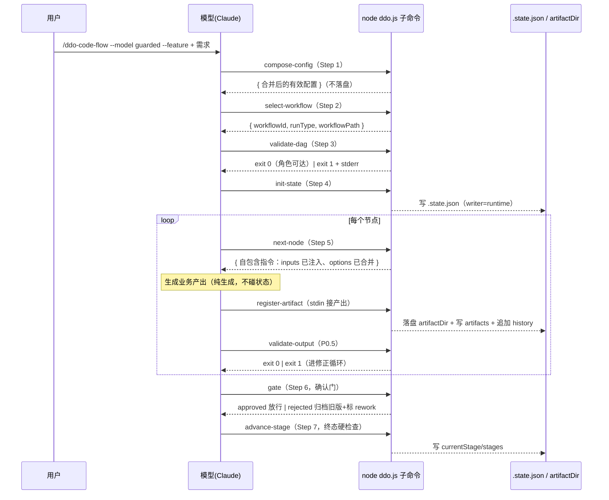

# 变更后流程预览（示例，非交付物）

> 本文是本次改动落地后，ddo-code-flow **整体触发流程**的一版示例预览，供你在 Coding 前先看清「变更情况」。它本身不会进入代码变更，只是帮你评审：改动后流程怎么触发、比散文时代好在哪。

---

## 1. 触发总览：一个完整的 run 是怎么跑起来的

改动前，SKILL.md 用散文描述 Step 1–7，模型读散文后**自觉**完成每步（合并配置、校验 DAG、推进状态……）。改动后，这些机械步骤下沉成 9 个无状态 Node 子命令，模型只在 SKILL.md 指引下**在 Bash 里调命令**，命令吐 JSON/退出码，模型据此走下一步。



---

## 2. Step → 子命令映射：什么时候调、调谁、返回什么

| Step | 触发时机 | 子命令 | 输入 | stdout | 退出码语义 | 对 .state.json |
|---|---|---|---|---|---|---|
| 1 | run 启动，读默认配置后 | `compose-config` | `--skill-root --project-root --args-json` | 合并后 JSON | 0/2 | 只读，**不落盘** |
| 2 | 配置组合完，选工作流 | `select-workflow` | `--model --feature/--bugfix --text` | `{workflowId,runType,workflowPath}` | 0/2 | 只读 |
| 3 | 选中工作流后，执行前 | `validate-dag` | `--workflow` | 无（成功静默） | 0 通过 / **1 环或缺角色** / 2 | 只读 |
| 4 | DAG 校验通过，建/续状态 | `init-state` / `find-resumable` | `--project-root --worktree-dir` | state JSON / 候选列表 | 0 / 1 多候选需选择 / 2 | 写（runtime 字段） |
| 5 | 每轮取下一个节点 | `next-node` | `--state` | 自包含指令 | 0 / 2 | 只读 |
| 5 | 生成产出后登记 | `register-artifact` | stdin 产出 + `--role` | `{path}` | 0 / 2 | 写 artifacts + history（runtime） |
| P0.5 | 登记后校验产出 | `validate-output` | `--artifact --output-schema-ref` | 无（成功静默） | 0 合法 / **1 非法** / 2 | 只读 |
| 6 | 到达确认门阶段 | `gate` | `--stage --action --feedback` | `{next}` | 0 / 77 pending | 写 history（runtime） |
| 7 | 阶段终端产出完成 | `advance-stage` | `--state` | `{currentStage}` | 0 / **1 未满足终态** / 2 | 写 currentStage/stages（runtime） |

**触发仍是软约束**：SKILL.md 保留「何时调哪个命令」的散文纪律；下沉的是**命令被调之后做什么**（DAG 校验、角色注入、状态归属、门控），这部分由代码定死。

---

## 3. 修正循环：退出码就是「受控失败」

改动后，`validate-output` / `validate-dag` / `advance-stage` 会**故意 exit 1**——不是崩溃，是把「该硬的地方」用进程退出码表达：

```
next-node → 生成产出 → register-artifact → validate-output
                                              │
                              exit 0 ─────────┴────── exit 1
                              放行                         │
                                       读 stderr（人类可读错误说明）
                                                          │
                                       改产出 → 重新 register → 重新 validate
```

门过不过、DAG 有没有环、产出合不合规，**由代码说了算，不由模型自评**。模型看到非零退出码 + stderr，进入修正循环。

---

## 4. 为什么比散文时代更好（对比收益）

| 维度 | 改动前（散文） | 改动后（代码） |
|---|---|---|
| 机制放哪 | SKILL.md 散文，靠 LLM **自觉执行** | `ddo.js` 不可变代码，靠**进程强制** |
| 上下文成本 | 312 行散文 + 每步规则都要进上下文 | 代码**不进上下文**（code ≠ context），SKILL.md 变短 |
| 长跑漂移 | 跨几十轮 + 摘要压缩后，约束被稀释且**不报错** | 命令现读现写 .state.json，约束**永不稀释** |
| x-ddo-writer | 只是注释，模型可能越权写/自造顶层字段 | `applyMutation` 守卫，越权/自造 → exit 1 |
| 失败形态 | 静默出错（偷懒、漏登记不被发现） | 响亮报错（非零退出码 + stderr），可自愈 |
| 模型角色 | 生成器 + 解释器 | 只做生成，簿记交给代码 |

---

## 5. 状态归属：applyMutation 写守卫示意

所有写 `.state.json` 都走唯一入口 `applyMutation(state, patch, writer)`，从 `state.schema.json` 的 `x-ddo-writer` 建 `field → writer` 表：

| 字段 | writer | 谁能写 |
|---|---|---|
| `runId` / `worktreePath` / `type` / `dateDescription` / `artifactDir` | `git-worktree` | git-worktree 节点 |
| `workflowId` / `createdAt` / `args` / `currentStage` / `stages` / `artifacts` / `pendingOutputs` / `history` | `runtime` | runtime 子命令 |
| `issueContext` | `issue-fetch` | issue-fetch 节点 |
| `gatePending` | `remote-gate` | remote-gate 节点 |
| `prInfo` | `create-pr` | create-pr 节点 |

越权写（writer 不拥有该字段）或自造顶层字段（`additionalProperties:false`）→ **exit 1**。

---

> 预览到此。若这个流程形态符合预期，请回到 Plan 确认（同意进入 Test-Planning）；若要调整触发点、命令职责或对比口径，直接说，我改 Plan 或这份示例。
