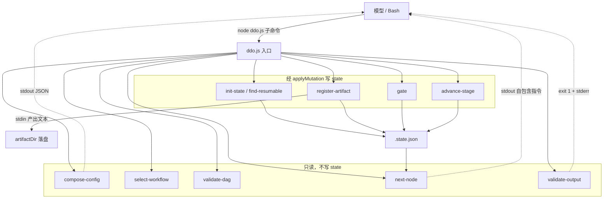

# Ddo-Code-Flow 技术 Plan

> 以仓库事实、技术决策和实现契约指导 Test-Planning、Tasking、Coding、Verification 与 Review。文档模式：single。revision: 3。

---

## 执行摘要

目标：把 ddo-code-flow 的确定性内核（配置组合、DAG/角色校验、状态写入归属、门控）从 SKILL.md 散文下沉为一套无状态 Node CLI（`scripts/runtime/ddo.js`），模型只做生成、机械簿记交给代码。范围锁定为 P0.5 + P0（9 个子命令 + `applyMutation` 写守卫 + 协议解析 + SKILL.md Step 1–7 改写），P1/P2 不做。

关键结论（本次已定死）：
- **DEC-1**：Node CommonJS、零第三方依赖、零构建，复用 `scripts/metrics/plugin.js` 范式。
- **DEC-2**：入口 `scripts/runtime/ddo.js`，模块拆到 `scripts/runtime/lib/`，测试用 Node 内置 `node --test`。
- **DEC-3**：schema 校验自写一个**最小 draft-2020-12 子集校验器**（覆盖本仓库 schema 实际用到的关键字），不引 ajv。
- **DEC-4**：`run://` 解析基准 = **worktreePath**（修正原调研文档 §4 的「run://→artifactDir」笔误；存量 `.state.json` 的 `run://.ddo/runs/<type>/<dateDescription>/<file>` 均相对 worktreePath）。
- **DEC-5**：`validate-output` 语义 = 对 `json+markdown` 产物按 `jsonFields` 做必需字段/类型校验；对 `markdown` 产物校验 `required:true` 的 section 标题存在；对 `.state.json` 用子集校验器校验 `state.schema.json`。
- **DEC-6**：SKILL.md 改写放**最后**，等代码 + 测试全绿再改，避免半途把 skill 自己改坏。

---

## 范围与非目标

| 事项 | 说明 | AI 索引 |
|---|---|---|
| 新增 runtime CLI | `scripts/runtime/ddo.js` + 9 个子命令 + `lib/` 模块 | FR-RUNTIME-1, FR-SUBCOMMANDS-2 |
| 四件套契约 | stdout JSON / stderr 人类可读 / exit 0·1·2·77 / .state.json 唯一状态源 | FR-CONTRACT-3 |
| applyMutation 写守卫 | field→writer 表 + 越权/自造字段拦截 | FR-GUARD-6 |
| 协议解析 | skill:// project:// run:// | FR-PROTOCOL-7 |
| validate-output / register-artifact | 产物硬校验 + 黑板登记 | FR-VALIDATE-4, FR-REGISTER-5 |
| SKILL.md Step 1–7 改写 | 委托 runtime 子命令 | FR-SKILLMD-8 |
| 测试 | role reachability + state field ownership + 各子命令单测 | AC-9 |
| 非目标 | P1（预计算+分层加载）、P2（动态裁剪）、metrics 迁移、常驻服务、hooks 触发 | — |

---

## 现有设计与复用基线

| 能力 | 文件路径 | 符号 | 证据类型 | 采用方式 | 适用边界 | AI 索引 |
|---|---|---|---|---|---|---|
| 子命令+stdout JSON+exit 码+读写 .state.json 范式 | `scripts/metrics/plugin.js` | `parseArgs` / `readJson` / `writeJson` / `main` | Repository Fact | 复用现有实现（抽取为 lib 范式，不改原文件） | 只复用范式与 helper 形态，metrics 逻辑本身不动 | — |
| CommonJS 模块导出约定 | `scripts/metrics/pricing.js` | `estimateCostUsd` | Repository Fact | 复用现有实现 | lib 模块一律 CommonJS `module.exports` | — |
| 写守卫数据源（x-ddo-writer + additionalProperties:false） | `state.schema.json` | `properties.*.x-ddo-writer` | Repository Fact | 复用现有实现（只读，作为 field→writer 表来源） | 不改该文件 | FR-GUARD-6 |
| 配置/DAG 元 schema | `config.schema.json` | `$defs.workflowDefinition` / `workflowStage` / `workflowNode` | Repository Fact | 复用现有实现 | compose-config/select-workflow/validate-dag 的结构依据 | — |
| 工作流索引与选择规则 | `config.default.json` | `workflows.items` / `selection.rules` | Repository Fact | 复用现有实现 | select-workflow 的数据源 | — |
| atom-task frontmatter 契约 | `atom-tasks/_schema/atom-task-md.schema.json` | `produces` / `consumes` / `outputSchemaRef` / `options` / `confirmation` | Repository Fact | 复用现有实现 | 角色注入与产物校验依据 | FR-VALIDATE-4 |
| 输出产物元 schema | `atom-tasks/_schema/output-schema.schema.json` | `jsonFields` / `sections[].required` | Repository Fact | 复用现有实现 | validate-output 的校验依据 | DEC-5 |
| 角色目录 | `atom-tasks/artifacts.json` | `roles.*`（kind/file/dynamic） | Repository Fact | 复用现有实现 | 角色→文件名/类型解析 | FR-PROTOCOL-7 |
| DAG 与确认门定义 | `workflows/guarded.json` 等 | `pipeline[].atomTasks.nodes` | Repository Fact | 复用现有实现 | validate-dag / next-node 数据源 | FR-SUBCOMMANDS-2 |
| JSON Schema 子集校验 | 无现成实现 | — | Assumption（需新增） | 新增实现 | 覆盖本仓库 schema 实际关键字 | DEC-3 |

---

## 整体架构与流程

主流程：模型每轮先 `next-node` 取自包含指令 → 生成产出 → `register-artifact`（stdin 落盘+登记）→ `validate-output` 校验 → 门控 `gate` → `advance-stage` 推进。异常流程：任何校验/守卫 exit 1，模型读 stderr 进入修正循环。

---

## 技术选型与方案对比

| 方案 | 来源 | 仓库适配性 | 代价与风险 | 状态 | 结论 | AI 索引 |
|---|---|---|---|---|---|---|
| Node CommonJS 无依赖 CLI | 初始 Plan（doc §5） | 高：与 plugin.js 同栈，Claude Code 必带 Node | 极低 | accepted | 采用 | DEC-1 |
| bash / PowerShell | 初始 Plan（doc §5） | 低：只覆盖单平台 | JSON 深合并/DAG 用 shell 极脆 | rejected | 不采用 | — |
| Go/Rust 单文件二进制 | 初始 Plan（doc §5） | 低：跨平台零依赖但分发重 | 每次演进要交叉编译+分发版本 | rejected | 不采用 | — |
| 自写 JSON Schema 子集校验器 | 初始 Plan | 高：本仓库 schema 关键字有限 | ~250 行，需测覆盖 | accepted | 采用 | DEC-3 |
| 引入 ajv | 初始 Plan | 中 | 违背「零第三方依赖」，需 node_modules | rejected | 不采用 | DEC-3 |
| 手写 4 个 bespoke 校验器 | 初始 Plan | 中 | 重复、难维护 | superseded | 被通用子集校验器取代 | DEC-3 |
| `node --test` 内置测试 | 初始 Plan | 高：零依赖，Node 18+ 自带 | 无 | accepted | 采用 | DEC-2 |
| Jest / Mocha | 初始 Plan | 中 | 引依赖 | rejected | 不采用 | DEC-2 |
| 入口 `scripts/runtime/ddo.js` | 初始 Plan | 高：与 scripts/metrics/ 同构，根目录不污染 | 无 | accepted | 采用（doc 里 `node ddo.js` 为简写） | DEC-2 |
| `run://` → worktreePath | 初始 Plan（修正 doc） | 高：与全部存量 .state.json 一致 | 无 | accepted | 采用 | DEC-4 |
| `run://` → artifactDir | 原调研 doc §4 | 低：会解析出双重 `.ddo/runs/...` | 破坏存量数据兼容 | rejected | 判定为笔误，修正 | DEC-4 |

---

## 数据模型设计

### 实体与字段

- **RunState**（`.state.json`）：字段与 `x-ddo-writer` 完全沿用 `state.schema.json`（不新增字段）。派生一张运行时内存表 `fieldOwner: { <field>: <writer> }`。
- **ArtifactRecord / HistoryEvent / StageState**：沿用 `state.schema.json` 的 `$defs`。
- **EffectiveConfig**：`config.default.json ← .ddo/config.json ← run 参数` 深合并结果，仅内存，不落盘。
- **SubcommandSpec**：`{ name, writer, writes: [fields], reads: [fields], args, stdin }` 的分派表（代码内常量，非磁盘数据）。

### schema 与 DDL（如适用）

无数据库、无新磁盘 schema。新增代码内结构：`fieldOwner` 表、`subcommand` 分派表、协议解析映射（均为内存/代码常量，不需落盘）。

### 状态与不变量

- `.state.json` 是唯一状态源；所有写走 `applyMutation`，无内存缓存、无并发写（模型串行）。
- `additionalProperties:false` → 禁止自造顶层字段。
- 每个顶层字段恰一个 `x-ddo-writer` → 越权写 exit 1。
- `history` 只追加；`artifacts` 按 role 键控。
- 崩溃可恢复：`find-resumable` 扫 `currentStage != done` 且锚点匹配的 run。

### 迁移、兼容与回滚

- P0.5/P0 是纯增量 + SKILL.md 改写，**不新增 .state.json 字段**，存量 run 无迁移。
- `run://` 修正只改解析逻辑，不改存量数据（存量 path 本就相对 worktreePath）。
- SKILL.md 改写放在最后，且可单独回滚（runtime 代码可独立存在）。

---

## API 接口设计

| 接口/入口 | 请求 | 响应 | 错误与幂等 | 复用标准 | 实现职责 | AI 索引 |
|---|---|---|---|---|---|---|
| `node ddo.js compose-config` | `--skill-root` `--project-root` `--args-json` | stdout 合并后 JSON | exit 2 用法错 | plugin.js arg 约定 | 深合并，不落盘 | FR-SUBCOMMANDS-2 |
| `select-workflow` | `--model` `--feature/--bugfix` `--text` | stdout `{workflowId,runType,workflowPath}` | 无匹配→fallback | selection.rules | 显式→规则→fallback | — |
| `validate-dag` | `--workflow` | exit 0 / exit 1 + stderr | 幂等只读 | role reachability | 拓扑遍历+produced 集 | AC-5 |
| `init-state` / `find-resumable` | `--project-root` `--worktree-dir` | stdout state JSON / 候选列表 | 多候选→exit 1 求选择 | Step 4 | 建/续 state，writer=runtime | — |
| `next-node` | `--state` | stdout 自包含指令 | 幂等只读 | Kahn + 角色注入 | 选批、注入 `{{inputs.*}}`、合并 options | AC-7 |
| `register-artifact` | stdin 产出文本 + `--role` | stdout `{path}` | writer=runtime | artifacts.json 落盘规则 | 落盘+登记+追加 history | AC-3 |
| `validate-output` | `--artifact` `--output-schema-ref` | exit 0 / exit 1 + stderr | 幂等只读 | output-schema.schema.json | 结构校验 | AC-2 |
| `gate` | `--stage` `--action approved/rejected` `--feedback` | stdout `{next}` | writer=runtime | confirmationGates | 放行 / 归档 `_del` + 标 rework | — |
| `advance-stage` | `--state` | stdout `{currentStage}` | writer=runtime | 终态硬检查 | 全满足才推进 | AC-8 |

---

## 算法设计

### 1. 深合并（compose-config）
输入：`default`、`project`、`args` 三个对象。不变量：对象递归合并、数组整体替换、标量替换。输出合并结果，不写盘。复杂度 O(n)。

### 2. 角色可达性校验（validate-dag）
按 stage 顺序 + 节点拓扑序遍历，维护 `produced` 集合。对每个 enabled 节点：其 `produces/consumes` 的 role 必须存在于 `artifacts.json`；每个 `required:true` 的 consume 必须已在 `produced` 中，例外：`stage-artifact`（运行时同 stage 解析）、读 `.state.json.issueContext` 等 fallback 的 role。重复同 run 生产者 → exit 1。复杂度 O(V+E)。

### 3. Kahn 拓扑选批（next-node）
入度 0 的节点为一批；`parallelApprove`/`parallelWith`/`parallelGroups` 决定同层并行。解析 consumes 取 artifact path，替换 `{{inputs.<role>}}`；合并 options（workflow 覆盖 > config 覆盖 > node options > atom-task 默认）。输出自包含指令。

### 4. applyMutation 写守卫
输入 `(state, patch, writer)`。加载 `state.schema.json` 建 `fieldOwner` 表；对 patch 每个顶层字段：若字段不在 schema（additionalProperties:false）→ exit 1；若 `fieldOwner[field] != writer` → exit 1。通过后合并并写盘（原子写临时文件再 rename）。

### 5. 协议解析
`skill://X` → `path.join(skillRoot, X)`；`project://X` → `path.join(projectRoot, ".ddo", X)`；`run://X` → `path.join(worktreePath, X)`（注意：`X` 已含 `.ddo/runs/...`）。未知前缀 → exit 2。

### 6. 最小 JSON Schema 子集校验器
支持关键字：`type`（含联合数组）、`required`、`properties`、`additionalProperties`、`$ref`（局部 `#/$defs/...`）、`enum`、`const`、`pattern`、`minLength`、`minItems`、`items`、`oneOf`、`format`（仅 `date-time` 用轻量正则）。不支持的未知关键字**忽略**（不因此报错），以保证对现有 schema 全部放行。

---

## 文件变更计划

| 文件/目录 | 变更职责 | 复用或依赖 | AI 索引 |
|---|---|---|---|
| `scripts/runtime/ddo.js` | CLI 入口：arg 解析、子命令分派、exit code 归一 | plugin.js 范式 | DEC-2 |
| `scripts/runtime/lib/args.js` | 统一 `--flag value` 解析 | plugin.js `parseArgs` | — |
| `scripts/runtime/lib/json.js` | `readJson` / `writeJson`（原子写） | plugin.js | — |
| `scripts/runtime/lib/jsonschema.js` | 最小子集校验器 | state/config/atom-task-md/output-schema | DEC-3 |
| `scripts/runtime/lib/protocol.js` | skill:// project:// run:// 解析 | state.schema.json / artifacts.json | DEC-4 |
| `scripts/runtime/lib/config.js` | compose-config 深合并 | config.schema.json | — |
| `scripts/runtime/lib/workflow.js` | select-workflow + validate-dag | config.default.json / workflows/* | — |
| `scripts/runtime/lib/state.js` | init-state / find-resumable / applyMutation | state.schema.json | FR-GUARD-6 |
| `scripts/runtime/lib/nodes.js` | next-node（Kahn + 注入 + 合并） | workflows/* / atom-tasks/* | — |
| `scripts/runtime/lib/artifacts.js` | register-artifact / validate-output | artifacts.json / output-schema | AC-2, AC-3 |
| `scripts/runtime/lib/gate.js` | gate 门控 | workflows confirmationGates | — |
| `scripts/runtime/lib/advance.js` | advance-stage 终态检查 | state.schema.json | AC-8 |
| `scripts/runtime/test/*.test.js` | role reachability / field ownership / 各子命令 | node:test | AC-9 |
| `SKILL.md` | Step 1–7 改写为委托子命令 | runtime 子命令 | FR-SKILLMD-8 |

---

## 兼容、稳定性与回滚

| 关注点 | 适用性 | 设计/理由 | 回滚信号 | AI 索引 |
|---|---|---|---|---|
| 存量 run 恢复 | 是 | 不新增 state 字段；find-resumable 沿用锚点匹配 | 旧 .state.json 无法被 init/find-resumable 读取 | AC-9 |
| run:// 解析 | 是 | 修正为 worktreePath，与存量一致 | 产物路径解析出重复 `.ddo/runs` | DEC-4 |
| SKILL.md 改写 | 是 | 放最后、可单独回滚 | 改写后 run 无法推进（散文基准可恢复） | DEC-6 |
| 零依赖 | 是 | 无 node_modules，文本分发即时生效 | 引入 require 第三方包即违背 | DEC-1 |
| 写守卫 bootstrap | 是 | `init-state` 作为特例授权写初始骨架（含 null 的 git-worktree 字段） | 越权写未被拦截 | FR-GUARD-6 |

---

## Verification Anchor

| 需验证契约 | 可观察结果 | 证据位置 | AI 索引 |
|---|---|---|---|
| 零依赖运行 + 退出码 | `node ddo.js <cmd>` 返回 0/1/2/77 | test | AC-1 |
| validate-output 拦截 | 非法产物 exit 1 + stderr | test | AC-2 |
| register-artifact 登记 | 落盘 + artifacts + history | test | AC-3 |
| applyMutation 拦截越权 | 越权/自造字段 exit 1 | test | AC-4 |
| validate-dag 环/缺 role | 缺 required consume exit 1；guarded exit 0 | test | AC-5 |
| compose-config 不落盘 | 输出 JSON 且无 effective config 文件 | test | AC-6 |
| next-node 注入 | `{{inputs.*}}` 已替换、options 已合并 | test | AC-7 |
| advance-stage 终态 | 未全满足不推进 | test | AC-8 |
| reachability/ownership 测试 | 新增角色/边/字段时测试覆盖 | test | AC-9 |

---

## 开放问题与 Spec 对应

| 问题 | 确定答案或阻塞原因 | 解决位置 | AI 索引 |
|---|---|---|---|
| PD-1 入口位置 | `scripts/runtime/ddo.js` | 文件变更计划 | DEC-2 |
| PD-2 测试框架 | Node 内置 `node --test` | 技术选型 | DEC-2 |
| PD-3 run:// 基准 | worktreePath（修正 doc §4 笔误） | 算法设计 §5 | DEC-4 |
| PD-4 writer 身份 | 子命令分派表硬编码 writer；atom-task 侧 writer（git-worktree/issue-fetch/remote-gate/create-pr）经 register-artifact 或薄 `apply-state` 走守卫 | API 设计 | FR-GUARD-6 |
| PD-5 SKILL.md 改写粒度/兼容 | 放最后；散文保留可作回滚基准 | 兼容回滚 | DEC-6 |
| PD-6 validate-output 语义 | json+markdown 校验 jsonFields；markdown 校验 required section 标题；state 校验 state.schema.json | 算法设计 §5 | DEC-5 |

---

## 风险与下游交接

**风险**
- **自托管鸡生蛋**：本 run 用散文版 skill 驱动，写代码版 runtime；新 runtime 不能驱动本 run，只能靠测试验证。缓解：每子命令配确定性单测；SKILL.md 改写放最后。
- **原调研文档 §4 的 run:// 笔误**：已修正（DEC-4）。缓解：测试覆盖协议解析。
- **写守卫与 git-worktree 字段的归属**：`runId/worktreePath/type/dateDescription/artifactDir` 属 `git-worktree`，但 `init-state` 需写 null 骨架。缓解：`init-state` 授权写初始骨架，后续这些字段由 git-worktree writer 写（见 PD-4）。
- **子集校验器过严/过松**：未知关键字忽略，防止误拦；用全部现有 schema 做快照测试。

**下游交接**
- Tasking 按「只读子命令 → 写守卫 → 注入/登记 → 门控/推进 → SKILL.md 改写」顺序拆任务，依赖顺序。
- Coding 只改 `scripts/runtime/**` 与 `SKILL.md`，不动 `state.schema.json` / `config.schema.json` / `atom-tasks/**` / `workflows/**` / `scripts/metrics/**`。
- 事实失效处理：若发现某 schema 关键字未被子集校验器覆盖，停止并报告，不静默放宽。

---

## 用户确认

- ✅ **同意**：批准当前 Plan，进入 Test-Planning。
- ❌ **修改：<反馈>**：修改 Plan，展示变更后重新确认。
- ❓ **提问：<问题>**：仅答疑，不修改文档或确认状态。
- 📦 **归档**：列出 `references/` 下可选模板名（当前目录无模板）。
