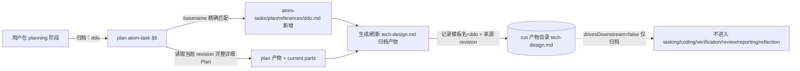

# Ddo-Code-Flow 技术 Plan

> revision 1 · 文档模式 single · 依据已批准 spec（revision 2）：为 plan atom-task 既有归档机制新增名为 `ddo` 的归档模版（内容取自 issue #36「技术方案设计模板」）。

---

## 执行摘要

本计划实现 spec revision 2 的全部 FR：在 `atom-tasks/plan/references/` 新增归档模版 `ddo.md`，内容为 GitHub issue #36（《【Feature】plan归档能力补全》）正文中的「技术方案设计模板」，使用户命令 `归档：ddo` 可经 plan atom-task 既有归档机制按名命中该模版并生成/刷新 tech-design 归档产物。

关键结论：归档机制（命令协议、按名精确匹配、tech-design 产物角色、`drivesDownstream=false`、`staleWhenPlanRevisionChanges=true`、归档非批准）已由 `atom-tasks/plan/plan.md §6/§8` 与 `plan.output.schema.json#archive` 完整定义并经运行时测试覆盖，本次为零机制改动的纯内容新增——全部交付物为一个新文件。文档模式 single，revision 1。

---

## 范围与非目标

| 事项 | 说明 | AI 索引 |
|---|---|---|
| 新增归档模版文件 | `atom-tasks/plan/references/ddo.md`，内容忠实采用 issue #36 正文（含头部「整理依据/文档边界/归档属性」说明块），不删改 | FR-1, FR-2 |
| 接入既有归档机制 | 依赖 plan.md §6 按名匹配规则：`归档：ddo` → basename `ddo` → 命中 `ddo.md`；`归档` 列表命令自动枚举该文件（`*.md` 模式） | FR-1 |
| 不回归既有归档属性 | `drivesDownstream=false`、revision 变化即 stale、归档不改变确认门——均由既有机制保证，本次不改代码即不回归 | FR-3, FR-4, FR-5 |
| 交付 | 变更提交至 `feat/2026-08-29-plan-archive-capability` 分支并经 PR 交付 | 交付 |
| 非目标：不改归档机制 | 不修改 plan.md、plan.output.schema.json、runtime 代码、workflow、artifacts.json、state.schema.json | Non-goal |
| 非目标：不新增其他模版/角色/状态字段 | 无新产物角色（复用 tech-design）、无新 .state.json 顶层字段、无 workflow 边变化 | Non-goal |

---

## 现有设计与复用基线

| 能力 | 文件路径 | 符号 | 证据类型 | 采用方式 | 适用边界 | AI 索引 |
|---|---|---|---|---|---|---|
| 归档命令协议（`归档` 枚举 / `归档：<模板名>` 生成刷新） | atom-tasks/plan/plan.md | §6 归档、§8 用户确认 | Repository Fact | 复用现有实现 | 用户于 planning 阶段对 plan 产物发起命令 | FR-1 |
| 归档契约（模版目录、匹配规则、只读模版、记录模板名+revision） | atom-tasks/plan/plan.output.schema.json | `archive.templatesDirectory`、`archive.selectionRules`、`archive.recordInOutput` | Repository Fact | 复用现有实现 | 模版置于 `atom-tasks/plan/references/` 且为 `*.md` | FR-1 |
| tech-design 归档产物角色 | atom-tasks/artifacts.json | `roles.tech-design`（kind=markdown, file=tech-design.md, 描述即「Optional technical design appendix produced by planning」） | Repository Fact | 复用现有实现 | 归档输出登记角色，无需新登记 | FR-3 |
| 归档属性（不驱动下游 / revision 变化即 stale / 非批准） | atom-tasks/plan/plan.output.schema.json | `archive.drivesDownstream=false`、`archive.staleWhenPlanRevisionChanges=true`；plan.md §5「tech-design 产物只是简化归档，不作为任何下游阶段的执行输入」、§6「归档不是批准动作」 | Repository Fact | 复用现有实现 | 机制既有，零改动即满足 | FR-3, FR-4, FR-5 |
| issue #36 模版原文 | run://.ddo/runs/feat/2026-08-29-plan-archive-capability/issue-context.md（源：https://github.com/Djhhhhhh/Ddo-Code-Flow/issues/36） | 「技术方案设计模板」全文（章节一/二，2.1–2.7） | Repository Fact | 复用现有实现 | 逐字采用，不删改、不回写 | FR-2 |
| 运行时测试基线 | scripts/runtime/test/*.test.js | 12 个测试文件，`node --test scripts/runtime/test/` 全绿 | Repository Fact | 复用现有实现 | 变更后复跑验证不回归 | 验收 |
| 文档同步面（README / SKILL.md / show_case.md） | README.md、SKILL.md、show_case.md | 全文检索无归档模版清单或 references/ 描述（仅 show_case.md 列 plan 产物含 `tech-design（可选）`，已正确） | Repository Fact | 不适用 | 无文档需同步 | PD-2 |

---

## 整体架构与流程

本次改动仅在既有归档流程中插入一个静态模版文件，无参与方或控制流变化：

异常路径：模版名未命中（目录片段/通配符/穿越路径）由既有匹配规则拒绝，本次不新增处理逻辑。

---

## 技术选型与方案对比

| 方案 | 来源 | 仓库适配性 | 代价与风险 | 状态 | 结论 | AI 索引 |
|---|---|---|---|---|---|---|
| A：新增 `atom-tasks/plan/references/ddo.md`，内容逐字采用 issue #36 正文 | 初始 Plan | 与 plan.md §6、plan.output.schema.json#archive 契约完全对齐；零代码改动 | 唯一风险是模版转录偏差，以与 issue 正文逐字 diff 消除 | accepted | 采用：唯一满足「机制不改、模版加进去」的路线 | DEC-1 |
| B：将模版内容内联进 plan.md 指令 | 初始 Plan | 违反「归档模板统一放在 atom-tasks/plan/references/ 并按名称选择」的既有契约；触碰机制文件 | 引入机制回归风险，违背 spec Non-goals；`归档` 枚举列表能力失效 | rejected | 否决 | DEC-1 |

License 风险：N/A（模版内容来自同仓库同作者的 issue，无第三方内容）。

---

## 数据模型设计

不适用及原因：本次无业务实体、无数据库、无 `.state.json` 顶层字段新增（不触碰 state.schema.json），归档产物沿用既有 `tech-design` 角色登记，无状态与不变量变化，无迁移/兼容/回滚对象。

---

## API 接口设计

不适用及原因：无对外接口与协议变化。用户命令协议（`归档` / `归档：<模板名>`）已存在于 plan.md §8 与 plan.output.schema.json#archive，本次仅增加一个可被匹配的模版名 `ddo`，协议本身零改动。

---

## 算法设计

不适用及原因：无非平凡算法、状态机、并发或一致性逻辑。模版选择为既有按名精确匹配（basename/完整文件名相等比较），本次不新增代码。

---

## 文件变更计划

| 文件/目录 | 变更职责 | 复用或依赖 | AI 索引 |
|---|---|---|---|
| `atom-tasks/plan/references/ddo.md`（新增） | ddo 归档模版：内容逐字采用 issue #36「技术方案设计模板」正文（含头部整理依据/文档边界/归档属性说明块、「一、需求描述」「二、技术方案详情」2.1–2.7 章节骨架、Mermaid-only 与 N/A 规则） | 依赖 plan.md §6 按名匹配；依赖既有 `归档：<模板名>` 命令协议 | FR-1, FR-2 |
| 其他文件 | 无变更（机制零改动） | — | Non-goal |

Coding 契约：模版文件内容必须与 issue #36 正文逐字一致（以本次 run 已登记的 `issue-context.md` 中「Issue 正文」部分为唯一事实源）；文件为 UTF-8、LF 换行；不得添加 issue 正文以外的章节或前言。

---

## 兼容、稳定性与回滚

| 关注点 | 适用性 | 设计/理由 | 回滚信号 | AI 索引 |
|---|---|---|---|---|
| 向后兼容 | 适用 | 纯新增文件；无模版时 `归档` 列表为空、`归档：ddo` 报未命中——新增后只增能力不改旧行为 | 既有运行流出现行为差异（不应发生） | DEC-1 |
| 运行时测试不回归 | 适用 | 变更前后各跑一次 `node --test scripts/runtime/test/`，基线 12 pass | 任一测试 fail | 验收 |
| 回滚 | 适用 | 删除 `atom-tasks/plan/references/ddo.md` 即完全回滚，无残留状态 | — | 回滚 |
| 性能/安全/灰度/可观测性 | 不适用 | 静态内容文件，无执行路径 | — | — |

---

## Verification Anchor

| 需验证契约 | 可观察结果 | 证据位置 | AI 索引 |
|---|---|---|---|
| `归档：ddo` 可命中模版 | `atom-tasks/plan/references/ddo.md` 存在；按 plan.md §6 匹配规则，`归档：ddo` 的 basename `ddo` 与 `ddo.md` 的 basename 相等 → 命中；`归档` 枚举（`references/` 下 `*.md`）包含 `ddo` | 新文件 + plan.md §6 / plan.output.schema.json#archive.selectionRules | AC-1 |
| 模版内容忠实性 | 新文件与 issue #36 正文逐字一致：章节「一、需求描述」「二、技术方案详情」（2.1 整体架构 / 2.2 技术选型与方案对比 / 2.3 业务详细流程 / 2.4 接口设计 / 2.5 算法设计 / 2.6 数据结构设计 / 2.7 错误码设计）、Mermaid-only 与禁 PlantUML/ASCII 规则、N/A 规则、归档属性声明（drivesDownstream=false / staleWhenPlanRevisionChanges=true / 归档不代表批准）均在 | 与 run://.ddo/runs/feat/2026-08-29-plan-archive-capability/issue-context.md 的 issue 正文逐字 diff | AC-5 |
| 归档属性不回归 | 本次 diff 仅含新增模版文件，无机制文件改动 → `drivesDownstream=false`、stale 语义、归档非批准保持 | `git diff main --stat` | AC-2, AC-3, AC-4 |
| 测试基线不回归 | `node --test scripts/runtime/test/` 全部通过（基线 12 pass / 0 fail） | verification 阶段命令输出 | 验收 |
| 职责边界合规 | 无新角色（复用 tech-design）、无新状态字段、无 workflow 变更、未改 .gitignore、运行期未写 skillRoot | CLAUDE.md v4 规则自检 | 验收 |

---

## 开放问题与 Spec 对应

| 问题 | 确定答案或阻塞原因 | 解决位置 | AI 索引 |
|---|---|---|---|
| BQ-1 归档参数输入通道 | 复用 plan atom-task 既有归档命令通道（`归档` 枚举、`归档：<模板名>` 触发）；已由用户答复确认 | spec rev 2 写回；本 Plan 直接采用 | BQ-1 |
| I-1 模版文件名 | 定为 `ddo.md`：`归档：ddo` 按 plan.md §6「完整文件名或不含 .md 的 basename 精确匹配」命中 | DEC-1 | I-1 |
| I-2 issue 正文收录范围 | 整体收录（含头部说明块），不删改——用户未授权裁剪，忠实性优先 | DEC-1、Coding 契约 | I-2 |
| I-3 归档内容输入 | 沿用既有机制：选中模板 + 当前 revision 完整详细 Plan；模版中引用 spec/requirement 的章节由归档执行时从 run 产物取材；不扩展机制 | plan.md §6 既有规定 | I-3 |
| PD-1 stale/来源记录承载 | 沿用 plan.output.schema.json#archive.recordInOutput：归档产物内记录「模板名 + Plan revision」；stale 为行为语义（revision 变化即失效、用户再次 `归档：ddo` 刷新），无需新状态字段 | archive.recordInOutput（既有） | PD-1 |
| PD-2 文档同步 | 无需同步：README/SKILL.md/show_case.md 无归档模版清单；show_case 对 `tech-design（可选）` 的描述已正确 | 复用基线表末行 | PD-2 |

---

## 风险与下游交接

- 风险 1（模版转录偏差）：issue 正文含大量表格与特殊符号，人工转录可能丢字。缓解：以本 run 已登记的 `issue-context.md` issue 正文为唯一事实源，Coding 后立即逐字 diff；Verification 以 diff 为零为通过条件。
- 风险 2（部署副本同步）：运行时实际加载的 skill 位于 `~/.claude/skills/Ddo-Code-Flow`（skillRoot），新模版需在该副本同步后才能在真实运行中被 `归档：ddo` 命中。该同步属交付后的部署动作，不在本 run 范围（运行期禁写 skillRoot）；delivery-doc 中说明。
- Tasking/Coding 读取范围：本 Plan 全文（single 模式，无 parts）+ spec rev 2 + issue-context 模版原文。
- 事实失效处理：若 Coding 时发现 plan.md §6 / archive schema 契约与本文不符，停止并报告，不得自行变更已批准契约。

---

## 用户确认

请选择：

- `同意`：批准当前 revision 1，进入 Test-Planning。
- `修改：<反馈>`：将反馈应用到新 revision。
- `提问：<问题>`：只回答问题，不修改文档、revision 或确认状态。
- `归档`：列出 `references/` 下可选模板名（当前实现落地前为空）。
- `归档：<模板名>`：使用按名称选中的模板生成或刷新 tech-design 产物（不代表批准）。
