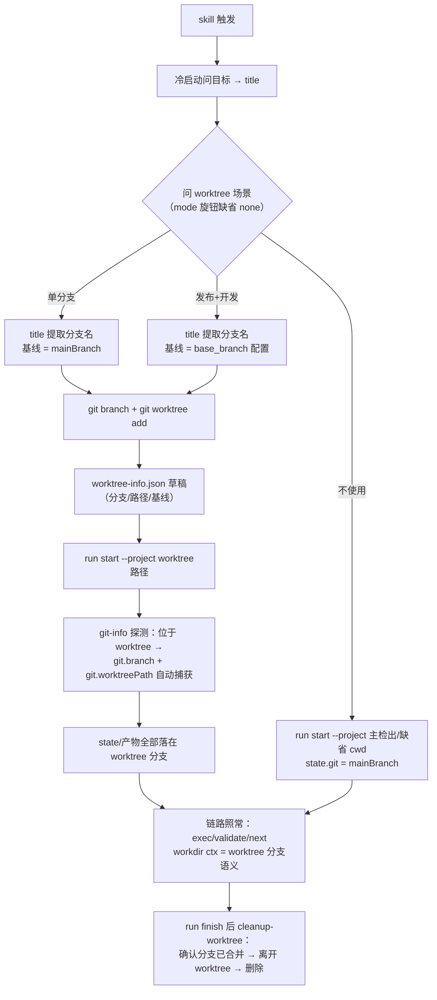

# Worktree 创建时机机制补充 — 技术 Plan

- **revision**: 2
- **文档模式**: single

## 执行摘要

本 Plan 将已确认 spec（FR-WTT-1~5）转化为可实施设计：worktree 创建时机定版为**冷启动阶段、run start 之前**（分支名从冷启动问得的需求一句话提取），state 与全部产物随 `--project <worktree>` 落在 worktree 分支内；`git.worktreePath` 进 state 的通道（09 工作项遗留 O1）采用 **git-info 推断链扩展**（run start 自动探测 projectRoot 位于 worktree 时捕获 `branch` / `worktreePath`），CLI 命令面零新增参数；git-worktree 原子任务从「链内阶段」重定位为「启动前置动作」，配置以 `configurable` 旋钮挂载（mode / base_branch / worktree_dir，缺省 mode=none 保持现状）。机制文档落 SKILL.md，README 同步。含 Mermaid 流程、文件变更清单与验证锚点。

职责分层定版（r2，送审问答补充）：**注册内置、创建留任**——`branch`/`worktreePath` 进 state 是 CLI 内置推断（git-info 扩展，零 agent 参与、零新参数）；创建动作（分支名提取 / git 建库 / 登记产物）由 git-worktree 前置任务承载，不并入 SKILL.md、不内置 CLI（候选 D-a/D-b 已入技术选型表评估并 rejected）。

## 范围与非目标

| 事项 | 说明 | AI 索引 |
|---|---|---|
| 机制文档 | SKILL.md 新增「worktree 创建时机」机制定义（三场景、时序、拓扑、配置、交互），冷启动协议与驱动示例同步 | FR-WTT-1/3/5 |
| 注册链路实现 | git-info 推断扩展：projectRoot 位于 worktree 时捕获 branch / worktreePath（解决 O1） | FR-WTT-2 |
| 任务重定位 | git-worktree 任务改为启动前置动作：prompt 重写、ctx 引擎删除、output schema 对齐、configurable 扩展 | FR-WTT-1/4 |
| 收尾衔接 | cleanup-worktree 清理前提修正（projectRoot=worktree 时的离开顺序与未合并保护） | FR-WTT-2 |
| 文档同步 | README 机制表与流程说明同步 | FR-WTT-1 |
| 非目标 | 不改 workdir.js 判定语义、目录布局、产物生命周期规则；不改 workflows/*.json（git-worktree 不入链）；不引入 PR 自动化 / 多 worktree 并行管理；不改 .gitignore | spec Non-goals |

## 现有设计与复用基线

| 能力 | 文件路径 | 符号 | 证据类型 | 采用方式 | 适用边界 | AI 索引 |
|---|---|---|---|---|---|---|
| run start git 推断 | tools/lib/git-info.js | `gitInfo(project)` | Repository Fact | 扩展现有实现 | 增加第三档 worktree 探测；主检出/非 git 行为不变 | DEC-5 |
| workdir 判定 | tools/lib/workdir.js | `resolveWorkdir` | Repository Fact | 复用现有实现 | worktreePath 非空 → worktree 分支语义；worktreePath=projectRoot 时结果不变、ctx 升级为 worktree 语义，天然兼容 | DEC-2 |
| run start 装配 | tools/cli.js | `cmdRunStart`（--project / atomTasks 预填） | Repository Fact | 复用现有实现 | `--project <worktree>` 现已支持；git 字段不受 assertState 校验，增量字段安全 | DEC-1 |
| 分支命名规则 | atom-tasks/git-worktree/prompt.md | 执行步骤 §1-§2 | Repository Fact | 扩展现有实现 | kebab ≤50、类型前缀、worktreeDir 缺省父目录——保留，输入源改为冷启动 title | DEC-4 |
| configurable 旋钮机制 | atom-tasks/_schema/task-config.schema.json | `configurable` | Repository Fact | 复用现有实现 | mode/base_branch/worktree_dir 按此声明；list tasks 呈现、持久定制走 --tasks-dir | FR-WTT-4 |
| 清理规则 | atom-tasks/cleanup-worktree/prompt.md | rules | Repository Fact | 扩展现有实现 | 「state.git.worktreePath 存在时清理」条件在新拓扑下自动满足；「切换回 projectRoot」措辞需修正 | DEC-4 |
| 前期设计悬案 | .ddo/runs/feat/ddo-code-flow-v2/09-coding-worktree/plan.md | 开放问题 O1/O3 | Repository Fact | 不适用（本 Plan 直接解决 O1；O3 转验证锚点） | worktreePath 通道三候选的比较见技术选型表 | DEC-1 |
| 测试套件 | tools/tests/*.test.js | node:test | Repository Fact | 复用现有实现 | exec.test.js 含 workdir 与 git-worktree ctx 用例需同步调整 | VA-1 |

## 整体架构与流程

参与方：用户（冷启动问答）、agent（分支名提取、git 创建、CLI 代跑）、CLI（state 物化与推断）、git 仓库（主检出 + worktree）。

异常流：worktree 创建的任何 git 失败（非 git 环境、脏基线、分支重名）→ 暂停报告，不产半截 state（run start 尚未发生，天然 fail-fast）；探测到 projectRoot 位于 worktree 但 branch 探测失败 → 仅记 worktreePath、branch 置空（字段必存语义同 mainBranch 的可空约定）。

## 技术选型与方案对比

| 方案 | 来源 | 仓库适配性 | 代价与风险 | 状态 | 结论 | AI 索引 |
|---|---|---|---|---|---|---|
| A. 冷启动预建 + `--project` 落位 + git-info 自动推断 | 初始 Plan | 与 D5 推断链、冷启动问答、`--project` 参数全部同构 | 依赖冷启动问得 title 作分支名来源（语义质量受一句话限制，可接受——本 run 即实证） | accepted | 采用 | DEC-1 |
| B. 链内创建（requirement 后）+ runDir 迁移 | 初始 Plan | 违背 state 稳定性：迁移需改 index 指针/resume 路径，回滚复杂 | 中途迁移 state 风险高；requirement.md 全文仅边际优于 title 关键词 | rejected | 不采用 | DEC-1 |
| C. state 留主检出 + worktreePath 指向 worktree（现分裂拓扑） | 初始 Plan | workdir.js 已支持 | 直接违反用户明确约束（state 须落 worktree 分支） | rejected | 不作主机制；workdir 判定保留兼容 | DEC-2 |
| O1-a. run start 显式 `--worktree` 参数写入 | 09 工作项 O1 候选 | 可行 | 多一个可传错的参数；与「git 信息自动推断」哲学不一致 | superseded | 被方案 A 的自动推断取代（同为命令面写入，推断式零参数） | DEC-1 |
| O1-b. 钩子读 worktree-info.json 登记 | 09 工作项 O1 候选 | 可行 | 依赖产物文件存在与格式校验，多一跳间接 | rejected | 不采用；worktree-info.json 降级为审计登记产物 | DEC-1 |
| mode 缺省 none（不使用） | 初始 Plan | 非 git 环境与存量用法零变化 | 用户须显式表达才获得隔离 | accepted | 采用（保持现状即最保守缺省） | DEC-3 |
| D-a. 删除 git-worktree 任务，创建规程并入 SKILL.md | r2 送审问答候选（「是否仍需原子任务」） | 可行（SKILL.md 已是机制权威载体） | configurable 三旋钮与 output schema 失去任务级载体——list tasks 呈现 / default 预填 / --tasks-dir 持久定制全断；执行细则膨胀 SKILL.md，违背渐进式加载分层（机制节放「何时/为何」，「怎么做」留任务 prompt） | rejected | 不采用；任务保留为前置动作 | FR-WTT-4 |
| D-b. 创建动作内置 CLI（run start 或专设命令代跑 git 建库） | r2 送审问答候选 | 可行（一条命令完成） | 分支名提取是自然语言语义判断 + 场景问答是人机交互，溢出确定性脚本边界（格式分界契约）；与命令面零扩张选型冲突（同 O1-a 被否理由）；创建失败将混入 state 物化路径，破坏 fail-fast | rejected | 不采用；创建留任 agent（前置任务规程） | DEC-1 |

## 数据模型设计

### 实体与字段

`state.git` 扩展（增量可选字段，assertState 不校验 git 形状——Repository Fact）：

- `mainBranch: string`（现状保留）
- `branch?: string`——projectRoot 位于 worktree 时的当前分支名；探测失败置空串
- `worktreePath?: string`——projectRoot 位于 worktree 时的绝对路径（= dirs.projectRoot）

`worktree-info.json`（run start 后由 agent 写入 runDir 的登记产物）：`branchName` / `worktreePath` / `worktreeDir` / `type` / `baseRef` / `createdAt`（沿用现 schema 字段，删除与 state 概念冲突的 `runId`、`dateDescription` 字段，命名描述对齐 prompt v2 的 kebab 关键词规则）。

### schema 与 DDL（如适用）

不适用——无数据库变更。涉及的结构契约为 `state.git`（上述增量字段）与 git-worktree 的 output schema（JSON，非 DDL）。

### 状态与不变量

- 不变量保持：`dirs.runDir` 必须位于 `dirs.projectRoot` 之内（worktree 模式下两者都在 worktree 内，天然满足）
- `git` 字段语义沿用「字段必存、值可空」约定（02 v1.1 修正）；`branch`/`worktreePath` 仅在 worktree 拓扑出现，主检出/非 git 缺省不出现
- `worktreePath` 非空 ⇒ 其值 = `dirs.projectRoot`（新拓扑单一性；分裂拓扑为遗留兼容形态，机制文档不再推荐）

### 迁移、兼容与回滚

- 兼容：旧 state 无新字段零影响；exec/workdir/next 不读 `branch`（仅呈现与审计），`worktreePath` 读取方（workdir ctx、cleanup-worktree 条件）语义不变
- 回滚：新字段为纯增量，git-info 还原即回到现状；机制文档回滚随 git revert

## API 接口设计

| 接口/入口 | 请求 | 响应 | 错误与幂等 | 复用标准 | 实现职责 | AI 索引 |
|---|---|---|---|---|---|---|
| `run start --project <worktree>` | 现有参数 | state 物化 + git 增量捕获 | 幂等性不变（statePath 已存在即报错） | cmdRunStart 现状 | 零参数改动，行为由 git-info 扩展自动生效 | DEC-1 |
| `list tasks` | 现有参数 | git-worktree 新旋钮呈现 | 不适用 | configurable 机制 | 暴露 mode/base_branch/worktree_dir | FR-WTT-4 |
| `exec` / `validate` / `next` | 现有参数 | workdir ctx 在 worktree 拓扑下呈现 worktree 分支语义 | 不适用 | resolveWorkdir 现状 | 无改动 | DEC-2 |
| `resume` | 现有参数 | 位置/门概要 | 不适用 | index-registry 现状 | 无改动（statePath 绝对路径不受影响） | DEC-2 |

## 算法设计

**worktree 探测**（git-info 第三档，非平凡判断）：

- 输入：projectRoot；输出：`{ inWorktree, branch }`
- 步骤：`git rev-parse --path-format=absolute --git-common-dir` 与 `--git-dir` 绝对化后比较——不等 ⇒ 位于 worktree；相等 ⇒ 主检出。在 worktree 内再取 `git branch --show-current` 得 branch（ detached 时置空）
- 不变量：仅在既有仓库推断通过后执行；任何 git 失败 ⇒ 字段置空不阻断启动
- 边界：submodule（.git 文件指向主仓库工作树）同样以 git-dir ≠ common-dir 判定，行为一致

**分支名提取**：复用 prompt v2 规则（关键词 kebab-case ≤50 字符、类型前缀、冲突追加 `-2`），非新算法，不赘述。

## 文件变更计划

| 文件/目录 | 变更职责 | 复用或依赖 | AI 索引 |
|---|---|---|---|
| SKILL.md | 新增「worktree 创建时机」机制节（三场景/时序/拓扑/注册链路/配置/**职责分层**——注册内置、创建留任）；冷启动协议加场景问答；驱动示例加 worktree 形态；诚实边界更新（注册链路已实现） | 引用 git-info/workdir 现状 | FR-WTT-1/3/5 |
| tools/lib/git-info.js | 第三档 worktree 探测与 branch/worktreePath 捕获 | 扩展 gitInfo | DEC-5 |
| atom-tasks/git-worktree/prompt.md | 重写为启动前置动作：输入=冷启动 title、三场景基线规则、创建后 `run start --project`、worktree-info.json 后置登记 | 复用命名规则 §1-§2 | DEC-4 |
| atom-tasks/git-worktree/config.json | configurable 增 mode（default: none）/ base_branch / worktree_dir。消费时序（r2 澄清）：旋钮的**消费时点在冷启动问答**——agent 读任务 config（经 list tasks 或直读）呈现缺省并接受对话定制；run start 预填 `state.atomTasks` 仅作登记留痕（创建先于 state 存在，预填值非创建依据） | task-config schema | FR-WTT-4 |
| atom-tasks/git-worktree/git-worktree.js | 删除（前置动作无 state，ctx 引擎失去调用方） | — | DEC-4 |
| atom-tasks/git-worktree/git-worktree.output.schema.json | 字段对齐（删 runId/dateDescription，描述改 kebab 关键词命名） | output-schema 机制 | DEC-4 |
| atom-tasks/cleanup-worktree/prompt.md | 清理前提修正：离开 worktree → 主检出/仓库根；未合并分支保护提示 | rules 现状 | DEC-4 |
| README.md | 机制表（代码工作目录行）、冷启动说明同步 | — | FR-WTT-1 |
| tools/tests/exec.test.js | 删 git-worktree ctx 用例；workdir 用例补 worktreePath=projectRoot 形态 | node:test | VA-1 |
| tools/tests/start.test.js（或新增 git-info 用例文件） | run start 于 worktree 内的捕获用例；主检出回归用例 | node:test | VA-2/VA-3 |

## 兼容、稳定性与回滚

| 关注点 | 适用性 | 设计/理由 | 回滚信号 | AI 索引 |
|---|---|---|---|---|
| 存量 run 兼容 | 适用 | git 增量字段可选；旧 state 读写路径不触及新字段 | resume/exec 对旧 run 报错 | DEC-5 |
| 非 git 环境 | 适用 | gitInfo 第一档短路返回不变 | 非 git 项目 run start 失败 | DEC-5 |
| 主检出行为 | 适用 | 探测判定 git-dir=common-dir ⇒ 不产出新字段 | 主检出 run 出现 worktreePath | DEC-5 |
| 自定义链兼容 | 适用 | git-worktree 仍可被自定义链引用（结构合法），prompt 首部声明其标准时机为启动前置；链内引用属误用，文档明示 | 无 | DEC-4 |
| worktree 误删风险 | 适用 | cleanup 规则加未合并保护（未合并勿删，或仅删 worktree 保留分支） | 分支丢失 | DEC-4 |

## Verification Anchor

| 需验证契约 | 可观察结果 | 证据位置 | AI 索引 |
|---|---|---|---|
| VA-1 全量回归 | `node --test tools/tests/` 全绿 | tools/tests/*.test.js | AC-4 |
| VA-2 worktree 捕获 | 在真实 worktree 内 `run start --project <worktree>` → state.git 含 branch/worktreePath 且值正确；workdir ctx 呈现 worktree 分支语义 | 新 run 的 .state.json + exec 输出 | AC-4、FR-WTT-2 |
| VA-3 主检出回归 | 主检出 run start → state.git 与现状一致（无 worktreePath） | .state.json | AC-4 |
| VA-4 机制可读性 | 按 SKILL.md 机制节能无歧义回答 AC-1 四问（用不用/何时建/分支名从哪来/state 落哪） | SKILL.md | AC-1 |
| VA-5 配置生效 | 冷启动问答呈现旋钮缺省（读任务 config）；对话定制或 --tasks-dir 持久定制后，同 title 再走冷启动创建行为改变；run start 后 `state.atomTasks` 预填值与实际选择一致（登记语义） | 冷启动交互 + list tasks 输出 + .state.json | AC-3 |

## 开放问题与 Spec 对应

| 问题 | 确定答案或阻塞原因 | 解决位置 | AI 索引 |
|---|---|---|---|
| PD-1 时序矛盾解法 | 冷启动预建 + `--project` 落位（方案 A）；迁移式（B）与分裂拓扑（C）rejected | SKILL.md 机制节 + git-info | FR-WTT-1 |
| PD-2 预设装配 | 不入链：重定位为启动前置动作，workflows/*.json 零改动 | git-worktree prompt/config | FR-WTT-1 |
| PD-3 配置 schema | configurable 三旋钮（mode/base_branch/worktree_dir）；临时定制=对话表达，持久定制=--tasks-dir 覆盖；消费时点=冷启动问答（读任务 config），state.atomTasks 预填为事后登记（r2 时序澄清：创建先于 run start，预填值不参与创建） | git-worktree config + SKILL.md | FR-WTT-4 |
| PD-4 mode 缺省 | none（保持现状，显式选择才启用） | git-worktree config | FR-WTT-3 |
| spec Interpretation「单分支/发布+开发」 | 统一为基线选择差异：单分支基线=mainBranch，发布+开发基线=base_branch 配置 | SKILL.md 机制节 + prompt | FR-WTT-3 |
| 09 工作项 O1 | worktreePath 通道 = git-info 推断式写入（run start 自动捕获） | git-info.js | FR-WTT-2 |
| 09 工作项 O3 | 转 VA-2 实测验证 | 验证锚点 | FR-WTT-2 |

## 风险与下游交接

- **风险与缓解**：① 分支名质量受 title 一句话限制 → 冷启动问目标时强调一句话即分支语义来源，提取失败向用户索取描述（prompt 现规则保留）；② agent 在非 git 启动目录无法用宿主 worktree 切换工具（本 run 实证）→ SKILL.md 给出绝对路径 + `--project` 的等效操作路径；③ 删除 ctx 引擎影响未知自定义链 → prompt 首部声明标准时机，测试同步收敛。
- **Tasking/Coding 读取范围**：本 plan（single 模式）+ spec.md + SKILL.md 现状 + git-info.js / workdir.js / cmdRunStart 相关段 + git-worktree 与 cleanup-worktree 任务目录。
- **事实失效处理**：若 coding 期发现 cli.js 预填/装配与本文描述不符（以当时代码为准），停止并回报，不自行改已批准契约；SKILL.md 机制节落笔前须与实现实测（VA-2）对齐。

## 用户确认

- ✅ **同意**：批准当前 Plan，进入后续编排
- ❌ **修改：<反馈>**：按反馈出新 revision，重新评估后送审
- ❓ **提问：<问题>**：只读答疑，不改文档与确认状态
- 📦 **归档**：列出可用归档模板名（atom-tasks/plan/references/*.md）
- 📦 **归档：<模板名>**：按模板生成 tech-design 产物（不代表批准）
