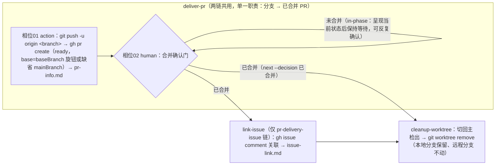

# PR 交付收尾 Workflow Plan

## 执行摘要

本 Plan 将已确认 spec（FR-WF-1/WF-2、FR-ISSUE-1、FR-PUSH-1、FR-PR-1/2、FR-CHECK-1、FR-CLEAN-1）落为本仓库的纯数据层新增：2 个预设（`pr-delivery` 主链、`pr-delivery-issue` 变体链）与 2 个新原子任务（`deliver-pr`、`link-issue`），复用 `cleanup-worktree`，零 CLI 内核改动。关键结论：(a) 全部机制积木已存在——预设加载（loadWorkflow）、human 相位确认门（buildGate）、configurable 旋钮、output schema 硬校验均为现成装配面，新增任务/预设只是数据与 prompt；(b) 合并确认门作为 `deliver-pr` 的相位 02（human）承载，选项「已合并」（推进型）与「未合并」（in-phase 保持等待）；(c) worktree 清理依赖的 `state.git.worktreePath` 注册机制已由 PR #52（4f521ba，WTT）合入 main，编码前先将本分支 ff 到 main（c51b577）。文档模式 single，revision r1。

## 范围与非目标

| 事项 | 说明 | AI 索引 |
|---|---|---|
| In：新增预设两条 | `workflows/pr-delivery.json`（主链）与 `workflows/pr-delivery-issue.json`（变体链），经 loadWorkflow 校验后进入 `list workflows` | FR-WF-1、FR-WF-2 |
| In：新增任务 deliver-pr | 相位 01 action（push + 建 ready PR + 产出 pr-info.md）、相位 02 human（合并确认门） | FR-PUSH-1、FR-PR-1、FR-PR-2、FR-CHECK-1 |
| In：新增任务 link-issue | 单相位 action：将 PR 与显式指定的 issue 评论关联，产出 issue-link.md；仅出现在变体链 | FR-ISSUE-1 |
| In：复用 cleanup-worktree | 零改造：移除 worktree、保留本地分支（未合并保护）、不触碰远程 | FR-CLEAN-1 |
| In：测试与文档 | 新增 `tools/tests/delivery.test.js`；README 预设清单两处更新 | AC-1 |
| 非：CLI/装配层改动 | 不改 tools/lib 任何内核；不引入 optional-stage 启用开关 | spec Non-goals |
| 非：既有任务改造 | create-pr / issue-fetch / remote-gate / cleanup-worktree 行为不变 | spec Non-goals |
| 非：自动合并与远程删除 | 合并动作归用户；远程分支永不删除 | FR-CHECK-1、FR-CLEAN-1 |
| 非：issue 自动关闭/label 操作 | 关联仅评论；关闭 issue 与 label 语义属 issue-driven 开发流，超出单一职责 | FR-ISSUE-1 边界 |

## 现有设计与复用基线

| 能力 | 文件路径 | 符号 | 证据类型 | 采用方式 | 适用边界 | AI 索引 |
|---|---|---|---|---|---|---|
| 预设加载与 DAG 校验 | tools/lib/workflow.js | loadWorkflow / expandStages | Repository Fact | 复用现有实现 | name=文件名、任务不重复、dependOn 引用存在、Kahn 无环 | DEC-2 |
| 确认门注册与拦截 | tools/lib/workflow.js | buildGate / standardOptions | Repository Fact | 复用现有实现 | human 相位声明 gate.options 三元组；action 白名单四类；未声明走标准二元兜底 | DEC-3 |
| 任务配置契约 | atom-tasks/_schema/task-config.schema.json | task-config schema | Repository Fact | 复用现有实现 | phases/id 两位数字/type/gate/configurable；additionalProperties 放行 | DEC-1 |
| prompt 相位切片与 ctx 钩子 | tools/lib/assemble.js | assemble / slicePrompt | Repository Fact | 复用现有实现 | `<!-- @phase:NN -->` 标记；`<task>.js` 钩子 assemble({phase,state,…}) 可相位感知 | DEC-3 |
| 产出契约注入与硬校验 | tools/lib/output-schema.js | loadTaskSchema / renderContract / validateArtifact | Repository Fact | 复用现有实现 | `<task>.output.schema.json` 符合 meta-schema；validate 按 sections/rules 硬校验 | VA 表 |
| configurable 旋钮机制 | tools/lib/assemble.js | mergeConfig（run 级 state.atomTasks） | Repository Fact | 复用现有实现 | 有 default 才预填；无 default 仅呈现，prompt 指示 agent 现读 state | DEC-6 |
| worktree 注册（WTT） | tools/lib/git-info.js（main@4f521ba） | gitInfo 第三档 | Repository Fact | 复用现有实现 | run start 位于 linked worktree 时自动产出 state.git.branch / worktreePath | DEC-5 |
| worktree 清理 | atom-tasks/cleanup-worktree/prompt.md（main 版） | — | Repository Fact | 复用现有实现 | 读 worktreePath/git.branch；切回主检出；未合并分支保护；无远程删除动作 | FR-CLEAN-1 |
| 两段式任务惯用法 | atom-tasks/spec/config.json | phases[01 action,02 human] | Repository Fact | 复用现有实现 | action+gate 形状与 @interact:required 标记是既有惯例 | DEC-3 |
| 测试模式 | tools/tests/{list,gate,start}.test.js | sandbox()/cli() | Repository Fact | 复用现有实现 | mkdtemp 沙箱 + DDO_HOME 指内 + spawnSync CLI；预设坏例走 --workflows-dir | VA 表 |

## 整体架构与流程

主链与变体链共用 `deliver-pr`（含合并确认门）；可选性由预设选链表达，`deliver-pr` 内不含任何 issue 逻辑。

异常流：push/gh 失败（网络、权限、未认证）→ deliver-pr:01 立即暂停报告，不产 pr-info.md、不进门；TTY 认证命令（gh auth login）不代跑，交用户宿主 shell 执行（create-pr 同款先例）。worktreePath 为空（run 未在 worktree 内启动）→ cleanup-worktree 按既有语义记录「无 worktree 需要清理」后完成。

## 技术选型与方案对比

| 方案 | 来源 | 仓库适配性 | 代价与风险 | 状态 | 结论 | AI 索引 |
|---|---|---|---|---|---|---|
| 4 任务拆分（push/pr-create/merge-confirm/link-issue 独立） | 提问轮初稿 | 合法但过重 | merge-confirm 无独立价值；push 无独立复用场景；链变长状态变多 | rejected | 用户否决：过重 | DEC-1 |
| 2 任务方案（deliver-pr 两相位 + link-issue，复用 cleanup-worktree） | 提问轮收敛 | 单一职责切分线划在 issue 边界，主链零 issue 逻辑 | 变体链中关联发生在合并之后（见 DEC-4 权衡） | accepted | 采用 | DEC-1 |
| 单一捆绑交付任务（push+PR+门+issue 全在内） | 初始候选 | 复刻 create-pr 捆绑问题 | issue 可选性退化为任务内条件逻辑，违背组合性 | rejected | 不采用 | DEC-1 |
| issue 可选 = 预设变体（两条 JSON） | 提问轮 | 现有 loadWorkflow 零改动即支持 | 预设数量随变体线性增长（当前 1 个变体，可接受） | accepted | 采用 | DEC-2 |
| issue 可选 = optional-stage 启用开关 | 提问轮候选 | 需改 run start 装配与 state 结构 | 装配层机制扩展，超出本 run 边界（spec Non-goal） | rejected | 变体增多时另立 run | DEC-2 |
| issue 可选 = 链内固定任务条件空过 | 提问轮候选 | 主链也会背上 issue 任务的呈现/跳过噪音 | 与「主链零 issue 环节」（AC-5 后半）冲突 | rejected | 不采用 | DEC-2 |
| 合并确认 = 独立 merge-confirm 任务 | 提问轮初稿 | 门必须由任务 human 相位声明，独立任务合法 | action 相位仅复读 pr-info，无独立价值 | rejected | 并入 deliver-pr:02 | DEC-3 |
| 合并确认 = deliver-pr 相位 02 human 门 | 提问轮收敛 | spec/plan/test-plan 两段式惯例；07 结构锁免费提供「未确认不清理」 | 无 | accepted | 采用 | DEC-3 |
| 合并确认 = 仅 prompt 软提示（无门） | 对照候选 | 无结构保证 | 违背 FR-CHECK-1 的验收语义 | rejected | 不采用 | DEC-3 |
| issue 关联 = 门后评论式（link-issue 在门之后） | 本轮推导 | deliver-pr 两链共用 ⇒ PR 正文构造时不能掺 issue 逻辑 | Closes #N 无法进 PR 正文、不自动关 issue；关联是评论级 | accepted | 权衡可接受：单一职责优先；关闭动作留用户 | DEC-4 |
| 编码基线 = fd05e0e（本 worktree 起点） | 初始状态 | 缺 WTT 注册与新版 cleanup-worktree | cleanup 依赖的 worktreePath 注册不存在，AC-3 无法本地验证 | superseded | 被 DEC-5 取代 | DEC-5 |
| 编码基线 = ff 到 main（c51b577） | 本轮发现 | 分支无自有提交，ff 零冲突；.ddo 本 run 目录 untracked 不受影响 | 无 | accepted | 编码第一步执行 | DEC-5 |
| baseBranch 传入 = configurable 旋钮（无静态 default）+ prompt 动态缺省 mainBranch | 本轮设计 | default 机制是静态值，mainBranch 因仓而异 | 无 | accepted | deliver-pr 读 state.atomTasks 旋钮，缺省回落 state.git.mainBranch | DEC-6 |

## 数据模型设计

### 实体与字段

- **pr-info.md**（deliver-pr:01 产出，供相位 02 呈现与 link-issue 消费）：`## PR 信息` 列表——PR 编号、URL、源分支（state.git.branch）、base 分支（实际生效值）、状态（ready，非 draft）、创建时间。
- **issue-link.md**（link-issue 产出）：`## 关联信息` 列表——issue 号、PR 编号与 URL、issue 评论链接。
- **state.atomTasks.deliver-pr.baseBranch**：可选字符串旋钮，无静态 default（不预填）；**state.atomTasks.link-issue.issueNumber**：无 default 旋钮，执行时必填语义（缺失则向用户索取）。
- **预设 JSON**：`pr-delivery`（stages: deliver-pr → cleanup-worktree）、`pr-delivery-issue`（stages: deliver-pr → link-issue → cleanup-worktree），version 1.0.0。

### schema 与 DDL（如适用）

无数据库。产物结构由两个 `<task>.output.schema.json` 声明（sections/rules），经 meta-schema 校验后由 validate 硬校验；任务配置经 task-config.schema.json 校验。

### 状态与不变量

- deliver-pr:02 门未关闭时 `next` 被 CLI 拦截（07 结构锁）——「未确认合并不得清理」是结构不变量而非 prompt 约定。
- cleanup-worktree 仅在 deliver-pr（变体链再加 link-issue）done 后由 DAG 点亮。
- 远程分支不变量：全链无任何远程删除动作（deliver-pr/link-issue rules 与 cleanup 既有约束共同覆盖）。
- 未合并分支保护：cleanup 既有规则（仅合并后且用户明确要求才 `git branch -d`）。

### 迁移、兼容与回滚

纯新增文件（2 预设 + 2 任务目录 + 1 测试 + README 局部），无 state 结构变更、无既有行为迁移。回滚 = revert 新增文件，存量 run 不受影响（预设只是启动装配源，state 自包含）。

## API 接口设计

| 接口/入口 | 请求 | 响应 | 错误与幂等 | 复用标准 | 实现职责 | AI 索引 |
|---|---|---|---|---|---|---|
| workflows/pr-delivery(.issue).json → loadWorkflow | 预设 JSON（name/version/description/stages+dependOn） | 物化进 .state.json 的 stages | 结构/DAG 违规启动即报错并列现有预设 | 现有预设契约（name=文件名、任务唯一、Kahn） | 声明两条链的阶段与依赖 | DEC-2 |
| atom-tasks/deliver-pr/config.json | task-config schema | list tasks 呈现 + run start 装配 | 校验失败 fail fast | task-config.schema.json + gate options 白名单 | 声明两相位、门选项（已合并/未合并）、baseBranch 旋钮 | DEC-3 |
| deliver-pr:02 gate.options | 已合并 → `next --decision 已合并`；未合并 → in-phase | 推进 / 保持等待 | 非法决议被 next 拦截 | buildGate 三元组契约 | 门声明数据源 | DEC-3 |
| deliver-pr.js ctx 钩子 | assemble({phase,statePath,…}) | 相位 01：可选注入 delivery-doc；相位 02：必需注入 pr-info.md | 必需缺失抛错（exit 1） | create-pr.js 钩子惯例 | 相位感知上下文 | DEC-1 |
| link-issue.js ctx 钩子 | assemble({statePath,…}) | 必需注入 pr-info.md | 缺失抛错 | 同上 | 下游消费 pr-info | DEC-4 |
| 外部命令面（prompt 指令层） | `git push -u origin <branch>`、`gh pr create --base <base>`（无 draft 标志=ready）、`gh issue comment <N>` | pr-info.md / issue-link.md | 失败立即暂停报告；TTY 认证命令不代跑 | create-pr 先例 | agent 执行层 | FR-PUSH-1 |

## 算法设计

不适用——本改动为数据资产与 prompt 级新增，无新算法/状态机；唯一的顺序保证（门→清理）由现成 DAG + 07 门拦截机制承担。链内无并发与一致性逻辑。

## 文件变更计划

| 文件/目录 | 变更职责 | 复用或依赖 | AI 索引 |
|---|---|---|---|
| （前置）feat/pr-delivery-workflow 分支 | ff 到 main c51b577（无自有提交，零冲突） | WTT（4f521ba） | DEC-5 |
| workflows/pr-delivery.json | 主链预设：deliver-pr → cleanup-worktree | loadWorkflow | DEC-2 |
| workflows/pr-delivery-issue.json | 变体链预设：deliver-pr → link-issue → cleanup-worktree | loadWorkflow | DEC-2 |
| atom-tasks/deliver-pr/ | config.json（两相位+门+旋钮）、prompt.md（相位切片+@interact）、deliver-pr.output.schema.json、deliver-pr.js（相位感知 ctx） | assemble/buildGate/output-schema | DEC-1、DEC-3 |
| atom-tasks/link-issue/ | config.json（单相位+issueNumber 旋钮）、prompt.md、link-issue.output.schema.json、link-issue.js（必需 pr-info ctx） | 同上 | DEC-4 |
| tools/tests/delivery.test.js | 新预设/新任务/门注册与拦截/契约注入的结构级测试 | sandbox()+cli() 模式 | VA 表 |
| README.md | 预设清单两处（选用说明 + 目录节）补两条交付链 | 现有排版 | AC-1 |

## 兼容、稳定性与回滚

| 关注点 | 适用性 | 设计/理由 | 回滚信号 | AI 索引 |
|---|---|---|---|---|
| 存量预设/任务行为 | 适用 | 纯新增，basic/standard 与既有任务零触碰 | list workflows/tasks 快照对比 | AC-1 |
| 与 main 并进冲突 | 适用 | 编码前 ff 到 c51b577；本分支改动均为新文件，唯一交集 README 两处行内补充 | merge 冲突即重估 | DEC-5 |
| gh/git 失败路径 | 适用 | 暂停报告不推进（create-pr 先例）；无部分写入（pr-info 仅在创建成功后产出） | 手验异常流 | VA 表 |
| 下游 skill 使用方 | 适用 | 安装面（SKILL.md 机制文档）零改动；新能力纯增量可选 | 无 | 兼容 |
| 回滚 | 适用 | revert 新增文件即完全移除 | 用户要求 | 迁移节 |

## Verification Anchor

| 需验证契约 | 可观察结果 | 证据位置 | AI 索引 |
|---|---|---|---|
| AC-1 | list workflows 出现两条新预设且阶段链正确；basic/standard 不变 | delivery.test.js + 手跑 `list workflows` | AC-1 |
| AC-2 | pr-info.md 含编号/URL/base/ready 状态；`gh pr view` 为 ready | run 目录 pr-info.md + GitHub PR 页 | AC-2 |
| AC-3 | 门未决时 next 被拦（exit 1）；已合并决议后 worktree 目录消失 | delivery.test.js（门拦截）+ 实链手验 | AC-3 |
| AC-4 | 清理后 `git ls-remote origin` 仍含特性分支 | 实链手验 | AC-4 |
| AC-5 | 变体链 issue 侧可见 PR 评论（issue-link.md 记录链接）；主链 exec 输出不含 issue 环节 | issue-link.md + 两条链 exec 输出对照 | AC-5 |
| 结构契约 | 任务 config 过 task-config schema；output schema 过 meta-schema；测试全绿（node --test tools/tests/*.test.js） | delivery.test.js | 全局 |

## 开放问题与 Spec 对应

| 问题 | 确定答案或阻塞原因 | 解决位置 | AI 索引 |
|---|---|---|---|
| spec PD-1（任务拆分与命名/顺序/关联时机） | 净新增 deliver-pr（01 action+02 human 门）与 link-issue；变体链顺序 deliver-pr → link-issue → cleanup-worktree；关联为门后评论式 | 文件变更计划 | DEC-1、DEC-4 |
| spec PD-2（baseBranch 传入与缺省） | configurable 旋钮（无静态 default）+ prompt 动态缺省 state.git.mainBranch | deliver-pr config/prompt | DEC-6 |
| spec PD-3（清理自身 worktree 的目录切换） | 已由 main@4f521ba 的新版 cleanup-worktree 内建（切回主检出 + 未合并保护），本 run 直接复用 | 复用基线表 | DEC-5 |
| spec BQ-1/BQ-2 | ready PR / 人工确认门——已固化进 deliver-pr 相位与门选项 | deliver-pr config | DEC-3 |
| 阻塞项 | 无 | — | — |

## 风险与下游交接

- **风险与缓解**：① gh 未认证/网络失败 → 暂停报告 + 认证交宿主 shell（先例约束）；② 变体链关联晚于合并（Closes #N 不进正文）→ DEC-4 已明示权衡，关闭动作留用户；③ main 再前进触碰 README/预设区 → 均为新增文件或行内补充，冲突面极小，编码时以最新 main 为准。
- **Coding 读取范围**：本 plan 全文（single 模式无分册）+ spec（已注入 run 状态）；参考实现样本：atom-tasks/spec/（两段式+门）、atom-tasks/create-pr/（旋钮+schema+钩子）、tools/tests/gate.test.js（门驱动测试）。
- **事实失效处理**：若编码时 main 的 cleanup-worktree/git-info 行为与本 plan 基线（c51b577）不符，停止并报告，不得自行改已批准契约。
- **测试调用形式**：`node --test tools/tests/*.test.js`（仓库既有约定）。

## 用户确认

- ✅ **同意**：批准当前 plan，进入 Coding。
- ❌ **修改：<反馈>**：按反馈更新受影响条目，展示变化后重新确认。
- ❓ **提问：<问题>**：只读答疑，不改变确认状态。
- 📦 **归档**：列出可用归档模板名（当前：`ddo.md`）。
- 📦 **归档：<模板名>**：按 atom-tasks/plan/references/ 内模板生成 tech-design 产物。
