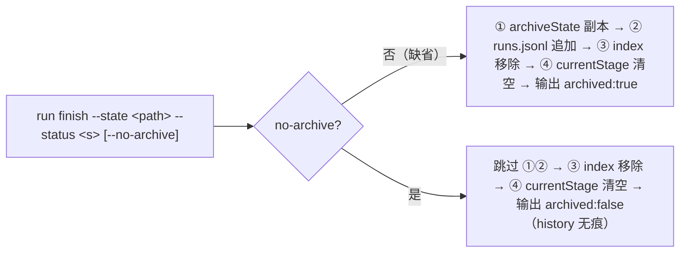

# run finish 免归档开关 Plan

## 执行摘要

将已确认 spec（FR-FLAG-1、FR-FINISH-1、FR-RETRO-1、FR-COMPAT-1）落为 `run finish` 的免归档旗标 `--no-archive`：布尔旗标（bare 形式与 `=true/false` 形式均支持，需给 parseArgv 增加布尔集——现解析器所有 flag 强制取值）；启用时跳过收口四步中的 ①（`history.archiveState` 副本拷贝）与 ②（`history.append` runs.jsonl 追加），③ index 移除与 ④ currentStage 清空照旧，finish 输出增加 `archived: false` 标识。不带旗标路径零变化（FR-COMPAT-1）。跳过逻辑放在 `runFinish` 调用处，`history.js` 保持纯函数不动。文档模式 single，revision r1。

## 范围与非目标

| 事项 | 说明 | AI 索引 |
|---|---|---|
| In：run finish 旗标 | `--no-archive`（布尔）：跳过 ①②，③④ 照旧，输出 `archived` 字段 | FR-FLAG-1、FR-FINISH-1 |
| In：解析器布尔集 | parseArgv 增加 BOOLEAN_FLAGS 集合（bare 与 `=` 形式），对其他命令零影响 | FR-FLAG-1 |
| In：追溯适用 | 旗标只在 finish 时读取，无需 run start 配合（state 无新字段） | FR-RETRO-1 |
| In：测试 | lifecycle 域免归档用例 + 缺省归档回归 + 解析器布尔用例 | AC-1~3 |
| 非：run start 改动 | 不加启动期旋钮、不动 state 结构 | spec Non-goals |
| 非：自动类型判断 | 不按 run 类型/预设自动免归档 | spec Non-goals |
| 非：history 域改动 | history.js 两函数与其格式不动；无查询/清理命令 | spec Non-goals |

## 现有设计与复用基线

| 能力 | 文件路径 | 符号 | 证据类型 | 采用方式 | 适用边界 | AI 索引 |
|---|---|---|---|---|---|---|
| 收口四步 | tools/cli.js | runFinish（L141） | Repository Fact | 扩展现有实现 | ①② 在调用处条件跳过；③ registry.unregister、④ currentStage 清空不动 | DEC-1 |
| 归档与追加 | tools/lib/history.js | archiveState / append | Repository Fact | 复用现有实现 | 不改函数本体；跳过发生在调用方 | DEC-2 |
| 参数解析 | tools/cli.js | parseArgv（L961） | Repository Fact | 扩展现有实现 | 现「flag 必取值」；增加 BOOLEAN_FLAGS 后 bare token 置 true，`=` 形式照常 | DEC-3 |
| 命令注册表 | tools/cli.js | REGISTRY（run finish 条目） | Repository Fact | 扩展现有实现 | usage/options 补一行旗标描述 | DEC-3 |
| finish 测试模式 | tools/tests/lifecycle.test.js | 「run finish 归档 state 副本…」用例 | Repository Fact | 复用现有实现 | sandbox + 断言 history 目录/jsonl/index/state | VA 表 |

## 整体架构与流程

异常流：非法 `--status` 与未知旗标行为不变（UsageError/hard fail 现状）；免归档 finish 对不存在 history 目录无依赖（本来就跳过），崩溃面更小。

## 技术选型与方案对比

| 方案 | 来源 | 仓库适配性 | 代价与风险 | 状态 | 结论 | AI 索引 |
|---|---|---|---|---|---|---|
| `--no-archive` 布尔旗标（bare + `=` 形式） | 本轮设计 | 需 parseArgv 增布尔集（~6 行，仅集合内 token 分支） | 解析器共享路径改动，需补用例防回归 | accepted | 采用 | DEC-3 |
| `--archive false` 取值旗标 | 备选 | 零解析器改动 | 双重否定可读性差；用户词汇应是「免归档」正向动作 | rejected | 不采用 | DEC-3 |
| 跳过逻辑放 history.js 内部（archiveState 加参） | 备选 | 可行 | history 域承担开关语义，纯函数变条件函数 | rejected | 调用处跳过，history 不动 | DEC-2 |
| run start 旋钮物化 state.noArchive | spec PD-2 | 需 state 结构变更 + 启动面改动 | 与「追溯适用已存在 run」诉求冲突（旧 run 无该字段） | rejected | 本 run 不做，PD-2 记录 | DEC-1 |

## 数据模型设计

### 实体与字段

- finish 输出对象增加 `archived: boolean`（缺省 true）；state 结构零变更（FR-RETRO-1：旗标不落 state）。
- runs.jsonl 行结构不变；免归档时该行不产生。

### schema 与 DDL（如适用）

不适用——无数据存储变更（history 格式不动）。

### 状态与不变量

- 免归档不变量：`~/.ddo/history/<runId>/` 不存在且 runs.jsonl 无该 runId 行。
- 收口不变量保持：finish 后 index 无该 run、`currentStage` 为空数组、state 原文件保留（随项目版控走）。
- 幂等性变化：重复 finish 缺省路径幂等（①② 幂等覆盖）；免归档路径天然幂等（连续跳过）。

### 迁移、兼容与回滚

纯增量（解析器布尔集 + finish 条件分支 + 注册表文案），无存量数据迁移。回滚 = revert 两文件改动；已产生的免归档收口无需补偿（本就不留痕）。

## API 接口设计

| 接口/入口 | 请求 | 响应 | 错误与幂等 | 复用标准 | 实现职责 | AI 索引 |
|---|---|---|---|---|---|---|
| run finish CLI | `run finish --state 
 --status <s> [--no-archive]` | `{ finished, finalStatus, archived }` | 非法 status → UsageError（现状）；重复 finish 幂等 | REGISTRY options 声明 | 免归档分支 | DEC-1 |
| parseArgv | `--no-archive`（bare → true）/ `--no-archive=false` | flags 映射 | 集合外 bare token 维持「缺少取值」报错 | 现解析契约 | 布尔集扩展 | DEC-3 |
| status 派生命令（可选呈现） | 无改动 | — | — | — | availableCommands 中 finish 命令文案不带新旗标（保持简短），旗标经 --help 发现 | DEC-3 |

## 算法设计

不适用——单一条件分支，无算法/状态机；收口顺序语义由既有注释与测试承载。

## 文件变更计划

| 文件/目录 | 变更职责 | 复用或依赖 | AI 索引 |
|---|---|---|---|
| tools/cli.js | ① parseArgv 增 BOOLEAN_FLAGS（含 `no-archive`）；② runFinish 条件跳过 ①② + 输出 archived；③ REGISTRY run finish 的 usage/options 文案 | history.js / index-registry | DEC-1、DEC-3 |
| tools/tests/lifecycle.test.js | 新增：免归档 finish（history 目录/jsonl 无记录、index 移除、currentStage 清空、输出 archived:false）；缺省 finish 回归（archived:true，既有断言不动） | sandbox 模式 | VA 表 |
| tools/tests/cli.test.js | 新增：bare 布尔旗标与 `=` 形式解析；集合外 bare token 仍报「缺少取值」 | 现解析用例 | DEC-3 |

## 兼容、稳定性与回滚

| 关注点 | 适用性 | 设计/理由 | 回滚信号 | AI 索引 |
|---|---|---|---|---|
| 存量命令行为 | 适用 | 缺省路径逐字节等价（条件不触发）；旗标未用则解析器分支不命中 | 全量测试回归 | FR-COMPAT-1 |
| 解析器共享面 | 适用 | 仅集合内 token 变化；集合初始仅 `no-archive` | cli.test 解析用例 | DEC-3 |
| 交互协议（#53） | 不适用 | finish 非门决议载体，呈现校验不涉 | — | — |
| 回滚 | 适用 | revert 两文件即移除 | 用户要求 | 迁移节 |

## Verification Anchor

| 需验证契约 | 可观察结果 | 证据位置 | AI 索引 |
|---|---|---|---|
| AC-1 | `--no-archive` 收口后 `~/.ddo/history/` 无该 runId 目录、runs.jsonl 无该行，exit 0 且输出 `archived:false` | lifecycle.test.js 新用例 + 交付 run 手验 | AC-1 |
| AC-2 | 免归档收口后 resume/status 不再发现该 run；项目内 `.ddo/runs/` 产物与 state 原文件仍在 | lifecycle.test.js 断言 | AC-2 |
| AC-3 | 缺省 finish：history 目录/jsonl 照旧，输出 `archived:true` | 既有用例回归 + 新断言 | AC-3 |
| 解析契约 | bare 布尔与 `=` 形式；集合外 bare 仍报错 | cli.test.js 新用例 | DEC-3 |

## 开放问题与 Spec 对应

| 问题 | 确定答案或阻塞原因 | 解决位置 | AI 索引 |
|---|---|---|---|
| spec PD-1（旗标命名/输出/跳过位置/测试） | `--no-archive`；输出加 `archived`；跳过在 runFinish 调用处；lifecycle+cli 两处测试 | 文件变更计划 | DEC-1~3 |
| spec PD-2（启动期旋钮/预设默认） | 本 run 不做；以 rejected 决策记录于选型表 | 技术选型表 | DEC-1 |
| 阻塞项 | 无 | — | — |

## 风险与下游交接

- **风险与缓解**：解析器共享路径回归 → 布尔集合收敛为单元素并补三向用例（bare/`=`/集合外报错）；`--help` 文案遗漏 → REGISTRY options 同步。
- **Coding 读取范围**：本 plan 全文 + spec（已注入）；参考样本：tools/cli.js runFinish/parseArgv/REGISTRY、tools/tests/lifecycle.test.js L114 用例。
- **事实失效处理**：若编码时 runFinish/parseArgv 与本 plan 基线（ff8f7fe）不符，停止报告。
- **测试调用形式**：`node --test tools/tests/*.test.js`。
- **下游注意**：等待中的交付 run（pr-delivery worktree 内 20260927-192122-8a73）在本机制合入后以 `run finish --state <其 statePath> --status done --no-archive` 收口——finish 与 state 属同仓库，跨 worktree 调用安全（--state 绝对路径）。

## 用户确认

- ✅ **同意**：批准当前 plan，进入 Coding。
- ❌ **修改：<反馈>**：按反馈更新受影响条目，展示变化后重新确认。
- ❓ **提问：<问题>**：只读答疑，不改变确认状态。
- 📦 **归档**：列出可用归档模板名（当前：`ddo.md`）。
- 📦 **归档：<模板名>**：按 atom-tasks/plan/references/ 内模板生成 tech-design 产物。
