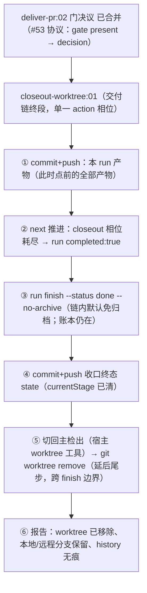

# 交付链收口设计 Plan

## 执行摘要

将已确认 spec（FR-ORDER-1、FR-ARCHIVE-1、FR-PROD-1、FR-CLEAN-KEEP-1、FR-NOHACK-1）落为**交付链专用收尾任务 `closeout-worktree`**：单一 action 相位，其 prompt 按结构顺序编码「产物入库 → 推进完成 → 免归档收口 → 切主检出 → 移除 worktree」——移除作为任务的延后尾步横跨 finish 边界，收口发生在 `next` 返回 completed 之后（结构完整），账本消失发生在收口之后（顺序冲突消除）。两条交付预设的末段由 `cleanup-worktree` 换为 `closeout-worktree`；通用 `cleanup-worktree` 零改动（开发链语义不动，免归档缺省不外溢）。零 CLI 内核改动。文档模式 single，revision r1。

## 范围与非目标

| 事项 | 说明 | AI 索引 |
|---|---|---|
| In：新增任务 closeout-worktree | 交付链专用收尾：产物入库 → 完成 → finish --no-archive → 移除 worktree（本地/远程分支保留） | FR-ORDER-1、FR-ARCHIVE-1、FR-PROD-1 |
| In：预设末段替换 | pr-delivery / pr-delivery-issue 的 cleanup-worktree → closeout-worktree | FR-ORDER-1 |
| In：测试 | 注册表/预设链/exec 顺序断言（finish 先于 remove、含 --no-archive、含终态 commit） | AC-1~4 |
| 非：通用 cleanup-worktree | 零改动（开发链行为与归档语义不动） | FR-CLEAN-KEEP-1 |
| 非：CLI 内核 | 不改 tools/lib、不加 finish 新模式 | DEC-3 |
| 非：合并确认门 | deliver-pr:02 门语义不变 | FR-NOHACK-1 |

## 现有设计与复用基线

| 能力 | 文件路径 | 符号 | 证据类型 | 采用方式 | 适用边界 | AI 索引 |
|---|---|---|---|---|---|---|
| 任务/预设装配面 | tools/lib/workflow.js、assemble.js | loadWorkflow / assemble | Repository Fact | 复用现有实现 | 新任务=新目录；预设换末段为纯 JSON 改动 | DEC-2 |
| 免归档旗标 | tools/cli.js runFinish + BOOLEAN_FLAGS | --no-archive | Repository Fact | 复用现有实现 | 输出 archived:false；仅交付链经任务 prompt 固化使用 | DEC-4 |
| 完成边界 | next 语义（相位耗尽→阶段收尾→DAG→completed:true） | next | Repository Fact | 复用现有实现 | finish 必须在 completed 之后——本设计的顺序基石 | DEC-1 |
| 新拓扑清理约束 | atom-tasks/cleanup-worktree/prompt.md（main 版） | 切回主检出/未合并保护 | Repository Fact | 复用语义（进新 prompt） | closeout 继承同一组安全约束 | FR-CLEAN-KEEP-1 |
| 实链绕行经验 | run 8a73 / bab5 的收口序列 | — | Repository Fact | 复用现有实现 | 本设计=绕行顺序的任务化固化 | DEC-1 |

## 整体架构与流程

异常流：任一步 git/CLI 失败立即暂停报告（既有先例约束）；主检出缺 `--no-archive` 旗标（旧版本 skill）时提示先更新；非 worktree 场景（worktreePath 为空）跳过 ⑤⑥ 仅报告「无 worktree 需要清理」。

## 技术选型与方案对比

| 方案 | 来源 | 仓库适配性 | 代价与风险 | 状态 | 结论 | AI 索引 |
|---|---|---|---|---|---|---|
| C1：改造通用 cleanup-worktree prompt（加交付分支） | 候选 | 一处改动全覆盖 | 通用任务被场景语义污染；免归档缺省外溢到开发链或需场景探测；开发链被动变更 | rejected | 不采用 | DEC-1 |
| C2：交付链专用收尾任务 closeout-worktree（预设末段替换） | 本轮设计 | 单一职责切分线=场景边界（承接首轮设计哲学）；通用任务零改动；结构顺序由 prompt 编码 | 任务数 +1；收尾动作横跨 finish 边界（显式编码，非隐式） | accepted | 采用 | DEC-1、DEC-2 |
| C3：run finish 容忍账本缺失（按 run-id 注销） | 候选 | 需 CLI 内核改动 | index 沦第二事实源片段；终态无法写回（BQ-2 终态入库不满足） | rejected | 不采用 | DEC-3 |
| C4：SKILL.md 驱动协议约定（纯文档） | 候选 | 零代码 | 软约束，违背 FR-NOHACK-1（依赖记忆/阅读） | rejected | 仅作辅助不改机制 | DEC-1 |
| 免归档缺省载体=closeout prompt 固化 --no-archive | BQ-1 落地 | 仅交付链生效，开发链归档语义不动 | 无 | accepted | 采用 | DEC-4 |
| 产物入库载体=closeout 步骤 ①+④（两次 commit） | BQ-2 落地 | ① 保底产物；④ 终态 state；均点名路径 | 提交粒度略细 | accepted | 采用 | DEC-5 |

## 数据模型设计

### 实体与字段

- **closeout-worktree/config.json**：name/version/desc（交付链收尾：产物入库→免归档收口→清 worktree）/单相位 01 action（无 output 声明——产物是动作与 git 提交本身）/defaults.rules（安全约束）。
- **预设 JSON**：两条交付链 stages 末段 `cleanup-worktree` → `closeout-worktree`（dependOn 不变形态）。
- 无 state 结构变更、无新旋钮（免归档为链内固定语义，不做成可配）。

### schema 与 DDL（如适用）

不适用——无产物 schema（动作型任务，先例：coding 同为无声明产物）。

### 状态与不变量

- **顺序不变量**：`next`（completed:true）先于 `run finish`；`run finish` 先于 `git worktree remove`——全部编码在任务 prompt 步骤序中。
- 免归档不变量：交付链收口后 `~/.ddo/history/` 无该 runId 痕迹、runs.jsonl 无该行。
- 分支不变量：本地分支默认保留、远程分支永不删除（继承 cleanup 安全约束）。

### 迁移、兼容与回滚

纯新增任务 + 两处预设 JSON 末段替换；通用 cleanup-worktree 与既有链零触碰。回滚 = revert（预设换回即可，closeout 目录删除）。存量进行中的交付 run（若有）不受影响（state 物化时已锁定旧任务集）。

## API 接口设计

| 接口/入口 | 请求 | 响应 | 错误与幂等 | 复用标准 | 实现职责 | AI 索引 |
|---|---|---|---|---|---|---|
| atom-tasks/closeout-worktree/ | config + prompt | list tasks 注册 | task-config schema 校验 fail fast | 现有任务契约 | 收尾顺序的结构编码 | DEC-2 |
| workflows/pr-delivery(.issue).json | 末段替换 | list workflows 阶段链更新 | loadWorkflow 校验 | 现有预设契约 | 链定义 | DEC-2 |
| closeout prompt 外部命令面 | git commit/push、next、run finish --no-archive、ExitWorktree+git worktree remove | 动作结果 | 任一失败暂停报告 | create-pr/cleanup 先例 | agent 执行层 | DEC-1 |

## 算法设计

不适用——无新算法；顺序保证=任务 prompt 步骤序 + 既有 CLI 语义（completed 边界、--no-archive、worktree remove 安全约束）的组合。

## 文件变更计划

| 文件/目录 | 变更职责 | 复用或依赖 | AI 索引 |
|---|---|---|---|
| atom-tasks/closeout-worktree/{config.json,prompt.md} | 新任务：六步收尾顺序 | task-config schema | DEC-1、DEC-2 |
| workflows/pr-delivery.json / pr-delivery-issue.json | 末段 cleanup-worktree → closeout-worktree；description 同步 | loadWorkflow | DEC-2 |
| tools/tests/delivery.test.js | 新增：注册表条目、两条预设阶段链更新、closeout exec 顺序断言（finish 先于 remove / --no-archive 在场 / 两次 commit 在场 / 门语义不变） | sandbox 模式 | VA 表 |
| README.md | 任务数 ×20；预设描述行同步 | 现有排版 | AC-1 |

## 兼容、稳定性与回滚

| 关注点 | 适用性 | 设计/理由 | 回滚信号 | AI 索引 |
|---|---|---|---|---|
| 开发链行为 | 适用 | 通用 cleanup-worktree 与 basic/standard 零触碰 | 全量测试回归 | FR-CLEAN-KEEP-1 |
| 存量交付 run | 适用 | state 自包含（物化时锁定任务集），不受预设变更影响 | resume 验证 | 迁移节 |
| 跨版本执行 | 适用 | closeout 步骤③在旧版 CLI（无旗标）会失败——prompt 写明「旗标不存在→提示更新 skill 后重试」 | 手验 | DEC-4 |
| 回滚 | 适用 | revert 四处文件 | 用户要求 | 迁移节 |

## Verification Anchor

| 需验证契约 | 可观察结果 | 证据位置 | AI 索引 |
|---|---|---|---|
| AC-1 | 链走完后 run 已收口且 history 无痕、全程无手工补序 | delivery.test.js 顺序断言 + 本 run 自身交付实链 | AC-1 |
| AC-2 | 收口终态 state 随分支入库（远端可追溯） | 本 run 交付实链的收口提交 | AC-2 |
| AC-3 | worktree 移除、本地分支保留、远程分支存在 | 本 run 交付实链手验 | AC-3 |
| AC-4 | deliver-pr 门行为不变（未呈现决议被拦） | delivery.test.js 既有断言回归 | AC-4 |

## 开放问题与 Spec 对应

| 问题 | 确定答案或阻塞原因 | 解决位置 | AI 索引 |
|---|---|---|---|
| spec PD-1（机制归属） | C2：交付链专用 closeout-worktree 任务，预设末段替换；C1/C3/C4 拒绝理由见选型表 | 文件变更计划 | DEC-1~3 |
| spec PD-2（产物入库载体） | closeout 步骤①（产物保底）+④（收口终态），点名路径 commit | prompt 六步 | DEC-5 |
| spec BQ-1/BQ-2 | 链内默认免归档=步骤③固化；随分支入库=步骤①④ | prompt | DEC-4、DEC-5 |
| 阻塞项 | 无 | — | — |

## 风险与下游交接

- **风险与缓解**：① 收尾动作横跨 finish 边界属新形态——prompt 步骤序即契约，测试断言顺序关键词；② 沙箱测试无法真实移除 worktree——E2E 由本 run 自身交付实链承担（第三次自食狗粮）；③ README/预设描述与实际不符——同步改。
- **Coding 读取范围**：本 plan 全文 + spec；参考样本：atom-tasks/cleanup-worktree/prompt.md（安全约束原文）、workflows 两 JSON、delivery.test.js。
- **事实失效处理**：若 main 的 next/finish/--no-archive 行为与基线（5ae50cb）不符，停止报告。
- **测试调用形式**：`node --test tools/tests/*.test.js`。

## 用户确认

- ✅ **同意**：批准当前 plan，进入 Coding。
- ❌ **修改：<反馈>**：按反馈更新受影响条目，展示变化后重新确认。
- ❓ **提问：<问题>**：只读答疑，不改变确认状态。
- 📦 **归档**：列出可用归档模板名（当前：`ddo.md`）。
- 📦 **归档：<模板名>**：按 atom-tasks/plan/references/ 内模板生成 tech-design 产物。
