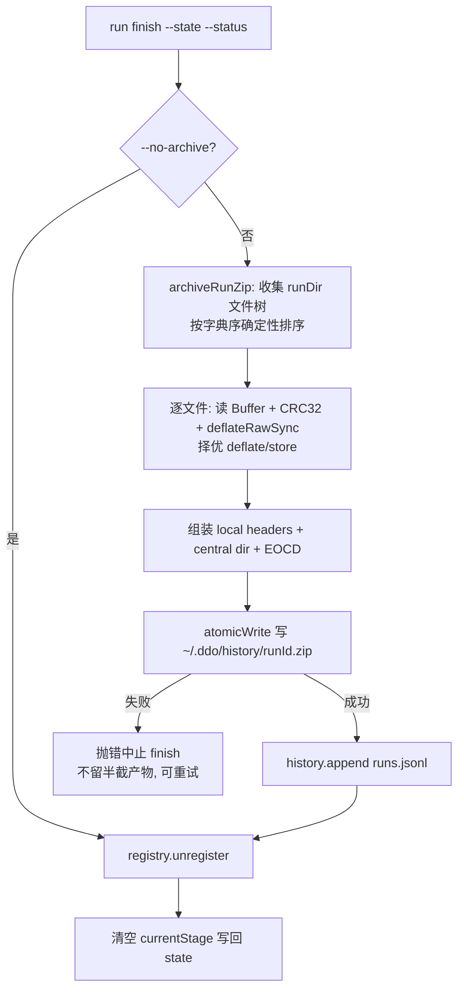

# Run Finish Zip 归档 Plan

---

## 执行摘要

本 Plan 将已确认 spec（FR-ARCH-1~4）落为技术方案：`run finish` 收口时把整个 runId 目录（runDir）用**纯 Node 零依赖 zip 写入器**打包为单个 `~/.ddo/history/<runId>.zip`，**取代**现有 `.state.json` 目录副本归档（`archiveState`）；`--no-archive` 语义不变（跳过一切用户级 history 写入）。迁移顺序保持 ①归档 ②runs.jsonl ③index 移除 ④清 currentStage，仅 ① 的实现由「复制单文件」换成「整目录 zip」，失败阻断、原子落盘、幂等覆盖。文档模式 `single`（本文件字符数约 9k ≤ 阈值 12000），revision 1。

---

## 范围与非目标

| 事项 | 说明 | AI 索引 |
|---|---|---|
| zip 归档能力 | run finish ①槽位由 state 单文件副本改为 runDir 整目录 zip 归档 | FR-ARCH-1 |
| 落点与形态 | `~/.ddo/history/<runId>.zip` 单文件，zip 内路径相对 runDir 根 | FR-ARCH-2、BQ-1-A |
| 取代目录副本 | 删除 `archiveState` 落目录行为，finish 后不再新增 `history/<runId>/` | FR-ARCH-4 |
| 开关联动 | `--no-archive` 同时跳过 zip 与 runs.jsonl（语义不变，行为面扩大到 zip） | FR-ARCH-3 |
| 非目标 | 不清理既有 `history/<runId>/` 目录；不做恢复/解压命令；不改 rollback `_del/`；不做 history 清理策略 | spec Non-goals |
| 非目标 | 不改 runs.jsonl 记录结构（statePath 仍指项目内原 state 文件） | — |

---

## 现有设计与复用基线

| 能力 | 文件路径 | 符号 | 证据类型 | 采用方式 | 适用边界 | AI 索引 |
|---|---|---|---|---|---|---|
| finish 迁移顺序与开关 | tools/cli.js | `runFinish`（L141-174） | Repository Fact | 扩展现有实现 | ①② 幂等、③④ 照旧的骨架不动，仅替换 ① 的实现体 | DEC-4 |
| state 副本归档（被取代） | tools/lib/history.js | `archiveState`（L28-34） | Repository Fact | 不适用 | 唯一调用方是 runFinish；删除并由 `archiveRunZip` 接替同槽位 | DEC-2 |
| 原子落盘 | tools/lib/fsutil.js | `atomicWrite`（L11-17） | Repository Fact | 复用现有实现 | 接受 Buffer；zip 先写 tmp 再 rename，杜绝半截 zip | DEC-3 |
| DDO_HOME 解析 | tools/lib/index-registry.js | `ddoHome`（L15-17） | Repository Fact | 复用现有实现 | 测试经 `DDO_HOME` 环境变量注入沙箱 | — |
| runDir 来源 | tools/lib/state.js | `assertDirs`（L39-53）/ `state.dirs.runDir` | Repository Fact | 复用现有实现 | `dirs` 为可选字段（历史 state 缺失）→ 回落 `path.dirname(statePath)` | DEC-5 |
| 收口测试基座 | tools/tests/lifecycle.test.js | finish 归档/`--no-archive` 用例（L114-158、L357-368） | Repository Fact | 扩展现有实现 | mkdtemp 沙箱 + `DDO_HOME` 指内 + spawnSync CLI 的既有约定 | VA-1 |

---

## 整体架构与流程

参与方不变：CLI `run finish` → history 模块（用户级）→ index-registry → state 文件（项目内）。变化集中在 history 模块内部（新增 zip 格式层 `tools/lib/zip.js`，归档编排由 `archiveState` 换成 `archiveRunZip`）。

异常流：zip 任一步失败（读源/组装/写盘）→ 异常向上抛出，`run finish` 以非零退出；②③④ 均未发生，run 仍处运行态，修复后可原命令重试（幂等）。

---

## 技术选型与方案对比

| 方案 | 来源 | 仓库适配性 | 代价与风险 | 状态 | 结论 | AI 索引 |
|---|---|---|---|---|---|---|
| 纯 Node：zlib.deflateRawSync + 自实现 CRC32 查表 | 初始 Plan | 仓库零 npm 依赖（无 package.json），Node 内置 zlib 即得真压缩 | 需手写 zip 容器格式（local header/central dir/EOCD），约百行 | accepted | 压缩收益实在（md/json 文本为主），零外部依赖，跨平台确定 | DEC-1 |
| 纯 Node：仅 store（不压缩） | 初始 Plan | 同上，格式层更简单 | 产物体积≈原目录，与「压缩成zip」的用户预期不符 | rejected | 作为 tiny 文件的逐条目回退路径保留（deflate 膨胀时降级 store） | DEC-1 |
| 系统 `zip` 命令子进程 | 初始 Plan | 依赖外部二进制，错误面走 stderr 解析 | 跨平台（含 Windows）不可移植；错误处理弱 | rejected | 与仓库「纯 Node 确定性 CLI」气质不符 | DEC-1 |
| npm 归档库（archiver/adm-zip） | 初始 Plan | 引入首个运行时依赖，破坏零依赖现状 | 安装/锁文件/供应链面全开 | rejected | 现有能力（Node 内置 zlib）已满足 | DEC-1 |

**DEC-2（PD-2）**：zip 落点 `~/.ddo/history/<runId>.zip` 平铺单文件；条目名 = 相对 runDir 根的 POSIX 路径（正斜杠），目录不单独立条目（由文件路径隐含）。依据：BQ-1 答案 A 的直接蕴含；平铺避免「目录里一个同名 zip」的冗余层级。

**DEC-3（PD-3）**：zip 失败阻断 finish（异常透传、非零退出）。依据：①槽位在最前，失败时后续步骤未发生、天然可重试；静默降级会丢失用户明确要求的归档产物（AC-1 无法交代）。

**DEC-4（PD-4）**：顺序维持 ①zip（原 archiveState 槽位）→ ②runs.jsonl 追加 → ③index 移除 → ④清 currentStage；重复 finish 对 zip 幂等覆盖（atomicWrite 同名 rename）。依据：既有迁移顺序注释（cli.js L154-155）语义不变。

**DEC-5**：runDir 取 `state.dirs?.runDir`，缺失回落 `path.dirname(statePath)`。依据：`dirs` 是可选字段（state.js L38 历史容错），statePath 恒为 `<runDir>/.state.json`。

---

## 数据模型设计

### 实体与字段

新增实体仅一个：zip 归档文件 `~/.ddo/history/<runId>.zip`。zip 内部条目集合 = runDir 递归全部**文件**（含点开头文件如 `.state.json`、`_del/` 回滚归档、`worktree-info.json` 等全部内容），条目名相对 runDir 根。`runs.jsonl` 记录结构与字段不变。

### schema 与 DDL（如适用）

不适用：无数据库。zip 格式契约见「算法设计」。

### 状态与不变量

- **内容不变量**：zip 解压结果与归档时刻的 runDir 逐字节一致（AC-1）；`.state.json` 在 zip 内保留**收束前最后位置**（zip 发生在清 currentStage 之前，与被取代的 archiveState 时序语义对齐）。
- **原子性不变量**：磁盘上不存在半截 zip（tmp + rename）。
- **无副作用不变量**：项目内 runDir 与 state 原文件零改动（AC-3）。

### 迁移、兼容与回滚

- 既有 `~/.ddo/history/<runId>/` 目录副本：**保留不动**（Non-goal），新旧形态在 history 中并存，无任何读取方（history query 尚未实现，`archiveState` 无其他调用方）。
- 行为回滚：revert 本次提交即回到 state 副本归档；zip 文件是新增产物，无 schema/格式负债。

---

## API 接口设计

| 接口/入口 | 请求 | 响应 | 错误与幂等 | 复用标准 | 实现职责 | AI 索引 |
|---|---|---|---|---|---|---|
| CLI `run finish`（行为变更，签名不变） | `--state <path> --status <done\|aborted\|failed> [--no-archive]` | `{ finished, finalStatus, archived }`（shape 不变） | zip 失败→异常退出非零；重复 finish 幂等覆盖 zip | 既有四通道约定（stdout JSON/stderr 人话/exit 码/state 现读） | ①槽位换 archiveRunZip；help 文案更新（L849-855） | FR-ARCH-1~4 |
| lib `history.archiveRunZip(runId, runDir, home)` | runId、runDir 绝对路径、可选 home | zip 目标路径 | 内部失败抛错（DEC-3）；幂等覆盖 | ddoHome() 解析、atomicWrite | 编排：调 zip 格式层 → 原子落盘 | DEC-2 |
| lib `zip.buildZip(entries)` / `zip.zipDir(dir)` | 目录或 {name, data} 条目序列 | Buffer | 确定性排序；无外部副作用 | 纯函数风格（同 assemble.js 气质） | 格式层：CRC32 + deflate + 容器组装 | DEC-1 |

---

## 算法设计

**zip 写入器（非平凡，唯一新算法）**

- 输入：runDir 绝对路径；输出：完整 zip 的 Buffer。
- 步骤：① 递归收集文件清单，按条目名字典序排序（确定性：同输入 → 同字节输出）；② 每文件读 Buffer → 查表法 CRC32（多项式 0xEDB88320，预生成 256 项表）→ `zlib.deflateRawSync` → 若压缩后 ≥ 原长则该条目降级 store（method 0），否则 method 8；③ 依次写 local file header（通用位标志 bit 11 = UTF-8 名，DOS 时间取条目 mtime）+ 数据，记录偏移；④ 汇 central directory（每条目一份）+ EOCD（条目数、目录偏移与长度）。
- 不变量：central directory 记录的偏移/长度与实际写入严格一致；EOCD 条目数 = 收集数；CRC 与数据一致。
- 边界：空文件（长度 0，合法）；空目录（不产生条目——runDir 实际至少含 .state.json，防御即可）；条目名非 ASCII（中文产物文件名由 bit 11 覆盖）；>4GB 单文件超出 docs 产物量级，不加 64 位扩展（zip32 上限内）。

其余均为普通业务逻辑（调用点替换、help 文案），不写伪代码。

---

## 文件变更计划

| 文件/目录 | 变更职责 | 复用或依赖 | AI 索引 |
|---|---|---|---|
| tools/lib/zip.js（新增） | zip 格式层：CRC32、条目组装、buildZip/zipDir | Node zlib（内置）；无仓库依赖 | DEC-1 |
| tools/lib/history.js | 删 `archiveState`，增 `archiveRunZip(runId, runDir, home)`，导出面更新 | fsutil.atomicWrite、ddoHome | DEC-2 |
| tools/cli.js | runFinish ①槽位调用替换 + runDir 解析（DEC-5 回落）+ help 文案 | history.archiveRunZip | DEC-4、DEC-5 |
| tools/tests/lifecycle.test.js | 既有 finish 归档两用例（L114-143、L357-368）改 zip 断言；--no-archive 用例（L146-158）增「无 zip」断言 | 既有 sandbox/spawnSync 约定 | VA-1、VA-2 |
| tools/tests/zip.test.js（新增，或并入 lifecycle） | zip 内容校验：unzip -p 抽取 .state.json 比对 + 结构断言 | 系统 unzip 仅测试环境用 | VA-1 |
| SKILL.md / README.md | 归档描述更新为 zip 语义（L31/L36/L149；README L125/L168/L221） | — | FR-ARCH-4 文档面 |

---

## 兼容、稳定性与回滚

| 关注点 | 适用性 | 设计/理由 | 回滚信号 | AI 索引 |
|---|---|---|---|---|
| 旧 history 目录副本 | 适用 | 保留不清理，无读取方受影响 | 无需回滚 | — |
| zip 格式正确性 | 适用 | 确定性排序 + 结构断言 + unzip 交叉验证 | 测试红 / 手动 unzip -t 失败 | VA-1 |
| finish 失败语义 | 适用 | 失败在最前槽位，重试幂等 | 用户报告 finish 报错但 run 状态未损 | DEC-3 |
| runs.jsonl 兼容 | 适用 | 记录结构零改动 | — | — |
| 部署面（skillRoot 副本） | 适用 | 仓库源改文档与实现；已部署副本随下次安装/同步更新，不在本 run 范围 | — | — |

---

## Verification Anchor

| 需验证契约 | 可观察结果 | 证据位置 | AI 索引 |
|---|---|---|---|
| AC-1：zip 存在且内容一致 | 沙箱内 finish 后 `history/<runId>.zip` 存在，unzip 抽取 `.state.json`/产物与 runDir 原文件逐字节一致 | tools/tests（lifecycle/zip 用例） | VA-1 |
| AC-2：--no-archive 跳过 | 无 zip、无 runs.jsonl、`archived:false` | tools/tests/lifecycle.test.js 用例 | VA-2 |
| AC-3：项目内零改动 | finish 后 git status 不变 | 手动/测试断言 runDir mtime 与内容 | VA-3 |
| AC-4：无目录副本 | history 下无 `history/<runId>/` 新目录 | tools/tests 断言 | VA-4 |
| 回归 | `node --test tools/tests/*.test.js` 全绿 | 本仓库测试约定 | VA-5 |

---

## 开放问题与 Spec 对应

| 问题 | 确定答案或阻塞原因 | 解决位置 | AI 索引 |
|---|---|---|---|
| PD-1 zip 生成方式 | DEC-1：纯 Node zlib.deflateRawSync + 自实现 CRC32，tiny 条目降级 store | 本 Plan 技术选型 | DEC-1 |
| PD-2 落点布局 | DEC-2：`history/<runId>.zip` 平铺，条目相对 runDir | 本 Plan | DEC-2 |
| PD-3 失败策略 | DEC-3：阻断 finish，原子落盘不留半截 | 本 Plan | DEC-3 |
| PD-4 执行顺序 | DEC-4：维持 ①②③④，zip 占 ① 槽位，幂等覆盖 | 本 Plan | DEC-4 |
| BQ-1（已裁定） | 答案 A 已写回 spec（FR-ARCH-4） | spec.md | — |

无阻塞项。

---

## 风险与下游交接

- **风险**：zip 容器格式手写出错（偏移/CRC/EOCD 细节）——缓解：zip 格式层独立成模块 + 结构化单测 + 系统 `unzip` 交叉验证（仅测试环境）。
- **风险**：中文/特殊文件名兼容——缓解：bit 11 UTF-8 标志 + 用例覆盖中文名产物（本仓库产物名即含中文场景少，以 spec.md 等固定名为主）。
- **Tasking/Coding 读取范围**：plan.md（single 模式，无 plans/ 分册）；实现严格按「文件变更计划」六行展开，zip.js 内部函数拆分由 Coding 自主。
- **事实失效处理**：若 runFinish 槽位结构、archiveState 签名、atomicWrite 能力与上述 Repository Fact 不符（含行号漂移），停止并报告，不得按失效契约硬改。

---

## 用户确认

- ✅ **同意**：批准本 Plan，进入后续编排。
- ❌ **修改：<反馈>**：按反馈修订，展示变化后重新确认。
- ❓ **提问：<问题>**：仅答疑，不改本 Plan。
- 📦 **归档**：列出 `atom-tasks/plan/references/` 下可用模板名（不产出文档）。
- 📦 **归档：<模板名>**：按名生成 tech-design 产物（记录模板名与 revision）。
