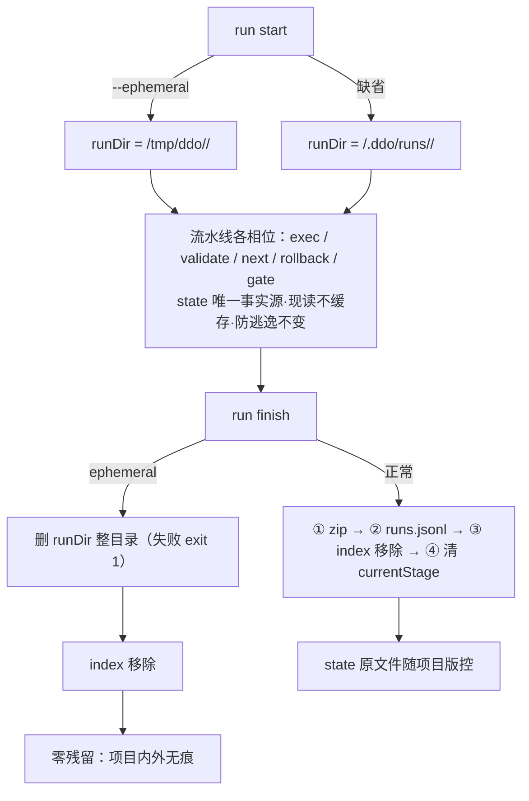

# RunId 目录创建可配与 State 居所 Plan

---

## 执行摘要

本 Plan 将已确认 spec（FR-1~4）落为技术方案：新增 `run start --ephemeral` 布尔旗标（guide 同步增问），启用后 run 的全部运行材料（含 `.state.json` 与产物）落 `<用户主目录>/tmp/ddo/<type>/<runId>/`，项目内不创建 runId 目录；`run finish` 读 `state.ephemeral` 走临时分支——跳过 zip 归档与 runs.jsonl 追加（蕴含免归档）、删除 runDir 整目录、移除 index 指针，实现项目内外零残留。正常模式（缺省）所有行为零变化：现有迁移顺序、目录布局、版控语义原样保留。核心适配点四处：`assertDirs` 的 runDir ⊂ projectRoot 校验为临时模式开显式例外、`resolveWorkdir` 改为优先 `state.dirs.projectRoot`（tmp 布局下 statePath 上溯推导失效）、`resume` 的项目过滤与元数据回落 `state.dirs`、closeout-worktree prompt 的产物入库步骤按 ephemeral 条件化。文档模式 `single`（约 10k 字符 ≤ 阈值 12000），revision 1。

---

## 范围与非目标

| 事项 | 说明 | AI 索引 |
|---|---|---|
| 临时模式开关 | `run start --ephemeral` 布尔旗标 + guide 第四问「运行材料居所」 | FR-2、AC-5 |
| 运行材料居所 | ephemeral 时 runDir = `<home>/tmp/ddo/<type>/<runId>/`，项目内零创建 | FR-2、AC-2 |
| state 标记与例外 | state 顶字段 `ephemeral: true`；`assertDirs` contain 校验开例外 | FR-3 |
| 结束即删 | run finish 临时分支：免归档 → 删 runDir → index 移除 | FR-4、AC-4 |
| 寻址适配 | resolveWorkdir / resume 改为优先 `state.dirs`（对 tmp 布局成立） | FR-3、AC-3 |
| 非目标 | 正常模式任何行为不变（缺省路径零改动）；不重构 `~/.ddo` 全局层；不做存量 runId 目录清理；不改 WTT 机制 | spec Non-goals |

---

## 现有设计与复用基线

| 能力 | 文件路径 | 符号 | 证据类型 | 采用方式 | 适用边界 | AI 索引 |
|---|---|---|---|---|---|---|
| run 启动装配 | tools/cli.js | `runStart`（L360-422） | Repository Fact | 扩展现有实现 | runDir 计算处（L386-390）按 ephemeral 分叉；state 组装处增 `ephemeral` 字段 | DEC-1、DEC-2 |
| finish 迁移编排 | tools/cli.js | `runFinish`（L141-176） | Repository Fact | 扩展现有实现 | noArchive 分支骨架不动，ephemeral 分支插在其前 | DEC-3、DEC-4 |
| 旗标解析 | tools/cli.js | `BOOLEAN_FLAGS`（L971） | Repository Fact | 复用现有实现 | 追加 `ephemeral` 成员即得布尔语义 | DEC-1 |
| 冷启动引导 | tools/cli.js | `runGuide`（L653-680） | Repository Fact | 扩展现有实现 | questions 数组增第四问，hint 更新映射 | DEC-1 |
| 目录声明校验 | tools/lib/state.js | `assertDirs`（L39-54） | Repository Fact | 扩展现有实现 | contain 检查增 ephemeral 例外参数；绝对路径校验保留 | DEC-5 |
| 工作目录判定 | tools/lib/workdir.js | `resolveWorkdir` / `projectRootOf` | Repository Fact | 扩展现有实现 | 优先 `state.dirs.projectRoot`，statePath 上溯降为历史回落 | DEC-5 |
| resume 发现层 | tools/cli.js | `runMetaFromPath`（L686-690）、`runResume`（L718-766） | Repository Fact | 扩展现有实现 | meta 与 `--project` 过滤均增 `state.dirs` 回落 | DEC-5 |
| homedir 解析惯例 | tools/lib/index-registry.js | `ddoHome`（L12-14） | Repository Fact | 复用现有实现 | `os.homedir()` 尊重 `HOME` 环境变量，测试隔离沿用此道 | DEC-2 |
| 原子写底座 | tools/lib/fsutil.js | `atomicWrite` / `withLock` | Repository Fact | 复用现有实现 | state 落 tmp 同样走原子写；index 锁语义不变 | — |
| 测试基座 | tools/tests/start.test.js 等 | mkdtemp 沙箱 + `DDO_HOME` 注入 + spawnSync CLI | Repository Fact | 扩展现有实现 | ephemeral 用例增 `HOME` 指向沙箱，隔离真实 `~/tmp` | VA-2~4 |

---

## 整体架构与流程

参与方：CLI（run start / run finish / guide / resume）→ state 文件（唯一事实源，居所二分）→ index-registry（全局指针）→ history（仅正常模式触达）。临时模式不新增模块，只新增「居所解析」与「结束删除」两段逻辑，全部落在既有函数的分叉里。

异常流：临时分支删除失败 → 整体 exit 1，state 与 index 完好（先删后 unregister 的顺序保证），用户排查后重跑 `run finish` 即恢复收口；run 中途崩溃 → tmp state 经 `~/.ddo/index.json` 指针被 `resume` 正常发现（寻址适配后含 `--project` 过滤）。

---

## 技术选型与方案对比

| 方案 | 来源 | 仓库适配性 | 代价与风险 | 状态 | 结论 | AI 索引 |
|---|---|---|---|---|---|---|
| 载体：run start 旗标 + guide 增问 | 初始 Plan | 旗标机制现成；guide 为冷启动唯一数据源，问句可被结构化消费 | 两处小改；无新子系统 | accepted | 采用：`--ephemeral` + guide 第四问 | DEC-1 |
| 载体：`.ddo/config.json` 项目级字段 | 初始 Plan | CLI 现无任何读取方，需新建配置读取子系统 | 为单一 case 引入持久配置面，违背最小实现 | rejected | 拒绝；per-run 粒度已满足 PR workflow 场景（run 由 agent 启动） | DEC-1 |
| tmp 路径：`<home>/tmp/ddo/<type>/<runId>` | 初始 Plan | 与项目内布局同构，排查直觉一致；`ddo/` 前缀隔离用户 tmp 内容 | 无 | accepted | 采用；`--dir-name` 与 `--ephemeral` 互斥（语义名对即删材料无意义，fail fast） | DEC-2 |
| tmp 路径：`os.tmpdir()` | 初始 Plan | 系统级 `/var/folders/...`，不在「用户根目录下」，重启清理策略不受控 | 违背用户原话定位 | rejected | 拒绝 | DEC-2 |
| tmp 路径：`~/.ddo/tmp` | 初始 Plan | `~/.ddo` 是持久索引/归档居所，混入易失材料违背分区 | 语义混淆 | rejected | 拒绝 | DEC-2 |
| 删除：run finish 内建分支 | 初始 Plan | finish 是唯一收口入口（契约既有），材料生命周期与 run 生命周期同界 | 分支逻辑 +6 行 | accepted | 采用 | DEC-3 |
| 删除：独立清理命令 | 初始 Plan | 多一步人工编排，违背「执行完成后直接删掉」 | 遗忘即残留 | rejected | 拒绝 | DEC-3 |
| 删除顺序：先删 runDir 后 unregister | 初始 Plan | 删除失败时 state+index 完好可重试 finish | 无 | accepted | 采用 | DEC-3 |
| state 标记：顶字段 `ephemeral: boolean` | 初始 Plan | 模式是 run 级属性，与 dirs（路径声明）正交 | 无 | accepted | 采用；缺省无字段 = 正常（存量 state 零迁移） | DEC-5 |
| state 标记：由 runDir 路径推断 | 初始 Plan | 隐式契约，路径规则一变即碎 | 脆弱 | rejected | 拒绝 | DEC-5 |

---

## 数据模型设计

### 实体与字段

state 顶层数组外增一个可选字段 `ephemeral: boolean`：出现且为 `true` 即临时模式；缺省（或 `false`）为正常模式。`assertState` 增校验：出现即须为布尔。`dirs` 三字段语义不变——`runDir` 指向 tmp 绝对路径，`projectRoot` / `tasksDir` 仍指真实项目。index.json、runs.jsonl 结构零变化（ephemeral run 不追加 runs.jsonl）。

### schema 与 DDL（如适用）

不适用：无数据库。CLI 帮助文档（cli.js 命令表）与 SKILL.md / README.md 的旗标说明为对外契约的文档面。

### 状态与不变量

- I1 唯一事实源：statePath 仍是全部语义命令的唯一入口，tmp 布局下现读不缓存契约不变。
- I2 防逃逸：产物声明仍为 runDir 内相对路径（`artifactPath` 双层校验对 tmp runDir 同样成立）。
- I3 居所不变量收窄：runDir ⊂ projectRoot 在正常模式成立；ephemeral 模式为显式例外——runDir 须位于 `<home>/tmp/ddo/` 之下（`assertDirs` 按例外放行，绝对路径校验保留）。
- I4 终态：ephemeral run 的 finish 成功路径必然终结于「runDir 不存在、index 无条目、history 无痕」。

### 迁移、兼容与回滚

存量 state 无 `ephemeral` 字段 → 缺省正常，零迁移。回滚 = revert 单 PR（无持久数据格式变化）。`os.homedir()` 在 `HOME` 缺失时回落系统接口（罕见，不额外处理）。

---

## API 接口设计

| 接口/入口 | 请求 | 响应 | 错误与幂等 | 复用标准 | 实现职责 | AI 索引 |
|---|---|---|---|---|---|---|
| `run start --ephemeral` | 布尔旗标（无值），与 `--title` / `--workflow` / `--type` / `--project` 组合 | 同现状结构；statePath 指向 `<home>/tmp/ddo/<type>/<runId>/.state.json`；state 含 `ephemeral: true` | 与 `--dir-name` 并传 → UsageError（exit 2）指明互斥；runId 碰撞沿用 freshRunId 重掷 | BOOLEAN_FLAGS 机制 | runDir 分叉计算 + state 标记写入 | DEC-1、DEC-2 |
| `guide` | 无 | questions 增第四问 `home`：「运行材料居所？」选项 正常（缺省）/ 临时（项目内不建 runId 目录，材料落 `~/tmp/ddo/`，finish 后即删，对应 `--ephemeral`）；hint 更新映射说明 | 无副作用不变 | runGuide 既有形态 | 冷启动可发现性 | DEC-1 |
| `run finish`（无新参） | 读 `state.ephemeral` | ephemeral：`{ finished, finalStatus, ephemeral: true, deleted: true }`；正常：现状返回 | 删除失败 → exit 1 + stderr 给出手动清理路径；重跑 finish 幂等（目录已删则直接走完剩余步） | runFinish 迁移编排 | 临时分支：免归档 → 删 runDir → unregister | DEC-3、DEC-4 |
| `resume [--project] [--run-id]` | 无变化 | 清单含 tmp 布局 run，projectRoot/type 元数据来自 `state.dirs` | `--project` 过滤对 tmp run 以 `state.dirs.projectRoot` 命中 | tryLoadState 惰性校验 | 过滤与 meta 的 dirs 回落 | DEC-5 |

---

## 算法设计

仅两处非平凡，均为顺序不变量而非数据结构：

1. **finish 临时分支顺序**：`①跳过 zip 与 runs.jsonl（蕴含免归档）→ ②fs.rmSync(runDir, { recursive: true, force: true, maxRetries: 3, retryDelay: 100 }) → ③registry.unregister`。不变量：② 成功前不动 index——失败时 state 与指针双完好，重试无残留半态。②③ 之后**不写回 state**（currentStage 清空对一个即将/已经消亡的文件无意义，正常分支该写回保留）。幂等：目录已不存在时 `force: true` 静默通过，重跑 finish 直接完成 ③。
2. **runDir 分叉解析**（runStart 内）：`ephemeral → path.join(os.homedir(), 'tmp', 'ddo', type, runId)`；正常 → 现状 `path.join(project, '.ddo', 'runs', type, dirName)`。两分支共用既有的「statePath 已存在则抛错」防重检查。复杂度 O(1)，无边界情形（runId 唯一性由 freshRunId 保证）。

其余适配（resolveWorkdir 优先 dirs、runMetaFromPath 回落、resume 过滤）为直改，无算法内容。

---

## 文件变更计划

| 文件/目录 | 变更职责 | 复用或依赖 | AI 索引 |
|---|---|---|---|
| tools/cli.js | runStart：旗标解析 + runDir 分叉 + state.ephemeral + `--dir-name` 互斥校验；runFinish：临时分支；runGuide：第四问 + hint；runResume / runMetaFromPath：dirs 回落；BOOLEAN_FLAGS 追加；命令表 run start / finish 条目 desc 更新 | BOOLEAN_FLAGS / runFinish 骨架 / runGuide 形态 | DEC-1~5 |
| tools/lib/state.js | assertState 增 `ephemeral` 可选布尔校验；assertDirs 增 ephemeral 例外参数（contain 检查跳过，绝对路径校验保留） | assertDirs 既有结构 | DEC-5 |
| tools/lib/workdir.js | resolveWorkdir 优先 `state.dirs.projectRoot`，statePath 上溯降为历史回落（tmp 布局下上溯结果错误） | dirs 显式化契约（11） | DEC-5 |
| atom-tasks/closeout-worktree/prompt.md | 产物入库与终态入库步骤增条件：`state.ephemeral` 时跳过（材料在项目外无物可入库）；免归档收口指引改为 ephemeral 语义下直接 `run finish` | closeout 既有步骤序 | DEC-5 |
| SKILL.md / README.md | 临时模式说明：旗标、居所、结束即删、WTT 组合边界（产物不入分支，适合流程型 run） | SKILL 冷启动协议节 | DEC-1、DEC-4 |
| tools/tests/start.test.js | 新用例：ephemeral 启动落 tmp 布局、项目内无新目录、`--dir-name` 互斥报错、缺省行为回归 | mkdtemp + HOME/DDO_HOME 注入 | VA-1~3 |
| tools/tests/lifecycle.test.js | 新用例：ephemeral finish 删除 runDir、index 移除、history 无 zip 无 jsonl 行、删除幂等重跑 | finish 既有用例形态 | VA-4 |
| tools/tests/resume.test.js、tools/tests/list.test.js | resume 发现 tmp run（--project 命中）；guide 含第四问 | 既有断言形态 | VA-3、VA-5 |

---

## 兼容、稳定性与回滚

| 关注点 | 适用性 | 设计/理由 | 回滚信号 | AI 索引 |
|---|---|---|---|---|
| 存量 state 兼容 | 适用 | `ephemeral` 缺省即正常；assertState 对旧 state 零新约束 | 现有套件红 | FR-1 |
| 正常模式零变化 | 适用 | 缺省路径代码不动，仅新增分叉；AC-1 由既有测试全绿背书 | 任何既有用例红即停 | FR-1、VA-1 |
| 删除不可逆 | 适用 | aborted / failed 也删（spec 解释表声明）；诊断价值让位于零残留契约 | 用户反馈需要失败留痕 → 后续迭代按状态区分 | FR-4 |
| tmp 孤儿目录 | 适用 | 未跑 finish 的崩溃 run 由 index 指针 + resume 兜底可续；index 已消的孤儿不自动清（与存量清理同属 Non-goal） | — | 风险 R2 |
| ephemeral × WTT 组合 | 适用 | runDir 在项目外 → 产物不入 worktree 分支；guide desc 与 SKILL.md 明示「适合流程型 run」 | — | 风险 R3 |
| 测试环境隔离 | 适用 | `HOME` 指沙箱防真实 `~/tmp` 污染（os.homedir 尊重 HOME） | 用例在真机留痕即隔离失效 | VA-2~4 |

---

## Verification Anchor

| 需验证契约 | 可观察结果 | 证据位置 | AI 索引 |
|---|---|---|---|
| 正常模式行为与现状一致 | 既有全量测试绿（`node --test tools/tests/*.test.js`） | tools/tests/*.test.js | VA-1 |
| ephemeral 启动落 tmp 布局、项目零创建 | statePath 位于沙箱 `tmp/ddo/<type>/<runId>/`，项目 `.ddo/runs` 无新目录 | tools/tests/start.test.js | VA-2 |
| ephemeral run 全链路命令可用 | exec / validate / next / gate 在 tmp state 上走通一个最小流 | tools/tests/start.test.js + gate.test.js 用例组合 | VA-3 |
| finish 后零残留 | tmp runDir 不存在、index 无条目、history 目录无新 zip 且 runs.jsonl 行数不变；重跑 finish 幂等 | tools/tests/lifecycle.test.js | VA-4 |
| 配置可发现 | guide 输出含 `home` 问卷；run start 帮助含 `--ephemeral` | tools/tests/list.test.js | VA-5 |

---

## 开放问题与 Spec 对应

| 问题 | 确定答案或阻塞原因 | 解决位置 | AI 索引 |
|---|---|---|---|
| PD-1 配置载体与粒度 | `run start --ephemeral` 旗标 + guide 第四问；单载体无优先级问题 | 本 Plan 技术选型 / cli.js | DEC-1 |
| PD-2 tmp 路径与命名 | `<home>/tmp/ddo/<type>/<runId>/`；runId 唯一性沿用 freshRunId | 本 Plan 技术选型 / cli.js | DEC-2 |
| PD-3 删除位置与容错 | finish 内建；先删后 unregister；失败 exit 1 给手动路径；rmSync force+maxRetries 幂等 | 本 Plan 算法设计 / cli.js | DEC-3 |
| PD-4 与 --no-archive / history 组合 | ephememal 蕴含免归档（zip 与 jsonl 均无）；并传 `--no-archive` 冗余不报错；`--no-archive` 单独用维持现状（保留不删） | 本 Plan 技术选型 / cli.js | DEC-4 |
| PD-5 引用面适配 | state.ephemeral 标记 + assertDirs 例外 + resolveWorkdir/resume dirs 优先 + closeout prompt 条件化 | 本 Plan 文件变更计划 | DEC-5 |

---

## 风险与下游交接

- **R1 删除不可逆**：失败 run 的材料同样消亡（spec 解释表已声明该解释）。缓解：SKILL/README 明示；若实践需要失败留痕，后续按 finalStatus 分叉（独立迭代）。
- **R2 tmp 孤儿目录**：崩溃且 index 已消的 run 材料无自动清理。缓解：顺序不变量保证「index 在则 state 在」；孤儿清理与存量清理同属 Non-goal，用户可手动清 `~/tmp/ddo/`。
- **R3 ephemeral × WTT 误导**：feature run 误用 ephemeral 会致产物不入分支、交付链产物入库空转。缓解：guide 选项 desc 与 SKILL.md 边界说明；closeout prompt 条件化后空转变为显式跳过。
- **下游读取范围**：single 模式全文即 plan.md；Coding 按文件变更计划表逐文件实施，行号引用以符号名为准（`runStart` / `runFinish` / `runGuide` / `runResume` / `assertDirs` / `resolveWorkdir`）。
- **事实失效处理**：若实施时发现 cli.js 结构与 Repository Fact 描述不符（如函数重构移位），停止并报告，不得按失效锚点盲改。

---

## 用户确认

- ✅ **同意**：批准本 Plan，进入后续编排。
- ❌ **修改：<反馈>**：按反馈修订本 Plan（revision +1），展示变化后重新确认。
- ❓ **提问：<问题>**：仅答疑，不修改本 Plan。
- 📦 **归档**：列出 `atom-tasks/plan/references/` 下可用模板名（不产出文档）。
- 📦 **归档：<模板名>**：按模板名生成 tech-design 产物（记录模板名与来源 revision）。
