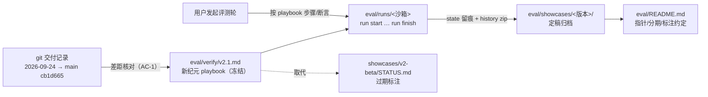

# Eval 评测体系重设计 Plan

**revision: R1** ｜ 模式: single ｜ 依据: spec.md（已确认，BQ-1/2/3 已写回）

## 执行摘要

本 Plan 将「eval/showcases 过期核对 + 新评测方案设计」落为三个文档变更：新增 `eval/verify/v2.1.md`（新纪元 playbook，自包含两层结构：回归层 + 增量层，专项按 P0/P1 分期）、为旧 showcase 落 `eval/showcases/v2-beta/STATUS.md` 过期标注、更新 `eval/README.md`（当前版本指针 + 分期/标注/归档附属物约定）。核对结论（AC-1）固化在 playbook 的覆盖差距表内，使证据随版本演进可追溯。纯文档交付，不执行评测、不动内核与任务定义。

## 范围与非目标

| 事项 | 说明 | AI 索引 |
|---|---|---|
| 新版 playbook | `eval/verify/v2.1.md` 全量设计：锚定表、覆盖差距表、重点注意（回归层 + 增量层）、输入清单、执行步骤与断言、比较基准、判定与记录 | FR-DESIGN-1 / FR-SCOPE-1 / FR-SCOPE-2 |
| 旧 showcase 标注 | `eval/showcases/v2-beta/STATUS.md`：已过期、被 v2.1 取代 | FR-LEGACY-1 |
| eval/README 更新 | 当前版本指针切换 + 专项分期约定 + STATUS 标注约定 + zip 归档附属物 | FR-CONV-1 / PD-3 |
| 非目标 | 不执行评测、不新增 showcase 运行数据；不改 tools/、atom-tasks/、workflows/；不做无关文档改版 | spec Non-goals |

## 现有设计与复用基线

| 能力 | 文件路径 | 符号/锚点 | 证据类型 | 采用方式 | 适用边界 | AI 索引 |
|---|---|---|---|---|---|---|
| playbook 章节骨架 | eval/verify/v2-beta.md | §0 锚定表～§6 首跑基线 | Repository Fact | 复用现有实现 | 已冻结只读；新 playbook 沿用骨架并重写内容 | DEC-2 |
| 三目录约定与沙箱规范 | eval/README.md | 目录约定表 / 沙箱规范节 | Repository Fact | 扩展现有实现 | 追加约定不推翻既有语义 | PD-3 |
| showcase 归档布局 | eval/showcases/v2-beta/ | artifacts/ state-archive/ timeline.md ASSESSMENT.md | Repository Fact | 复用现有实现 | 新 showcase 同构；zip 附属物为新增约定 | DEC-5 |
| 能力交付证据 | git log（2026-09-24 → main `cb1d665`） | PR #51–#63 提交序列 | Repository Fact | 复用现有实现 | 差距核对的唯一标尺来源 | FR-CHECK-1 |
| 被测版本锚点 | SKILL.md frontmatter | `version: 2.0.2` | Repository Fact | 复用现有实现 | 锚定表输入；纪元标签不复读此值 | DEC-1 |
| 测试基线断言 | tools/tests/ | node --test 119 用例 | Repository Fact | 复用现有实现 | playbook 步骤 0 的比较基准 | AC-2 |

## 整体架构与流程

评测体系信息流（本次改动即虚线右侧三件落盘物）：

## 技术选型与方案对比

| 方案 | 来源 | 仓库适配性 | 代价与风险 | 状态 | 结论 | AI 索引 |
|---|---|---|---|---|---|---|
| playbook 命名 `v2.1.md`（纪元标签） | 初始 Plan | 与 v2-beta 命名序列自然衔接；锚定表内记录 SKILL 2.0.2 + commit，标签与 metadata 解耦 | 无 | accepted | 纪元标签「v2 + 一批增量能力」，不复读易漂移的 metadata 小版本 | DEC-1 |
| 命名 `v2-ga.md`（转正式） | 初始 Plan | 呼应 ASSESSMENT「转正式」结论 | 「正式」语义模糊，后续小版本无法续排 | rejected | — | DEC-1 |
| 沿用 v2-beta.md 追加复验 | 初始 Plan | 无新文件 | 违反其自声明冻结约定 | rejected | — | DEC-1 |
| 单文件自包含 + 两层结构（回归层压缩表 + 增量层详表 + P0/P1 分期） | 初始 Plan | 每纪元一个 playbook 自足，执行者无需拼装多文件 | 文件较长 | accepted | 冻结约定要求自包含；分期解决 BQ-2 成本问题 | DEC-2 |
| 增量式 playbook（只写新能力，回归引用旧文件） | 初始 Plan | 文件短 | 跨文件断言拼接易错位 | rejected | — | DEC-2 |
| 按专项拆多个 playbook | 初始 Plan | — | 文件数膨胀，P0/P1 已可内表达分期 | rejected | — | DEC-2 |
| 标注载体 `STATUS.md`（归档目录内新增文件） | 初始 Plan | 不触碰冻结正文，git 可见 | 多一个小文件 | accepted | 归档正文零改动的唯一安全路径 | DEC-3 |
| ASSESSMENT.md 顶部加横幅 | 初始 Plan | 显眼 | 修改已归档评估正文，破坏档案完整性 | rejected | — | DEC-3 |
| 差距结论固化进 playbook 覆盖差距表 | 初始 Plan | 随版本演进可持续对照 | 无 | accepted | 独立 GAP.md 会随下一版再过期 | DEC-4 |

## 数据模型设计

### 实体与字段

纯文档交付，无运行时实体。文档元数据契约：playbook 锚定表字段沿用 v2-beta §0 六项（验证目标版本 / playbook 版本 / 关联归档 / 测试基线 / 维护约定 / 失效判据）；`STATUS.md` 四字段（状态 / 取代者 / 判定依据 / 标注日期）。

### schema 与 DDL（如适用）

不适用——无数据存储变更。

### 状态与不变量

- 冻结不变量：`eval/verify/v2-beta.md` 与 `eval/showcases/v2-beta/` 现有文件内容零改动（本次唯一例外是目录内**新增** STATUS.md）。
- 锚定唯一性：同期仅一个 playbook 是 README「当前版本」指向的现行版。
- D 缺陷编号全局单调递增：v2-beta 已用至 D-4，新纪元从 D-5 起。

### 迁移、兼容与回滚

无 schema 迁移。文档层迁移 = 旧 showcase 加 STATUS.md + README 指针切换；回滚 = revert 本次提交（三文件均为新增或局部修改，无破坏性操作）。

## API 接口设计

| 接口/入口 | 请求 | 响应 | 错误与幂等 | 复用标准 | 实现职责 | AI 索引 |
|---|---|---|---|---|---|---|
| 不适用 | — | — | — | — | 本次为纯文档交付，无 CLI/API 变化；评测中引用的命令均为既有注册表命令 | — |

## 算法设计

不适用——无算法、状态机或并发逻辑变更；差距核对为逐维度人工比对，方法在 playbook §1 覆盖差距表中固化。

## 文件变更计划

| 文件/目录 | 变更职责 | 复用或依赖 | AI 索引 |
|---|---|---|---|
| `eval/verify/v2.1.md` | 新增：新纪元 playbook 全量——§0 锚定（SKILL 2.0.2 @ main cb1d665、测试 119）、§1 覆盖差距表（AC-1 落点）+ 重点注意（回归层 F1–F10 压缩表 + 增量层 F11–F19 详表）、§2 输入清单（含 P1 专项环境：GitHub 仓库、worktree 目录）、§3 执行步骤（P0 主链沿用 v2-beta 决议脚本并修正 F9→zip 断言 + 专项 A 交互闭环 / B WTT / C PR 交付链）、§4 比较基准（zip 附属物入 state-archive）、§5 判定与记录（D-5 起续号、P1 可延期）、§6 基线说明 | 复用 v2-beta 骨架；依赖 README 约定、git 交付证据 | DEC-1/2/4/5 |
| `eval/showcases/v2-beta/STATUS.md` | 新增：过期标注——状态（已过期）/ 取代者（eval/verify/v2.1.md）/ 判定依据（失效判据命中：新命令、state 新字段、门语义变化）/ 标注日期 | 新增实现（仓库无既有标注机制） | DEC-3 |
| `eval/README.md` | 修改：当前版本指针 v2-beta→v2.1；目录约定表补「旧 playbook 冻结、按纪元新建」「showcase 被取代时加 STATUS.md」；新增「专项分期」小节（P0 每轮必做 / P1 按需或里程碑）；showcase 归档补 zip 附属物约定 | 扩展现有实现 | PD-3 |

## 兼容、稳定性与回滚

| 关注点 | 适用性 | 设计/理由 | 回滚信号 | AI 索引 |
|---|---|---|---|---|
| v2-beta playbook 冻结 | 适用 | 零改动，仅在新文件中被引用 | v2-beta.md 出现 diff | DEC-3 |
| 旧 showcase 归档完整性 | 适用 | 正文零改动，标注走目录内新增 STATUS.md | 归档现有文件出现 diff | FR-LEGACY-1 |
| README 指针正确性 | 适用 | 指向的 v2.1.md 必须同提交落盘 | 指针目标缺失 | PD-3 |
| 断言时效性 | 适用 | playbook 断言须逐条对照当前 CLI 注册表与 SKILL.md（v2-beta step14 的 state 副本断言已因 #51 失效，是本次要修的典型） | 评测轮断言大面积失败 | DEC-4 |

## Verification Anchor

| 需验证契约 | 可观察结果 | 证据位置 | AI 索引 |
|---|---|---|---|
| 过期核对结论存在且逐维度 | v2.1.md §1 含覆盖差距表：已覆盖（F1–F10 对应能力）与未覆盖（2026-09-24 后交付的能力）分列 | eval/verify/v2.1.md | AC-1 |
| 每个待评能力有方法与判据 | F11–F19 各有评测步骤与通过断言（专项含分期标注） | eval/verify/v2.1.md §1/§3 | AC-2 |
| 设计落盘且不执行评测 | 三文件存在；eval/runs/ 无新增沙箱；tools/、atom-tasks/、workflows/ 零 diff | git status / 仓库树 | AC-3 |
| 冻结不变量成立 | v2-beta.md 与旧 showcase 现有文件零 diff（仅新增 STATUS.md） | git diff | DEC-3 |

## 开放问题与 Spec 对应

| 问题 | 确定答案或阻塞原因 | 解决位置 | AI 索引 |
|---|---|---|---|
| BQ-1 交付形态 | 只产出设计，评测执行留待用户另起 run（spec 已写回） | 文件变更计划（无 runs/ 新增） | FR-DESIGN-1 |
| BQ-2 专项覆盖 | 纳入专项，按 P1 分期标注（WTT、PR 交付链） | v2.1.md §2/§3 分期设计 | FR-SCOPE-2 |
| BQ-3 旧 showcase 处置 | 保留 + STATUS.md 标注 | eval/showcases/v2-beta/STATUS.md | FR-LEGACY-1 |
| PD-1 章节结构与命名 | 沿用 v2-beta 骨架；命名 v2.1.md（纪元标签） | DEC-1/DEC-2 | — |
| PD-2 归档细节 | 沿用四件套布局 + zip 附属物入 state-archive | DEC-5 | — |
| PD-3 README 改法 | 指针 + 约定补充 + 分期小节（见文件变更计划） | eval/README.md 条目 | PD-3 |
| D 编号续号 | 从 D-5 起（v2-beta §5 全局单调约定） | v2.1.md §5 | — |

## 风险与下游交接

- **风险与缓解**：① 断言与 CLI 实际行为错位——coding 阶段逐条对照 `tools/cli.js` 注册表与 SKILL.md，不得凭记忆写断言；② P1 专项含真实 GitHub PR 与分支操作——playbook 内标注人工步骤与可延期性；③ 锚定漂移——锚定表记录 SKILL 2.0.2 + main `cb1d665` + 测试 119 三重锚。
- **下游读取范围**：coding 读 spec.md + 本 plan + `eval/verify/v2-beta.md`（骨架与断言原文）+ `eval/README.md` + git 交付记录（PR #51–#63）。产物写入 Context: 工作目录声明的 worktree。
- **事实失效处理**：若实施中发现仓库事实与本 plan 记载不符（如断言涉及的行为已被改动），停止并报告，不得自行改已批准契约。

## 用户确认

- **同意**：批准本 Plan，进入 coding。
- **修改：<反馈>**：按反馈修订，展示变化后重新送审。
- **提问：<问题>**：只读答疑。
- **归档**：列出可用模板名（当前：`ddo.md`），不产出文档。
- **归档：ddo.md**：按该模板生成 tech-design 归档产物（记录模板名与 revision R1）。
