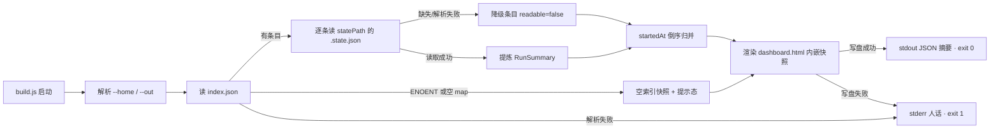

# Ddo Index Dashboard Showcase — 技术 Plan

revision: 1（single 模式）

## 执行摘要

以「基于 `~/.ddo/index.json` 的开发中需求 dashboard」为 case，在 `eval/runs/20260929-ddo-dashboard/` 新建独立沙箱项目：零依赖 Node 生成器 `build.js` 读取 DDO_HOME 全局索引并逐 run 提炼状态摘要，渲染为可直接双击打开的单文件 `dashboard.html`（内嵌数据快照 + 内联样式）；run finish 后按 eval/README.md 既有流程归档 showcase 材料。关键结论：数据获取采用「生成器内嵌快照」方案（同机制先例 `visualize.js` 已在仓库内验证），不做拖拽载入、不起服务。本 plan 为 single 模式，全部内容在本文档内。

## 范围与非目标

| 事项 | 说明 | AI 索引 |
|---|---|---|
| dashboard 沙箱项目 | `eval/runs/20260929-ddo-dashboard/`：build.js + 生成的 dashboard.html | T-1 |
| 只读消费全局索引 | 读 `DDO_HOME/index.json`（缺省 `~/.ddo`）+ 各 run `.state.json`，零写入 | T-2 |
| showcase 归档 | run finish 后按 eval/README.md 归档（ASSESSMENT.md + timeline.md + 产物副本），属收尾动作非本阶段文件变更 | T-3 |
| 非目标 | 不改 tools/atom-tasks/workflows；不展示 history 历史归档；不起 web 服务；不进仓库正式工具链 | T-4 |

## 现有设计与复用基线

| 能力 | 文件路径 | 符号 | 证据类型 | 采用方式 | 适用边界 | AI 索引 |
|---|---|---|---|---|---|---|
| index.json 指针注册表（结构契约 + DDO_HOME 解析） | tools/lib/index-registry.js | `readAll` / `ddoHome` / `indexPath` | Repository Fact | 复用现有实现（作为读取方契约：`{runId:{statePath,startedAt}}`、`DDO_HOME \|\| ~/.ddo`、ENOENT→空） | 只读，不持锁不写入 | R-1 |
| 单文件静态 HTML 生成先例（读 index→解析 state→生成 HTML） | eval/runs/20260924-visualizer-v2beta/visualize.js | `main()`（`--home`/`--out`） | Repository Fact | 复用现有实现（模式复用：flag 解析、四通道契约 stdout=JSON 摘要/stderr=人话/exit 0·1、单文件输出） | 该沙箱为归档材料，模式复用不直接 require | R-2 |
| 五状态色/标签语义 | eval/runs/20260924-visualizer-v2beta/visualize.js | `STATUS_COLOR` / `STATUS_LABEL` | Repository Fact | 复用现有实现（pending/running/done/failed/waiting-human 五状态映射沿用） | — | R-3 |
| `.state.json` 结构（runId/title/startedAt/git/dirs/currentStage/stages map） | tools/lib/state.js 及实际 state 文件 | 顶层字段 + `stages[<name>].status/.gate` | Repository Fact | 复用现有实现（enrichment 数据源，只读） | — | R-4 |
| 沙箱命名与布局约定 | eval/README.md §沙箱规范 | `runs/YYYYMMDD-<slug>` | Repository Fact | 复用现有实现（平铺 JS+HTML、无 package.json） | — | R-5 |
| showcase 归档流程 | eval/README.md §归档流程 | — | Repository Fact | 复用现有实现 | 发生在 run finish 后 | R-6 |

## 整体架构与流程

参与方与边界：`build.js`（唯一主动方，零依赖 Node 脚本）→ 只读 `DDO_HOME/index.json` → 只读各 `statePath` 指向的 `.state.json` → 产出 `dashboard.html`（数据以 JSON 快照内嵌，浏览器打开无任何运行时取数）。流水线侧（CLI/state）不被触碰。

## 技术选型与方案对比

| 方案 | 来源 | 仓库适配性 | 代价与风险 | 状态 | 结论 | AI 索引 |
|---|---|---|---|---|---|---|
| C1 生成器内嵌快照（node build.js → dashboard.html） | 初始 Plan（R-2 先例同机制） | 高——先例已在仓库验证，AC-1「打开即见」直接满足 | 快照非实时（页面标注生成时间缓解） | accepted | **DEC-1（PD-1 答案）**：采用 | C-1 |
| C2 纯静态 HTML + 页面内拖拽/选择 index.json | 初始 Plan | 中——file:// 下 FileReader 可行 | 打开后为空态需手动载入，AC-1 不满足；演示多一步 | rejected | 弃用 | C-2 |
| C3 本地 web 服务实时读 | 初始 Plan | 低——与 spec BQ-1 决议（静态单文件）冲突 | 服务依赖 | rejected | 与决议冲突，弃用 | C-3 |
| 列表视图（非图布局） | 初始 Plan | 高——需求是「列表+状态」，visualizer 的分层图布局（layout.js）针对工作流结构，不适用 | — | accepted | **DEC-2**：列表视图，沿用 R-3 状态语义 | C-4 |
| 刷新 = 重新生成 | 初始 Plan | 高——快照语义自洽 | 无自动轮询 | accepted | **DEC-3（PD-4 答案）**：重复执行 build.js 即刷新 | C-5 |

## 数据模型设计

### 实体与字段

- **IndexEntry**（外部契约，R-1，只读）：`{ runId: string(18, YYYYMMDD-HHMMSS-4hex), statePath: string(绝对路径), startedAt: ISO8601 }`。
- **RunSummary**（派生只读视图，内嵌快照的单元）：`{ runId, title, type, startedAt, currentStage, stages: [{ name, status, gateWaiting }], gitBranch, projectRoot, statePath, readable, degraded? }`。`type` 从 statePath 的 `.ddo/runs/<type>/<runId>` 路径段提取；`gateWaiting` 由 `stages[<name>].gate` 存在且未关闭推导；`readable=false` 时仅保留 index 侧字段并填 `degraded` 原因。

### schema 与 DDL（如适用）

不适用——无数据库；数据源为既有 JSON 文件，结构契约以 R-1/R-4 为准。

### 状态与不变量

- 不变量 1（只读）：dashboard 生成链路对 `~/.ddo` 与各 `.state.json` 零写入。
- 不变量 2（快照一致）：页面呈现的数据恒等于生成时刻内嵌的 JSON，无运行时取数。
- 不变量 3（降级不静默）：`readable=false` 的条目显式呈现在列表中并标注原因，不隐藏、不中断整体。

### 迁移、兼容与回滚

不适用——无持久化；沙箱目录整体可删（FR-DASH-4），删除即完整回滚。

## API 接口设计

| 接口/入口 | 请求 | 响应 | 错误与幂等 | 复用标准 | 实现职责 | AI 索引 |
|---|---|---|---|---|---|---|
| `node build.js [--home <DDO_HOME>] [--out <file>]` | CLI flags，缺省 `--home`=`DDO_HOME \|\| ~/.ddo`、`--out`=`./dashboard.html` | dashboard.html 落盘；stdout JSON 摘要 `{ runs, total, degraded, generatedAt, out }` | index.json 解析失败或写盘失败 → stderr 人话 + exit 1；可重复执行，幂等覆盖输出 | 四通道契约 + `--home`/`--out` 语义（R-2）；DDO_HOME 解析（R-1） | 读索引 → enrich → 排序 → 渲染 | A-1 |

## 算法设计

无非平凡算法。主流程为线性归并：读索引 → 逐条 enrich（单条容错降级）→ 按 `startedAt` 倒序 → 渲染。边界三种：空索引（呈现提示态）、单条降级（`readable=false` 行）、index.json 损坏（exit 1）。

## 文件变更计划

| 文件/目录 | 变更职责 | 复用或依赖 | AI 索引 |
|---|---|---|---|
| `eval/runs/20260929-ddo-dashboard/build.js` | 新增：零依赖 Node 生成器（头部注释说明用法；四通道契约） | R-1 契约、R-2 模式、R-3 语义 | F-1 |
| `eval/runs/20260929-ddo-dashboard/dashboard.html` | 新增产物：内嵌快照 JSON + 内联样式，双击即开 | 由 F-1 生成 | F-2 |

## 兼容、稳定性与回滚

| 关注点 | 适用性 | 设计/理由 | 回滚信号 | AI 索引 |
|---|---|---|---|---|
| 对流水线机制的影响 | 不适用 | 只读消费，tools/atom-tasks/workflows 零变更 | — | S-1 |
| index.json 结构演进 | 适用 | 按最小字段集（statePath/startedAt）宽容读取，多余字段忽略 | build.js exit 1 或字段缺失告警 | S-2 |
| 快照时效误导 | 适用 | 页面显著标注 generatedAt 生成时间 | 用户对照实际 index.json | S-3 |
| 沙箱生命周期 | 适用 | 独立目录，showcase 归档后可整体删除 | 归档完成 | S-4 |

## Verification Anchor

| 需验证契约 | 可观察结果 | 证据位置 | AI 索引 |
|---|---|---|---|
| AC-1：打开即见运行中 run 列表 | 浏览器打开 dashboard.html，列表含本次 showcase run（runId `20260929-221955-b3cd`）及 runId/标题/类型/当前阶段等字段 | eval/runs/20260929-ddo-dashboard/dashboard.html（内嵌 JSON 可直接检索 runId） | V-1 |
| AC-3：沙箱存在可打开的单文件 | 目录与文件存在，双击可开 | eval/runs/20260929-ddo-dashboard/ | V-2 |
| AC-2：showcase 归档材料 | finish 后 eval/showcases/ 下出现本次归档（ASSESSMENT.md/timeline.md/产物副本） | eval/showcases/（run finish 后验证） | V-3 |

## 开放问题与 Spec 对应

| 问题 | 确定答案或阻塞原因 | 解决位置 | AI 索引 |
|---|---|---|---|
| PD-1 数据获取方式 | 生成器内嵌快照（DEC-1） | 本文 §技术选型 | Q-1 |
| PD-2 解析容错 | 三级容错：空索引提示态 / 单条降级不阻塞 / index 损坏 exit 1 | 本文 §算法设计 | Q-2 |
| PD-3 展示字段 | RunSummary 字段集（DEC-4 于 §数据模型） | 本文 §数据模型 | Q-3 |
| PD-4 更新方式 | 重新执行 build.js（DEC-3） | 本文 §技术选型 | Q-4 |
| showcase 归档目录名 | 非阻塞：finish 归档时与用户确认（沿用 v2-beta 追加或立新名），不影响 coding | run finish 后 | Q-5 |

## 风险与下游交接

- **风险与缓解**：① index.json 结构无版本字段、未来演进——最小字段宽容读取（S-2）；② 快照过时被误读为实时——页面标注 generatedAt（S-3）；③ 演示时本 run 恰处 coding 相位——currentStage 呈现即真实快照，恰为演示素材。
- **下游读取范围**：single 模式无分册；coding 从本 plan.md 出发，按 §文件变更计划实施，样式与交互细节由 coding 自主（属实现细节）。
- **事实失效处理**：coding 中若发现 index.json/state 实际结构与 R-1/R-4 不符，停止实施并报告，不得自行改已批准契约。

## 用户确认

- 同意：批准本 plan，进入 Coding。
- 修改：<反馈>：按反馈修订，展示变化后重新送审。
- 提问：<问题>：仅答疑，不改变确认状态。
- 归档：列出可用归档模板名（atom-tasks/plan/references/ 下 *.md）。
- 归档：<模板名>：按模板生成 tech-design 产物（记录模板名与 revision）。
