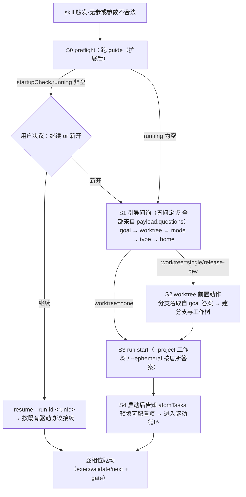
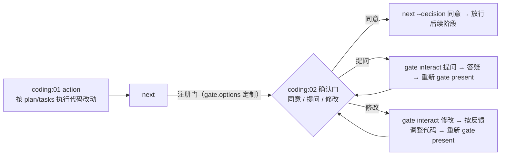

# 启动状态机稳定性 Plan

revision: 1 · 模式：single

## 执行摘要

基于已批准 spec（5 FR / 5 AC，BQ-1 决议形态 (b) 协议+结构层），本 plan 把 ddo 启动流程定版为一个由 CLI payload 驱动的确定性状态机：`guide` 命令扩展为「启动检查」单一数据源（新增 `startupCheck` 运行中 run 清单 + `worktree` 场景问，问题序列五问定版），SKILL.md 冷启动节重写为引用 payload 的状态机描述（消除双源）；`coding` 任务补 `:02` 人类确认相位（同意/提问/修改，复用既有 gate 机制）；`.gitignore` 追加本地运行时产物条目。全部为 SKILL.md + atom-tasks + tools 层变更，无数据库、无外部服务。关键结论：coding 静默推进的根因是任务无 phases 声明（schema：省略 = 单相位 01/action）；启动问询漂移的根因是 guide payload 与 SKILL.md 文字双源。

## 范围与非目标

| 事项 | 说明 | AI 索引 |
|---|---|---|
| guide 命令扩展 | `startupCheck`（running 清单 + resume 指引）与 `worktree` 场景问进入 payload；问题序列五问定版 | FR-STARTUP-1 / FR-RESUME-1 / FR-STATE-1 |
| coding 确认门 | coding 任务补 `:02` human 相位，gate.options 定制 同意/提问/修改 | FR-GATE-1 |
| SKILL.md 状态机重写 | 冷启动节重写为启动状态机（Mermaid），单一权威描述，只引用 payload 不自述问题清单 | FR-STARTUP-1 / FR-STATE-1 |
| README 同步 | guide 命令描述、启动行为描述同步 | FR-STATE-1 |
| .gitignore 追加 | `.claude/settings.local.json` + `.DS_Store` + `.env*` | FR-EXCLUDE-1 |
| 非目标 | 不改 gate 机制内核（present/interact/decision）、不改 exec/validate/next 节律、不处理 issue #62 审计的其他发现、不做 CLI 新命令（resume 已够用） | spec Non-goals |

## 现有设计与复用基线

| 能力 | 文件路径 | 符号 | 证据类型 | 采用方式 | 适用边界 | AI 索引 |
|---|---|---|---|---|---|---|
| 引导 payload 组装 | tools/cli.js:683-719 | `runGuide(f)` | Repository Fact | 扩展现有实现 | 无 state 无副作用约束保持；questions 数组加项 | DEC-1/DEC-2 |
| 运行中 run 发现层 | tools/cli.js:761-810 | `runResume(f)` / `tryLoadState` / `resumeRow(f,runId,entry,state)` | Repository Fact | 复用现有实现 | 惰性校验、`--project` 过滤语义原样；guide 只读不改 index | DEC-2 |
| 确认门注册与拦截 | tools/lib/gate.js（openGates 单一入口）+ cli.js next 拦截 | `stages[k].gate` | Repository Fact | 复用现有实现 | human 相位即注册源；未决议 next 被结构性拦截 | DEC-3 |
| gate.options 定制先例 | atom-tasks/reflection/config.json:相位02 | gate.options 三选项（同意/修改/提问） | Repository Fact | 复用现有实现 | 直接仿写，仅选项顺序按用户词汇（同意/提问/修改） | DEC-3 |
| phases 声明与缺省 | atom-tasks/_schema/task-config.schema.json（phases：省略=单相位 01/action；human=门注册源） | task-config.schema.json | Repository Fact | 复用现有实现 | coding 补显式两相位完全在 schema 内 | DEC-3 |
| WTT 旋钮数据 | atom-tasks/git-worktree/config.json | configurable[mode/base_branch/worktree_dir] | Repository Fact | 复用现有实现 | guide 的 worktree 问选项名固定三场景、desc/default 从 config 现算 | DEC-2 |
| 状态机文档先例 | SKILL.md「worktree 创建时机」节（时序定版写法） | — | Repository Fact | 复用现有实现 | 启动状态机节采用同风格定版 | DEC-4 |

## 整体架构与流程

### 启动状态机（定版）

参与方：宿主 agent（呈现与代跑）、CLI（`guide` / `resume` / `run start`，payload 单一数据源）、全局索引 `~/.ddo/index.json`、git（worktree 前置）。



异常流程：`run start` 参数/预设不合法 → 报错自带指路（既有）→ 回 S1 对应问重问；resume 的 statePath 失效 → 惰性淘汰不计入 running（既有）；用户在 B1 选新开时旧 run 保持运行中（不打断，可在后续 resume）。

### coding 确认门流程



未决议时 `next` 被结构性拦截（既有门机制），AC-2 因此可测。

## 技术选型与方案对比

| 方案 | 来源 | 仓库适配性 | 代价与风险 | 状态 | 结论 | AI 索引 |
|---|---|---|---|---|---|---|
| 启动检查并入 guide payload（startupCheck 字段） | 初始 Plan | 高：guide 已是冷启动唯一数据源，resume 发现层可直接复用 | guide 从「纯静态」变为读 index（仍无副作用、只读）；单次 index 读取代价可忽略 | accepted | 采纳：BQ-1 决议 (b) 的核心落点 | DEC-2 |
| 新增独立 `preflight`/`startup` 命令 | 初始 Plan | 中：命令面 +1，agent 需多记一条入口 | 与 guide 职责重叠（同为启动数据源），違反「单一数据源」目标 | rejected | 不采纳：两命令即两入口，重演双源问题 | DEC-2 |
| worktree 场景问进 guide questions（选项从 git-worktree configurable 现算） | 初始 Plan | 高：消除 SKILL.md 自述选项的双源；config 旋钮仍可 `--tasks-dir` 定制 | guide 需读任务 config（已有 --tasks-dir flag，路径现成） | accepted | 采纳：选项 name 硬编码三场景（机制名稳定），desc/default 引用 configurable | DEC-2 |
| coding 门挂任务 phases（human 相位 + gate.options） | 初始 Plan | 高：schema 原生支持；reflection:02 同构先例；所有含 coding 的预设自动生效 | 任务级声明影响 standard 链同样生效（预期内） | accepted | 采纳 | DEC-3 |
| coding 门挂 workflow 预设层 | 初始 Plan | 低：workflows/*.json 无门声明机制，需扩展装配内核 | 改动面大且破坏「门注册源=任务相位」的既有不变量 | rejected | 不采纳：違反 spec Non-goals（不动执行内核） | DEC-3 |
| .gitignore 追加三条目（settings.local.json / .DS_Store / .env*） | 初始 Plan（用户点名第一条） | 高：均为防误提交的本地运行时产物，与既有 .agents/ 条目同性质 | 无 | accepted | 采纳：点名项 + 审计建议同类项 | DEC-5 |

## 数据模型设计

### 实体与字段

**guide 响应 payload（扩展后契约，stdout JSON）**：

```
{
  startupCheck: {
    running: Array<{          // 复用 resumeRow 字段 + 新增组装层字段
      runId: string, title: string,
      projectRoot?: string, type?: string,
      startedAt: string,
      currentStage: Array<{ stage: string, phase: string, phaseType?: string, gateOpen?: boolean }>,
      completable?: boolean, note?: string,
      resumeCommand: string   // 组装层附加：'resume --run-id <runId>'
    }>,
    staleCount: number,
    hint: string              // 有 running：先呈现继续/新开；无 running：直接引导
  },
  questions: [                // 顺序定版，结构即协议
    { id: 'goal',     question, freeText: true },
    { id: 'worktree', question, options: [ none/single/release-dev（name 固定，desc/default 源自 git-worktree configurable）],
      followUp: { whenOption: 'release-dev', question: '基线（发布）分支名？', freeText: true } },
    { id: 'mode', ... }, { id: 'type', ... }, { id: 'home', ... }   // 既有四问原样移位
  ],
  hint: string                // 更新：答案→run start 参数映射 + running 时的 resume 分支说明
}
```

**coding/config.json（新增 phases）**：

```
phases: [
  { id: '01', summary: '按 plan/任务清单执行代码改动（产物是代码变更本身）', type: 'action' },
  { id: '02', summary: 'coding 完成确认门（同意/提问/修改）', type: 'human',
    gate: { options: [
      { name: '同意', desc: '确认 coding 产物完成，本相位完成并放行后续阶段', action: 'next --decision 同意' },
      { name: '提问', desc: '对实现内容答疑，不改变确认状态；处理后重新呈现', action: 'in-phase' },
      { name: '修改', desc: '按反馈调整代码实现，完成后重新送审', action: 'in-phase' }
    ] } }
]
```

### schema 与 DDL（如适用）

不适用——无数据库变更。配置文件变更均受既有 meta-schema（task-config.schema.json）管控，改后须通过 `validate` 生态（config 校验）。

### 状态与不变量

- guide 保持**无 state、无副作用**：只读 `~/.ddo/index.json` 与任务 config，不写任何文件——扩展不破坏此不变量。
- questions 数组顺序即问询协议顺序：`goal → worktree → mode → type → home`；agent 不得重排、不得增删（自定义模式的 `list tasks` 商定仍是 mode=自定义 分支内的既有动作，不属于问题序列）。
- 门不变量（既有，本次仅挂接）：coding:02 开门期间 `next` 被拦；in-phase 交互后未重新 present 不得决议。
- 启动状态机唯一权威描述在 SKILL.md「启动状态机」节；README 只摘要不复述问题清单。

### 迁移、兼容与回滚

- **进行中 run 的兼容**：phase 声明由 exec 现读任务 config（`tasksDirFor` 三级取值），非 state 物化——已启动的 run 在合并后进入 coding 会立即获得 `:02` 门（行为改善，非破坏）；当前全局索引无运行中 run，无存量迁移。
- **guide 兼容**：新增字段为增量，既有消费方（SKILL.md 引用）同步更新；旧 agent 若忽略 `startupCheck` 仅失去 resume 优先呈现，引导路径仍可用。
- **回滚**：纯文件变更，`git revert` 单 PR 即回；无数据迁移、无索引结构变更。

## API 接口设计

| 接口/入口 | 请求 | 响应 | 错误与幂等 | 复用标准 | 实现职责 | AI 索引 |
|---|---|---|---|---|---|---|
| `guide [--workflows-dir <path>] [--tasks-dir <path>]` | flags 同现状 | 扩展 payload（见数据模型） | 幂等（只读）；index 读失败沿 resume 同语义（条目惰性淘汰） | stdout JSON 四通道契约；resumeRow 复用 | runGuide 内组装 startupCheck（调 runResume 同源逻辑）+ worktree 问（读 git-worktree config） | DEC-2 |
| `resume` / `resume --run-id <id>` | 不变 | 不变 | 不变 | 不变 | 零改动（被 guide 复用） | DEC-2 |
| `run start` | 不变（--project/--ephemeral 等既有） | 不变 | 不变 | 不变 | 零改动 | — |
| coding 任务相位面（exec/validate/next 视角） | — | coding:01→:02 门 | 门拦截既有 | gate.options 定制契约 | config + prompt.md 声明 | DEC-3 |

## 算法设计

**启动状态机判定逻辑（runGuide 组装顺序）**：

- 输入：flags（tasks-dir/workflows-dir）＋ 全局 index ＋ git-worktree config。
- 输出：startupCheck + questions（见契约）。
- 不变量：同输入必同输出（确定性——AC-3 的可测形式：同环境两次调用 JSON 等值）；不写任何文件。
- 步骤：①读 index → 逐条 tryLoadState（惰性校验，stale 计数）→ running 行（resumeRow）附加 resumeCommand；②读 git-worktree config 的 configurable → 定位 key=mode 条目 → 组装 worktree 问（name 三场景固定，desc 引用 config 描述，default 标注 none 缺省）＋ release-dev 的 followUp（base_branch）；③拼接 questions（goal、worktree、mode、type、home）与 hint。
- 复杂度 O(index 条目数)；边界：index 为空/损坏条目（沿 resume 语义跳过）；git-worktree config 缺 mode configurable 时 → worktree 问退化为固定三场景文案（硬编码兜底，不阻断）。

**coding 门注册**：无新算法——openGates 既有路径按 human 相位注册 gate 实例（options 取自 config 声明），本 plan 只提供声明。

## 文件变更计划

| 文件/目录 | 变更职责 | 复用或依赖 | AI 索引 |
|---|---|---|---|
| tools/cli.js | runGuide 扩展（startupCheck 组装 + worktree 问 + hint 更新）；guide REGISTRY 的 summary/desc/usage 同步 | runResume/tryLoadState/resumeRow、git-worktree config 读取 | DEC-2 |
| atom-tasks/coding/config.json | 补 phases（:01 action 显式化 + :02 human 门三选项） | task-config.schema.json、reflection:02 先例 | DEC-3 |
| atom-tasks/coding/prompt.md | 补 :02 门相位行为定义（提问=答疑后重新呈现；修改=按反馈调整代码后重新送审；同意语义） | spec/plan 门行为定义写法 | DEC-3 |
| SKILL.md | 「冷启动」节重写为「启动状态机」（Mermaid 图 + 引用 payload 字段，删自述 worktree 选项清单）；「驱动一个 run」④ 的中断恢复引用对齐；「当前状态与边界」补记本轮 | 启动状态机定版 | DEC-4 |
| README.md | guide 命令参考描述、启动行为描述同步（不涉计数声明） | — | DEC-4 |
| .gitignore | 追加 `.claude/settings.local.json`、`.DS_Store`、`.env*` | — | DEC-5 |
| tools/tests/（guide 相关，新建或并入 cli.test.js） | guide payload 断言：startupCheck 形态、五问顺序、同环境两次输出等值 | 既有 mkdtemp+DDO_HOME 沙箱隔离约定 | VA-1/VA-2 |
| tools/tests/（gate/next 相关，并入 gate.test.js 或 next.test.js） | coding 门断言：开门三选项、未决议拦截、同意放行、interact 后须重新呈现 | 既有门测试写法 | VA-3 |

## 兼容、稳定性与回滚

| 关注点 | 适用性 | 设计/理由 | 回滚信号 | AI 索引 |
|---|---|---|---|---|
| 进行中 run 升级兼容 | 适用 | 相位现读 config 非 state 物化，合并即生效无迁移 | 无存量 run（当前 index 为空），不适用 | DEC-3 |
| guide 确定性 | 适用 | 只读组装、无时间戳/随机源；同输入同输出 | guide 两次调用输出不等值（测试 VA-2 失败） | DEC-2 |
| 双源回归 | 适用 | SKILL.md 删除自述选项后仅剩 payload 一源；code review 校验 README/SKILL 无问题清单复述 | 文档再现自述问题清单 | DEC-4 |
| standard 链连带 | 适用 | coding 门任务级声明，standard 同样生效（预期：coding 后停门再进 verification） | 用户反馈不希望 standard 停门（则需上移为预设差异，回滚本条） | DEC-3 |
| 回滚整体 | 适用 | 单 PR 文件变更，git revert 即回 | 任一 VA 失败且修复超范围 | — |

## Verification Anchor

| 需验证契约 | 可观察结果 | 证据位置 | AI 索引 |
|---|---|---|---|
| guide payload 含 startupCheck 且形态正确 | 沙箱造 running run 后 `guide` 输出 running 行（runId/resumeCommand/位置概要）；无 run 时 `running: []` | tools/tests guide 测试输出 | VA-1 |
| guide 确定性（AC-3 可测形式） | 同沙箱连续两次 `guide` stdout JSON 逐字节等值 | 同上 | VA-2 |
| coding 门行为（AC-2） | basic 链推至 coding:01 完成后 `next` 返回 openedGates（coding:02 三选项 同意/提问/修改）；无 --decision 再 next → exit 1；`--decision 同意` → reporting 激活；interact 提问后未重新 present 决议 → 拦截 | tools/tests 门测试输出 | VA-3 |
| 五问顺序定版 | payload.questions 的 id 序列断言 `[goal, worktree, mode, type, home]` | guide 测试 | VA-4 |
| 既有回归 | `node --test tools/tests/*.test.js` 全绿（119 + 新增） | 测试运行输出 | VA-5 |
| .gitignore 生效（AC-1） | `git check-ignore .claude/settings.local.json` 命中；`git status` 不再显示 untracked | 验证记录（verification 阶段） | VA-6 |
| SKILL.md 单一权威（AC-5） | 全文检索启动问询描述仅「启动状态机」节自洽；无第二处问题清单复述 | code review + 文档检索 | VA-7 |

## 开放问题与 Spec 对应

| 问题 | 确定答案或阻塞原因 | 解决位置 | AI 索引 |
|---|---|---|---|
| PD-1 coding 门挂接层位 | 定：任务 phases 层（human 相位 + gate.options）；预设层方案 rejected（无该机制且違反 Non-goals） | 本 plan 技术选型 | DEC-3 |
| PD-2 实现位置 | 定：runGuide 扩展（startupCheck + worktree 问 + followUp）；不新增命令；SKILL.md 重写冷启动节为状态机 | 本 plan 文件变更计划 | DEC-2/DEC-4 |
| PD-3 .gitignore 集合 | 定：`.claude/settings.local.json`（点名）+ `.DS_Store` + `.env*`（同类本地运行时产物，审计 F23 同建议） | 本 plan DEC-5 | DEC-5 |
| BQ-1（已决议） | 形态 (b)：协议+结构层，CLI 为单一数据源 | 全 plan | — |

## 风险与下游交接

- 风险与缓解：①guide 读 index 引入失败面 → 沿 resume 惰性淘汰语义，单条损坏不阻断（风险低）；②worktree 问选项 desc 引用 config 描述，config 文案改动会传导到 payload（这是特性不是缺陷——单一数据源）；③coding 门改变 standard 链节奏 → spec 已确认预期（coding 后停门）；④「修改」选项的重做范围 = coding:01 产物（代码变更）按反馈调整，无产物归档动作（_del 机制属 rollback，不属门内修改）——prompt.md 行为定义中写明。
- Tasking/Coding 读取范围：本 plan 全文（single 模式）；coding 按文件变更计划表逐文件实施，测试并入 tools/tests/ 既有文件风格（mkdtemp 沙箱 + DDO_HOME 覆写）。
- 事实失效处理：若实施中发现 cli.js 行号漂移（runGuide/runResume 符号仍在即可）不视为失效；若 gate 注册机制或 schema 约束与本文描述不符 → 停止报告，提请用户回到 plan 修订。
- 下游验收以 Verification Anchor 为准；AC-1/AC-7 属可人工复核项，VA-1~VA-5 须有测试产物。

## 用户确认

- ✅ **同意**：批准当前 plan，进入后续编排
- ❌ **修改：<反馈>**：反馈应用到新 revision 并重评估，展示变化摘要后重新送审
- ❓ **提问：<问题>**：只答疑，不改文档、revision 与确认状态
- 📁 **归档**：仅列出可用模板名
- 📁 **归档：<模板名>**：按 atom-tasks/plan/references/ 模板名生成 tech-design 产物
