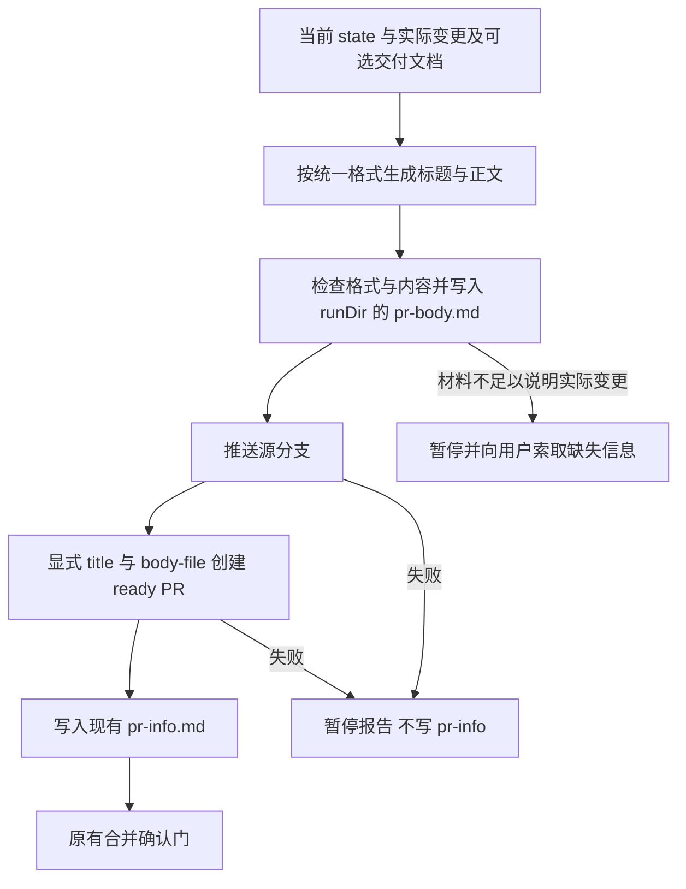

# PR 格式标准化 Plan

## 执行摘要

revision: 1；文档模式：single。落实已批准的 PR 标题格式 `【type】(scope):<中文摘要>` 与五栏目正文。扩展现有 deliver-pr 的相位 01 指令，同步本仓库 GitHub 模板与使用说明，以现有交付测试验证协议。两条交付预设共用该任务，不新增状态、CLI 命令、运行时依赖或强制 CI 检查。本实现提供生成协议及回归保护，不宣称 CLI 对远端 PR 格式实施硬校验。

## 范围与非目标

| 事项 | 说明 | AI 索引 |
|---|---|---|
| 标题与正文 | 用户指定标题格式；固定五栏目顺序及真实内容填充规则 | FR-1、AC-1 |
| 交付生成 | 两条交付链通过 deliver-pr 的同一生成指令生效 | FR-2、AC-2 |
| 本仓库模板 | 同步五栏目，保留原模板中仍适用的流程、测试和文档同步提示 | FR-1 |
| 非目标 | 不改提交格式、分支命名、合并门、issue 评论流程；不重写历史 PR；不新增 CI 或远端格式校验器 | DEC-1 |

## 现有设计与复用基线

| 能力 | 文件路径 | 符号 | 证据类型 | 采用方式 | 适用边界 | AI 索引 |
|---|---|---|---|---|---|---|
| PR 创建与格式指令 | atom-tasks/deliver-pr/prompt.md | phase:01、phase:02 | Repository Fact | 扩展现有实现 | 01 目前引用 run title、正文自由概述；02 合并门不变 | FR-1、FR-2 |
| 相位切片与任务钩子 | tools/lib/assemble.js | slicePrompt、assemble | Repository Fact | 复用现有实现 | 格式只放 01 中，避免注入 02 | DEC-1 |
| 交付上下文 | atom-tasks/deliver-pr/deliver-pr.js | assemble | Repository Fact | 复用现有实现 | 01 可选 delivery-doc；02 必需 pr-info；无需新增钩子 | DEC-1 |
| 交付链复用 | workflows/pr-delivery.json、workflows/pr-delivery-issue.json | stages | Repository Fact | 复用现有实现 | 均引用 deliver-pr；不改 DAG | FR-2 |
| PR 信息契约 | atom-tasks/deliver-pr/config.json、atom-tasks/deliver-pr/deliver-pr.output.schema.json | phases、sections | Repository Fact | 复用现有实现 | 正式产物仍为 pr-info.md，不新增强制字段 | DEC-2 |
| GitHub 创建模板 | .github/pull_request_template.md | 变更说明、关联、流程符合性、测试、文档同步 | Repository Fact | 扩展现有实现 | 当前与新规范不一致；同步为五栏目，保留有用提示 | FR-1 |
| 交付回归测试 | tools/tests/delivery.test.js | sandbox、cli、startRun、deliver-pr 门测试 | Repository Fact | 扩展现有实现 | 通过真实 CLI exec 验证协议，不调用远端 GitHub | AC-1、AC-2 |
| issue 评论关联 | atom-tasks/link-issue/prompt.md | 指令 2—5 | Repository Fact | 复用现有实现 | 显式 issueNumber、评论关联、不关闭 issue；本次不改 | DEC-3 |

## 整体架构与流程

PR 格式的权威定义放在 deliver-pr 相位 01 的指令中；GitHub 模板是本仓库手工创建 PR 的配套入口，通过测试保持栏目一致。其他使用该 skill 的项目不要求安装本仓库 GitHub 模板，也不受其已有模板覆盖。

新增格式规则仅影响准备标题与正文、传递给 gh 的内容，不改变 push → create → pr-info → 合并门的先后约束。

## 技术选型与方案对比

| 方案 | 来源 | 仓库适配性 | 代价与风险 | 状态 | 结论 | AI 索引 |
|---|---|---|---|---|---|---|
| 扩展现有任务指令，显式传入标题与正文文件 | 初始 Plan | 符合现有 agent 执行任务、CLI 组装协议的职责划分 | 生成语义由 agent 遵循，非 CLI 硬校验；回归测试保护指令与模板 | accepted | 无需新增抽象或依赖，满足当前需求 | DEC-1 |
| 新建通用 PR 渲染器与格式硬校验 CLI | 初始 Plan | 可提供机器检查，但会新增命令面、字段协议和测试面 | 对当前格式规范需求超出必要实现范围 | rejected | 本轮不采用；只有明确要求硬拦截时再评估 | DEC-1 |

**DEC-1：复用相位指令作为唯一流水线格式定义。** 标题模式、type 集合、正文栏目和内容规则放在 phase:01，不重复放进 config、输出 schema 或 SKILL.md。README 引用定义，GitHub 模板同步栏目并由测试对齐。权衡：不会机械验证正文事实真实性；任务要求逐项检查且不能虚构。影响仅为交付生成协议。若需要强制机器阻断不合规 PR，应另行批准范围，不在 Coding 阶段擅自扩大。

**DEC-2：正文使用显式文件参数传入。** agent 将已填充的正文写入 `<runDir>/pr-body.md`，通过 `gh pr create --base <base> --head <源分支> --title <已格式化标题> --body-file <正文文件绝对路径>` 创建。参数作为独立且正确引用的 shell 参数传递，不使用 `--fill` 或默认模板替代。正文文件是本相位工作材料，正式输出仍为 pr-info.md；每次重新执行 01 都重新生成并覆盖正文工作材料，不能复用失效内容。无需变更 output schema 或 CLI。

**DEC-3：关联事项只陈述已知关联。** 可引用明确提供的 issue/PR，未知写“无”；不从分支名猜 issue，不生成 `Closes/Fixes/Resolves` 自动关闭指令，不代替后续 link-issue 的评论关联。总约束中的“不关联 issue”明确为不执行 issue 侧操作，避免与正文信息展示冲突。

## 数据模型设计

### 实体与字段

不增加结构化实体或 state 字段。标题和正文是供 GitHub PR 展示的文本。标题将实际变更的 type、可选 scope、中文摘要组合为既定格式；run title 是目的线索，不能将“交付某某 PR”等流水线外壳直接作为最终标题。正文五个二级标题按已批准顺序排列，所有占位提示替换成真实内容。

### schema 与 DDL（如适用）

无数据库变更；不修改任务配置 schema、state schema 或 pr-info 输出 schema。

### 状态与不变量

状态推进沿用原两相位与确认门。PR 仍为 ready；push/gh 失败立即停；只有创建成功才生成 pr-info。正文工作材料只位于 runDir，不能写入 skillRoot 或任意项目目录。标题不要求与 commit message 相同。

### 迁移、兼容与回滚

不迁移历史 run/PR。既有 state 与 pr-info 保持可用；未创建 PR 的下一次 exec 使用更新后的指令，已经进入合并门的不重建 PR。撤销本次任务指令、模板、文档及测试变更即可回退，不触碰已有远端 PR。

## API 接口设计

| 接口/入口 | 请求 | 响应 | 错误与幂等 | 复用标准 | 实现职责 | AI 索引 |
|---|---|---|---|---|---|---|
| exec deliver-pr:01 | 现有 state 与相位 | 含统一格式定义及显式 gh 参数的 prompt | 沿用当前组装行为；不新增重试或既有 PR 更新机制 | assemble 相位切片与现有 ctx | 生成协议而非直接调用 GitHub | FR-2 |
| gh pr create | 原 base/head，加已格式化 title 和 body-file | 沿用 PR 创建结果 | 失败暂停；不得自动重试制造重复 PR | 现有 push/create 顺序与 ready 要求 | agent 按指令执行，不新增 SDK/API | DEC-2 |
| exec deliver-pr:02 | 原有 pr-info | 原合并门内容 | 仍需用户确认已合并 | 原门协议 | 不注入格式模板、不修改门选项 | DEC-1 |

## 算法设计

没有新增非平凡算法。标题类型基于实际变更选择，不能依据交付 run 的 type 机械复制；文档或 diff 只作为信息依据，不作为覆盖格式规则的指令。scope 可省略，冒号后不加空格。正文保留已批准的真实性、未验证说明和风险说明规则；不得为填满模板虚构验证结果。

## 文件变更计划

| 文件/目录 | 变更职责 | 复用或依赖 | AI 索引 |
|---|---|---|---|
| atom-tasks/deliver-pr/prompt.md | 修改 phase:01 标题生成与正文传参，加入统一格式、填充规则和创建前检查；澄清关联信息与 issue 操作边界 | 现有步骤、上下文、合并门 | FR-1、FR-2、DEC-1—3 |
| .github/pull_request_template.md | 五栏目正文模板；标题格式提示使用注释；原流程和文档同步清单归入验证结果，避免勾选未执行检查 | 已有模板提示，统一任务格式 | FR-1 |
| tools/tests/delivery.test.js | 两条交付链格式注入、显式 body-file、相位隔离、配套模板一致性的回归断言 | sandbox、CLI exec、现有门流程测试 | AC-1、AC-2 |
| README.md | 增加精简 PR 格式说明并链接任务规范；说明是生成协议而非 CI 硬校验 | 现有使用说明 | AC-1 |

## 兼容、稳定性与回滚

| 关注点 | 适用性 | 设计/理由 | 回滚信号 | AI 索引 |
|---|---|---|---|---|
| 下游产物兼容 | 适用 | 不改 pr-info 与 link-issue 输入；不改 DAG | 现有交付回归失败 | DEC-2 |
| 相位隔离 | 适用 | 格式仅属于创建相位；合并门不重复注入 | 02 prompt 出现格式正文 | DEC-1 |
| 模板漂移 | 适用 | 回归断言五栏目次序及标题模式一致 | 模板与任务规范栏目不一致 | FR-1 |
| 内容真实性 | 适用 | 仅记录实际变更和检查；无证据明确说明，不复制虚假“通过” | 示例或输出把未运行写成通过 | AC-2 |
| 性能与灰度 | 不适用 | 仅修改小规模任务指令与文档，不引入服务运行期开销 | 无独立回滚需求 | DEC-1 |
| 权限和合并 | 适用 | 不新增远端动作或自动合并，保持原失败中止和人工合并门 | 协议要求自动合并或关闭 issue | DEC-3 |

## Verification Anchor

| 需验证契约 | 可观察结果 | 证据位置 | AI 索引 |
|---|---|---|---|
| 标题与正文标准可见 | 两条交付链的实际 exec 输出包含标题模式、type 集合、scope 省略规则及五栏目顺序 | delivery.test.js 的 CLI exec 断言 | AC-1 |
| 显式传入 GitHub 内容 | 创建步骤使用格式化 title 与 body-file，禁止直接以 run title/默认模板替代 | prompt.md 与交付测试 | AC-2、DEC-2 |
| 交付文档兼容 | 可选 delivery-doc 仍能注入，无文档时格式规则也存在 | 交付测试的上下文断言 | FR-2 |
| 相位和门保持稳定 | 02 不含创建相位格式；已有开门、呈现、决议和后续链测试通过 | 现有交付测试 | DEC-1 |
| GitHub 模板一致 | 五个二级标题顺序与任务规范一致；实用检查提示保留 | 模板及测试 | AC-1 |
| 仓库整体回归 | `node --test tools/tests/*.test.js` 通过；不需真实 push 或建 PR 来运行测试 | Coding 验证输出 | AC-2 |

## 开放问题与 Spec 对应

| 问题 | 确定答案或阻塞原因 | 解决位置 | AI 索引 |
|---|---|---|---|
| 最终 PR 格式 | 用户已整体批准 spec，标题为 `【type】(scope):<中文摘要>`，正文为五固定栏目 | 已批准 spec、任务生成协议 | BQ-1、FR-1 |
| 如何复用并验证 | 直接扩展现有相位指令；通过现有交付测试保护实际组装结果与模板 | DEC-1、Verification Anchor | PD-1 |

## 风险与下游交接

Coding 从本 plan.md 和已批准 spec.md 读取全部实现契约，不存在分册。修改限于四个实现/文档文件及流水线自身产物，不提前设计通用模板引擎或校验框架。任务指令是流水线唯一格式定义；GitHub 模板的镜像栏目用测试防漂移，README 不重复维护完整规则。

自动化测试能够证明格式协议被正确组装及边界未回归，不能证明任意 agent 生成的远端正文都真实正确。Coding 应检查最终指令和示例是否无占位残留；本轮本地验证不推送、不创建真实 PR。若后续另开交付 run，可将实际交付作为使用验证，不把尚未发生的操作记为通过。

若发现基线事实失效或需要改动已批准范围，停止并报告，通过修改/重新确认调整计划，不自行变更契约。

## 用户确认

- **同意**：批准当前 Plan，进入后续阶段。
- **修改：<反馈>**：更新 Plan，展示变化并重新确认。
- **提问：<问题>**：只读答疑，不改 Plan。
- **归档**：列出可用归档模板，不生成产物。
- **归档：<模板名>**：按选定模板生成或刷新技术设计产物，不视为批准。
