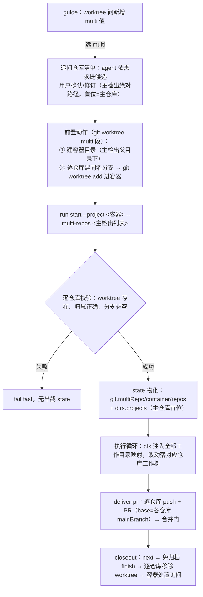

# 多仓库 worktree 隔离目录模式 Plan

> revision 1 · single 模式 · 依据已批准 spec（FR-ISOLATION-1/2、FR-DIR-1/2、FR-STARTUP-1、FR-REPO-1、FR-STATE-1/2、FR-DELIVER-1、FR-COMPAT-1）。

## 执行摘要

为目标：一次 run 跨多个仓库变更时，先建「隔离容器」（根含 `.ddo` 与各仓库 worktree），state 双段升级为多仓库表达，交付链逐仓库适配，单仓库行为零变化。范围：启动问询（worktree 旋钮新增 `multi` 值）、git-worktree 前置动作多仓库扩展、`run start --multi-repos` 注册、state schema 兼容演进、生效工作目录判定三分支、deliver-pr / closeout-worktree / cleanup-worktree 多仓库化、SKILL.md 与测试。关键结论：state 演进采用「主仓库语义原样保留 + 新增可选字段」路线（DEC-2），创建/注册分离沿用 WTT 机制（DEC-3），容器根 `.ddo` 在 multi 模式下产物以「容器持久化」替代「入库」（DEC-4，含回退条件）。文档 single 模式，revision 1。

## 范围与非目标

| 事项 | 说明 | AI 索引 |
|---|---|---|
| 启动问询扩展 | worktree 场景旋钮新增 `multi` 值与仓库清单追问（agent 提候选、用户确认） | DEC-1, FR-STARTUP-1, FR-REPO-1 |
| 前置动作扩展 | git-worktree prompt 增 multi 场景：先建容器，再逐仓库建分支与工作树 | FR-ISOLATION-2, FR-DIR-1/2 |
| run start 多仓库注册 | `--multi-repos <主检出1,主检出2,…>`（首位=主仓库），校验后物化 state | DEC-3, FR-STATE-1/2 |
| state schema 演进 | 新增可选 `git.multiRepo/container/repos` 与 `dirs.projects`，旧 state 零迁移 | DEC-2 |
| 生效工作目录 | resolveWorkdir 增 multi 分支：主工作树为锚，ctx 列全部仓库↔工作目录映射 | FR-STATE-1 |
| 交付链多仓库化 | deliver-pr 逐仓库 PR；closeout/cleanup 逐仓库移除与容器处置询问 | FR-DELIVER-1 |
| 非目标 | 不改单仓库任何行为；不支持中途追加仓库；不做逐仓库差异化工作流编排；不同步安装副本 | FR-COMPAT-1 |

## 现有设计与复用基线

| 能力 | 文件路径 | 符号 | 证据类型 | 采用方式 | 适用边界 | AI 索引 |
|---|---|---|---|---|---|---|
| worktree 场景问（WTT 旋钮） | tools/cli.js | `guideWorktreeQuestion` / `runGuide` | Repository Fact | 扩展现有实现 | 选项名固定三场景，需加第四值；followUp 机制已有（release-dev→base_branch） | Q1 |
| run start 装配 | tools/cli.js | `runStart` | Repository Fact | 扩展现有实现 | project=--project/cwd；state.git=gitInfo(project)；multi 需绕过容器根非 git 的事实 | Q2 |
| git 推断链 | tools/lib/git-info.js | `gitInfo` | Repository Fact | 扩展现有实现 | 提取逐仓库 mainBranch 推断为可复用 helper；worktree 判定（git-dir≠common-dir）不复用于成员注册 | Q3 |
| state 结构断言 | tools/lib/state.js | `assertState` / `assertDirs` | Repository Fact | 扩展现有实现 | git 段现无断言；dirs 含 runDir⊂projectRoot 检查（容器布局天然满足）；新字段「出现即须完整」 | Q4 |
| 生效工作目录判定 | tools/lib/workdir.js | `resolveWorkdir` | Repository Fact | 扩展现有实现 | 现两分支（worktree/project-root），单一实现点，各任务 ctx 钩子共用 | Q5 |
| 门与动态选项 | tools/lib/gate.js | `openGates` / `dynamicOptions` | Repository Fact | 复用现有实现 | 交付链确认门机制零改动 | Q6 |
| 预设物化 | tools/lib/workflow.js | `loadWorkflow` / `expandStages` | Repository Fact | 复用现有实现 | 预设与阶段链不变；pr-delivery 两链复用 | Q7 |
| 交付链 PR 任务 | atom-tasks/deliver-pr/{prompt.md,config.json,deliver-pr.output.schema.json} | 相位01 push+create / 相位02 合并门 | Repository Fact | 扩展现有实现 | 现按单 `git.branch` 语义；pr-info 为单 PR 列表节 | Q8 |
| 交付链收尾 | atom-tasks/closeout-worktree/prompt.md | 六步顺序（入库→next→finish→终态入库→切回→移除） | Repository Fact | 扩展现有实现 | 顺序即契约、测试有关键词断言；①④ 依赖 runDir 在 worktree 内，multi 下不成立 | Q9 |
| 开发链清理 | atom-tasks/cleanup-worktree/prompt.md | 五步 | Repository Fact | 扩展现有实现 | 同上 | Q10 |
| 注册表 | tools/lib/index-registry.js | `register` / `freshRunId` | Repository Fact | 复用现有实现 | 全局指针，multi 无需改动 | Q11 |

## 整体架构与流程

主流程不变量：容器先于任何 worktree 存在（spec FR-ISOLATION-2）；创建动作全部在前置动作（agent 层），注册动作全部在 run start（流水线层）——与单仓库 WTT 机制同构。异常流程：任一仓库 git 操作失败 → 前置动作整体暂停报告（无 state 产生，天然 fail-fast）；run start 校验失败 → exit 1 列明仓库与缺失项。

## 技术选型与方案对比

| 方案 | 来源 | 仓库适配性 | 代价与风险 | 状态 | 结论 | AI 索引 |
|---|---|---|---|---|---|---|
| A1 worktree 旋钮加 `multi` 值 | 初始 Plan | 选项数据源自 git-worktree config 现算，加值即生效；guide 问数不变 | 低：仅选项表与 followUp 扩展 | accepted | 采纳：与 none/single/release-dev 同层并列，语义本就是「启动形态与分支基线」 | DEC-1 |
| A2 独立第六问「是否隔离」 | 初始 Plan | 需重排问序与状态机 | 中：与 worktree 旋钮强耦合（互斥状态），双问易矛盾 | rejected | 隔离即 worktree 场景，不另立问 | DEC-1b |
| B1 state 主仓库语义保留 + 可选新字段（multiRepo/container/repos/projects） | 初始 Plan | assertState/assertDirs 零破坏；全部旧消费者（workdir/closeout/history）不动 | 低：新增「出现即须完整」断言 | accepted | 采纳：完美兼容的唯一低成本路线 | DEC-2 |
| B2 state 重构为 repos 主结构 | 初始 Plan | 所有消费者同改 | 高：破坏旧 state 读取，违背 FR-COMPAT-1 | rejected | 兼容硬边界否决 | DEC-2b |
| C1 run start `--multi-repos`（逗号分隔，首位主仓库）+ 注册时逐仓库校验 | 初始 Plan | 沿用 WTT「创建归前置、注册归流水线」分工；参数解析需支持可重复/列表 | 低-中：路径含逗号场景由校验兜底 fail fast | accepted | 采纳 | DEC-3 |
| C2 清单 JSON 文件交接 | 初始 Plan | — | 中：新增文件格式与生命周期，agent 构造成本高 | rejected | 两步交接不如参数直达 | DEC-3b |
| C3 CLI 内建创建 worktree | 初始 Plan | — | 违背既有创建/注册分离与「无半截 state」fail-fast 设计 | rejected | 不采 | DEC-3c |
| D1 multi 产物「容器持久化」 | 初始 Plan | 用户指定树形即容器根 `.ddo`；closeout ①④（入库）在 multi 下无入库对象 | 中：multi 正常模式产物不入版控（与单仓库差异），以容器处置询问兜底 | accepted | 采纳；回退条件见「兼容、稳定性与回滚」 | DEC-4 |
| E1 同名分支逐仓库（仓库内冲突 -2 后缀），PR base=各仓库 mainBranch | 初始 Plan | 分支名规则与单仓库同源；逐仓库 base 复用 git 推断链 | 低：baseBranch 全局配置在 multi 下为显式覆盖（用户责任） | accepted | 采纳 | DEC-5 |

## 数据模型设计

### 实体与字段

新增可选 state 字段（出现即须完整，缺失=单仓库旧语义）：

- `git.multiRepo`: boolean，multi 模式标记。
- `git.container`: string，隔离容器绝对路径（=dirs.projectRoot，冗余承载 spec 术语「容器」）。
- `git.repos`: array，每仓库一项，主仓库首位：
  `{ role: "primary"|"member", name: string(容器内目录名), repoPath: string(主检出绝对路径), worktreePath: string(容器内绝对路径), branch: string(实际分支), mainBranch: string }`。
- `dirs.projects`: string[]，代码工作目录清单（=repos[].worktreePath，同序；主仓库首位）。

兼容面：`git.mainBranch/branch/worktreePath` 与 `dirs.projectRoot/runDir/tasksDir` 语义完全不变——multi 下 worktreePath=主仓库工作树，projectRoot=容器根（runDir=`<容器>/.ddo/runs/<type>/<runId>` 仍满足 assertDirs 包含检查）。

### schema 与 DDL（如适用）

不适用（无数据库；JSON 结构校验走 assertState 扩展）。

### 状态与不变量

- 不变量 I1：容器目录先于任何仓库 worktree 创建（前置动作顺序保证）。
- 不变量 I2：`dirs.projects` 与 `git.repos[].worktreePath` 集合与顺序一致（run start 单次写入保证；断言校验）。
- 不变量 I3：`git.worktreePath === git.repos[0].worktreePath`（主仓库冗余一致性）。
- 不变量 I4：runDir ⊂ git.container（=dirs.projectRoot，assertDirs 既有检查承载）。

### 迁移、兼容与回滚

无存量迁移：新字段全可选，旧 state（单仓库）零改动可读可续跑（resume/status/exec 全链不感知）。回滚=代码回退，无数据回滚面。multi state 不提供「降级为单仓库」路径——模式随 run 生命周期固定。

## API 接口设计

| 接口/入口 | 请求 | 响应 | 错误与幂等 | 复用标准 | 实现职责 | AI 索引 |
|---|---|---|---|---|---|---|
| `guide` | 不变 | worktree 问新增 `multi` 选项与 `followUp`（仓库清单，freeText） | 无副作用不变 | 问题/选项现算机制（configurable） | cli.js `guideWorktreeQuestion` 选项表+followUp；config.json mode desc 更新 | A-1 |
| `run start` | 新增 `--multi-repos <path[,path…]>`（首位=主仓库主检出；与 --project=<容器> 同用） | state 物化含 repos/projects（形状见数据模型） | 逐仓库校验全或无；已存在 runDir 报错不变 | fail-fast、无半截 run 惯例 | runStart multi 分支：按 `<容器>/<basename(repoPath)>`（冲突 -2）推导 worktree 并校验 | A-2 |
| `exec`（各任务） | 不变 | multi state 下「Context: 工作目录」列出全部仓库↔工作目录映射 | 不变 | resolveWorkdir 单一实现点 | workdir.js 三分支 | A-3 |
| `gate present` / `next` / `rollback` | 不变 | 不变 | 不变 | 门机制零改动 | 无 | A-4 |
| `deliver-pr` 相位01 | git.repos 逐仓库 push+`gh pr create` | pr-info.md：multi 为逐仓库重复节（`## PR 信息（<name>）`）；单仓库保持原单节不变 | 任一仓库失败即暂停（不产出/不进门） | push 先于 create 惯例不变 | prompt+schema 双形态 | A-5 |
| `closeout-worktree` / `cleanup-worktree` | git.repos 逐仓库 | multi：跳过入库两步（容器持久化）、逐仓库移除、容器处置询问 | 分支保留规则逐仓库同现有 | 六步顺序不变量保留（multi 以逐仓库展开步骤⑥） | prompt 扩展 | A-6 |

## 算法设计

**A1 容器与分支命名推导**（前置动作，agent 按 prompt 执行）
输入：title、run type、主检出路径、已确认仓库清单。输出：branchName、containerPath、各成员目录名。
- branchName：复用单仓库规则（title→kebab-case 截断 50、`feat/`|`fix/` 前缀）。
- containerPath：`dirname(主检出)/<basename(主检出)>-<branchName 的 "/"→"-" >`；已存在同名目录 → 暂停报告。
- 成员目录名：`basename(repoPath)`，容器内冲突追加 `-2` 起递增。
复杂度 O(n)；边界：n=1 时仍是合法 multi（但引导上 multi 预期 n≥2，n=1 提示确认）。

**A2 多仓库注册校验**（run start，CLI）
对清单每项依序：① repoPath 存在且 `rev-parse --is-inside-work-tree`=true；② 容器内预期 worktree 目录存在；③ 该 worktree 归属 repoPath（`--git-common-dir` 归属比对）；④ `branch --show-current` 非空。任一失败收集并整体报错（exit 1），不写 state。全过 → 推导各仓库 mainBranch（origin/HEAD→init.defaultBranch→main，提取自 gitInfo 的共用 helper）、物化 state。不变量 I2/I3 写入时断言。

**A3 生效工作目录优先级**：`git.multiRepo && repos.length>0` → multi 分支（锚=主工作树，ctx 附映射表）→ `git.worktreePath` 非空 → worktree 分支 → projectRoot 分支。旧 state 依次落入后两分支，行为不变。

**A4 PR base 选择**：逐仓库 base = `repos[i].mainBranch`；`atomTasks["deliver-pr"].baseBranch` 显式配置时全局覆盖并如实记录实际生效值。

## 文件变更计划

| 文件/目录 | 变更职责 | 复用或依赖 | AI 索引 |
|---|---|---|---|
| tools/cli.js | guideWorktreeQuestion 加 multi 选项+followUp；runStart 加 --multi-repos 分支与校验；注册表 usage/help 更新 | git-info helper、state 断言 | F1 |
| tools/lib/git-info.js | 抽出 `inferMainBranch(repoPath)` 供多仓库注册复用（gitInfo 行为零变化） | — | F2 |
| tools/lib/state.js | assertState 增可选字段校验（multiRepo/container/repos/projects 形状与 I2/I3） | — | F3 |
| tools/lib/workdir.js | resolveWorkdir 增 multi 分支与 ctx 映射文本 | F3 | F4 |
| atom-tasks/git-worktree/config.json | mode desc 增 multi 场景说明 | — | F5 |
| atom-tasks/git-worktree/prompt.md | 增 multi 执行段：容器创建→逐仓库分支与 worktree→顺序与 fail-fast | A1 | F6 |
| atom-tasks/deliver-pr/prompt.md + config.json + deliver-pr.output.schema.json | 逐仓库 push/PR 指令；schema 双形态（单仓库原节不动 + 逐仓库重复节） | git.repos | F7 |
| atom-tasks/closeout-worktree/prompt.md | multi 前置分支：跳过 ①④、逐仓库移除、容器处置询问 | git.repos | F8 |
| atom-tasks/cleanup-worktree/prompt.md | 同 F8 的逐仓库清理 | F8 | F9 |
| SKILL.md | 启动状态机 S2 multi 前置、S3 参数映射、运行位置 multi 语义（按仓库 SKILL.md v2.0.3 结构最小增量） | — | F10 |
| tools/tests/start.test.js 等 | 新增 multi 用例（沙箱双 git 仓库）；存量用例零修改 | — | F11 |

## 兼容、稳定性与回滚

| 关注点 | 适用性 | 设计/理由 | 回滚信号 | AI 索引 |
|---|---|---|---|---|
| 旧 state 可读可续跑 | 全部单仓库 run | 新字段全可选、无迁移 | 存量 resume/status 测试红 | C-1 |
| guide 向后兼容 | 启动问询 | 仅增选项与条件 followUp；none/single/release-dev 行为与文案不变 | guide 快照测试红 | C-2 |
| pr-info 双形态 | 交付链 | 单仓库 schema 契约逐字不变；multi 走重复节 | delivery 校验测试红 | C-3 |
| multi 产物不入版控 | multi 正常模式 | DEC-4：容器持久化 + 处置询问兜底；回退条件=用户明确要求产物入库时，升级为主仓库工作树镜像提交方案（另立轮次） | 用户否决容器持久化 | C-4 |
| 路径含逗号等边角 | run start | A2 逐仓库校验 fail fast，错误明示仓库与缺失项 | 用例覆盖 | C-5 |
| 安装副本滞后 | 交付后 | 仓库为准，安装副本同步不在本 run 范围（既有已知陷阱） | — | C-6 |

## Verification Anchor

| 需验证契约 | 可观察结果 | 证据位置 | AI 索引 |
|---|---|---|---|
| 单仓库全链零回归（FR-COMPAT-1） | 存量测试全部通过且未修改 | `node --test tools/tests/*.test.js` | V-1 |
| multi 注册与 state 形状（AC-1/AC-5 state 面） | 沙箱双 git 仓库 run start 后 state.git.repos/dirs.projects 符合数据模型 | start.test.js 新用例 | V-2 |
| guide multi 选项与追问（AC-3） | guide payload 含 multi 选项与 followUp；未选 multi 时无追问 | guide.test.js 新用例 | V-3 |
| 工作目录映射注入 | multi state 下 exec coding 的 prompt「Context: 工作目录」含全部仓库映射 | exec.test.js 新用例 | V-4 |
| pr-info 双形态 | 单仓库旧形与 multi 重复节均通过 schema 校验 | delivery.test.js 新用例 | V-5 |
| closeout 顺序与 multi 分支 | prompt 关键词与先后断言扩展（逐仓库移除、容器处置询问在 finish 后） | delivery.test.js | V-6 |
| 真机端到端（AC-1/2/6 用户面） | 真实多仓库 run：容器先建、worktree 就位、state 可见 | 用户侧验收 | V-7 |

## 开放问题与 Spec 对应

| 问题 | 确定答案或阻塞原因 | 解决位置 | AI 索引 |
|---|---|---|---|
| PD-1 启动选择形态 | worktree 旋钮新增 `multi` 值（独立问被否，DEC-1b） | DEC-1 / F1 | Q-1 |
| PD-2 schema 与兼容 | 主仓库语义保留 + 可选新字段，零迁移（DEC-2） | 数据模型 / F3 | Q-2 |
| PD-3 CLI 参数与前置扩展 | `--multi-repos`（首位主仓库）+ git-worktree prompt multi 段（DEC-3） | A-2 / F1、F6 | Q-3 |
| PD-4 命名与路径计算 | A1（容器=主检出兄弟、成员=basename、同名分支逐仓库） | 算法 A1、DEC-5 | Q-4 |
| spec BQ-1/2/3 | 均已写回 spec；BQ-1→启动追问（A-1），BQ-2→A1 容器位置，BQ-3→交付链纳入（A-5/A-6） | 已闭环 | Q-5 |

## 风险与下游交接

- **风险 R1** 容器名/成员目录名冲突或路径边角：A1/A2 fail fast 兜底，错误信息指向修正动作。
- **风险 R2** multi 正常模式产物不入版控（与单仓库差异）：DEC-4 已明示并以容器处置询问兜底；回退条件见 C-4。
- **风险 R3** 安装副本与仓库漂移（现安装副本 SKILL.md v2.0.4 领先仓库 v2.0.3）：本 run 只改仓库；交付后同步安装副本属既有运维动作，不在范围内。
- **Tasking/Coding 读取范围**：本 plan 为 single 模式，全量读取即可；coding 按 F1–F11 对应实施，测试按 V-1–V-6 落用例。
- **事实失效处理**：若 coding 时发现上述 Repository Fact 与工作树不符（文件/符号漂移），停止并报告，不得擅自改已批准契约。

## 用户确认

- **同意**：批准当前 revision，进入后续编排。
- **修改：<反馈>**：反馈应用到新 revision 并重评估，展示变化摘要后重新送审。
- **提问：<问题>**：只答疑，不改文档、revision 与确认状态。
- **归档**：列出可用模板名（当前：ddo），不产出文档。
- **归档：<模板名>**：如 `归档：ddo`，按模板生成 tech-design 产物，不代表批准。
