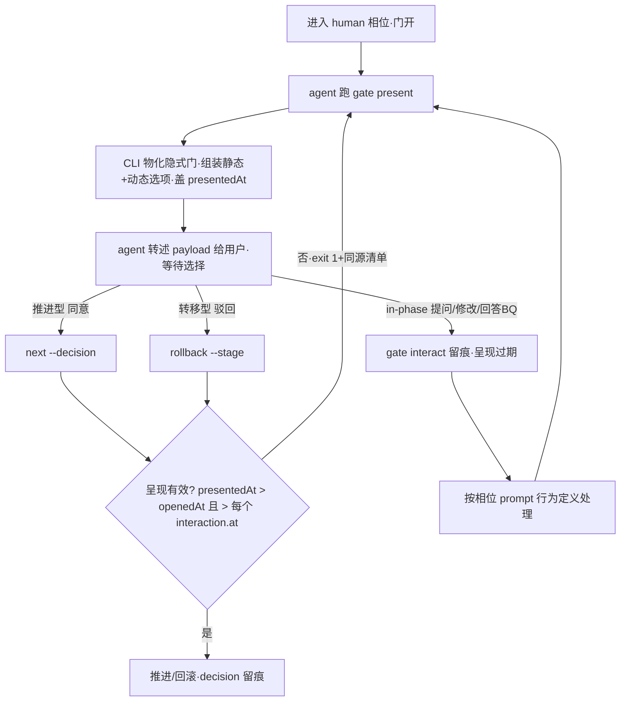

# 交互协议结构闭环 Plan

revision: 1（single 模式）

## 执行摘要

把「向用户呈现选项」从 prompt 散文约束升级为 CLI 结构保证：新增 `gate present`（统一呈现入口，写 `presentedAt` 留痕）、`gate interact`（in-phase 交互留痕，使呈现过期）、`guide`（冷启动引导 payload）；`next --decision` 与 `rollback`（作为门决议载体时）前置校验「最后交互后须重新呈现」，拒绝输出与呈现入口同源的选项清单与指引。动态选项（`回答BQ-N`）经 per-task `present` 钩子现算进 payload；status/resume 的 gateOptions 与 payload 同源。SKILL.md 与四个门任务 prompt 的呈现义务改写为机械规则。范围与边界见 spec（AC-1～AC-7）。

## 范围与非目标

| 事项 | 说明 | AI 索引 |
|---|---|---|
| 范围 | `gate` 域两命令 + `guide` 顶层命令、门留痕字段、决议前置校验、present 钩子协议、SKILL/prompt 协议同步、测试 | FR-1～FR-5 |
| 非目标 | 不防伪造决议（呈现后自己决议仍可能）；`run finish` 不校验（元操作）；「同意」在 BQ 未清时的抑制不进结构（spec 语义仍由 rules 约束）；不改 DAG/节律/命令对外形态 | spec Non-goals |
| 约束 | 四通道契约、`.state.json` 唯一事实源、结构保证优先于 prompt 约定 | spec 约束 |

## 现有设计与复用基线

| 能力 | 文件路径 | 符号 | 证据类型 | 采用方式 | 适用边界 | AI 索引 |
|---|---|---|---|---|---|---|
| 门实例构建与选项校验 | tools/lib/workflow.js | `buildGate`/`standardOptions`/`DECISION_RE`/`isLegalAction` | Repository Fact | 复用现有实现 | present 物化隐式门、动态选项校验复用同一套 | B1 |
| 拦截时选项渲染 | tools/cli.js | `renderOptions`/`fillState` | Repository Fact | 迁移进新 lib 并复用 | next 拦截、present payload、interact 报错同源渲染 | B2 |
| 状态视图派生 | tools/cli.js | `statusView`（gateOptions/availableCommands） | Repository Fact | 扩展现有实现 | 换用同源 openGates 派生，输出字段名不变（兼容 resume 消费方） | B3 |
| per-task 钩子装载 | tools/lib/assemble.js | `<name>.js` 的 `assemble` 钩子（MODULE_NOT_FOUND 容错） | Repository Fact | 扩展现有实现 | 新增 `present` 导出；装载容错策略照抄 | B4 |
| ctx 钩子范式（读 runDir 产物） | atom-tasks/spec/spec.js | `assemble({phase, statePath})` | Repository Fact | 扩展现有实现 | 同文件新增 `present` 钩子读 spec.md | B5 |
| state 结构断言 | tools/lib/state.js | `assertGate` | Repository Fact | 扩展现有实现 | 增可选字段校验（presentedAt/interactions） | B6 |
| 测试隔离范式 | tools/tests/gate.test.js | sandbox/cleanup/cli/writeState/writeGateDemo | Repository Fact | 复用现有实现 | 新测试文件照抄范式；自定义时间戳经 writeState 注入 | B7 |
| 冷启动数据面 | tools/cli.js | `listWorkflows`/`listTasks` | Repository Fact | 复用现有实现 | guide 内部调用，不重复实现 | B8 |

## 整体架构与流程

参与方：agent（唯一呈现执行者）、CLI（gate/guide/next/rollback/status/resume）、state（留痕）、per-task present 钩子（动态选项）。

## 技术选型与方案对比

| 方案 | 来源 | 仓库适配性 | 代价与风险 | 状态 | 结论 | AI 索引 |
|---|---|---|---|---|---|---|
| 新增 gate 域命令承载呈现/交互 | 初始 Plan | 与 run/next/rollback 命令风格一致 | 命令面 +3 | accepted | 呈现需写痕副作用，status 只读语义不承载 | D-1 |
| 扩展 status 承担呈现 | 初始 Plan | 无新命令 | status 变写命令、破坏只读视图语义与既有消费方 | rejected | 否 | D-1 |
| 时间戳判呈现新鲜 | 初始 Plan | 复用 nowIso | 同刻边界；测试经 writeState 注入时间戳可控 | accepted | 真实流程人机延迟 ≫ ms；同刻按过期（保守拦截） | D-3 |
| 单调版本号判新鲜 | 初始 Plan | 需额外持久计数器 | state 多一字段且事件失去时刻信息（审计价值降） | rejected | 否 | D-3 |
| guide 独立命令（冷启动） | 初始 Plan | 无状态、与 list 同层 | 命令面 +1 | accepted | list 保持数据面，guide 是引导视图 | D-8 |
| list 输出直接改 payload 形态 | 初始 Plan | 零新命令 | 破坏 list 既有输出消费方（SKILL/测试） | rejected | 否 | D-8 |

## 数据模型设计

### 实体与字段

门实例（`stages[k].gate`）新增可选字段：`presentedAt`（ISO 8601 字符串，最近一次呈现时刻）；`interactions[]`（相位内交互记录数组，元素 `{ option: string（非空，in-phase 选项名）, note?: string, at: ISO 8601 }`）。既有 `phase/openedAt/options/decision/closedAt` 不变。

### schema 与 DDL（如适用）

不涉及数据库。`state.js#assertGate` 增补：`presentedAt` 出现即须 ISO 字符串；`interactions` 出现即须数组且逐元素校验 `option` 非空字符串、`at` ISO 字符串、`note` 可选字符串。`_schema/task-config.schema.json` 不动（静态 gate.options 声明不变）。

### 状态与不变量

- INV-1（决议前置）：`decision` 存在 ⇒ 存在有效呈现：`presentedAt > openedAt` 且 `presentedAt > interactions[i].at`（严格大于；同刻视为过期——保守拦截方向）。
- INV-2（动态选项边界）：present 钩子产出的动态选项 `action` 恒为 `in-phase`，name 过 `DECISION_RE` 且不得与静态选项重名。
- INV-3（交互合法性）：`interactions[].option` ∈ 当前开门的有效 in-phase 选项集（静态 ∪ 动态）。
- 兼容不变量：旧 state（无新字段）合法——可选字段语义；收紧方向：首个 `gate present` 之前的决议被拦。

### 迁移、兼容与回滚

在途 run 无需迁移：字段可选、按需写入。回滚信号：既有测试大面积红（决议前缺 present）属预期契约变更，更新测试补 present 步骤；若 dogfooding 中 present/interact 命令行为异常，`git revert` 本轮提交即可（无数据迁移）。

## API 接口设计

| 接口/入口 | 请求 | 响应 | 错误与幂等 | 复用标准 | 实现职责 | AI 索引 |
|---|---|---|---|---|---|---|
| `gate present --state 
 [--tasks-dir]` | 无 | `{gates:[{stage,phase,options:[{name,desc,action,dispatch}]}], presentedAt, hint}`；dispatch 为命令型补全 `--state`、in-phase 给出 `gate interact … && 重新 present` 指引 | 无开门 exit 1 + stderr 指引；重复调用幂等覆盖 presentedAt（重呈现即新留痕） | 复用 buildGate/renderOptions/fillState/L2 风格 | 物化隐式门（无 gate 对象时按相位声明 build）、静态∪动态选项、盖戳、写 state | D-1/D-5 |
| `gate interact --state 
 --option <name> [--note <t>] [--tasks-dir]` | option=in-phase 选项名 | `{recorded:{stage,phase,option,at}}`，追加 interactions[] | 非 in-phase/未知选项 exit 1 + stderr 列有效 in-phase 名单；多门时须 `--stage` 指定（缺省唯一门） | 复用 openGates 派生 | 记录交互（使呈现过期）；不改 decision | D-1 |
| `guide [--workflows-dir] [--tasks-dir]` | 无 | `{questions:[{id,question,options:[{name,desc}],freeText?}]}`（问目标 freeText、问模式含预设+自定义、问类型常用枚举+自定义说明） | 无 state 无副作用，幂等 | 复用 listWorkflows/listTasks | 冷启动引导唯一数据源 | D-8 |
| `next`（改） | `--decision` | 拒绝路径输出与 present 同源清单 | 决议前无有效呈现 → exit 1 + stderr「先 gate present 呈现后决议」+ 清单；stdout JSON `{blocked:'gate-unpresented',gates}` | 复用同源渲染 | 既有语义不变，仅加前置校验 | D-3/D-5 |
| `rollback`（改） | `--stage` | 不变 | 目标 stage 自身开门且呈现无效 → exit 1 + 同上指引；非门用途不校验 | 复用共用校验 | 仅门决议载体场景受约束 | D-4 |

## 算法设计

**呈现有效性判定**（非平凡，其余为普通业务逻辑）：输入 gate 实例；输出 valid/invalid 与原因。规则：`presentedAt` 缺失 → invalid(never)；`presentedAt <= openedAt` → invalid(stale-open)；任一 `interactions[i].at >= presentedAt` → invalid(interacted)；否则 valid。时间比较按 ISO 字符串字典序（同格式同时区偏移由 nowIso 保证可比较；跨源注入的异格式时间戳在 assertGate 层面不校验格式细节，比较失败按 invalid 处理）。复杂度 O(n)。

**动态选项组装**：openGates(state, tasksDir) 对每个开门位置：静态选项 = gate.options（无 gate 对象 → buildGate 物化）；动态选项 = 装载 `<task>.js` 的 `present({phase, state, statePath, config})` 钩子（装载容错同 assemble 钩子；钩子内部错误 = 硬失败），返回 `{options:[…]}`，逐项按 INV-2 校验。单次 present 盖同一时刻戳。

## 文件变更计划

| 文件/目录 | 变更职责 | 复用或依赖 | AI 索引 |
|---|---|---|---|
| tools/lib/gate.js（新增） | openGates 物化/组装、payload/dispatch 构建、renderOptions 迁移、isPresentationValid、assertGatesPresented | buildGate/fillState（自 workflow.js、cli.js 迁入） | F1 |
| tools/lib/state.js | assertGate 增补 presentedAt/interactions 校验 | 既有模式 | F2 |
| tools/cli.js | REGISTRY 注册 gate present/gate interact/guide；runNext 拦截两路 + 决议前呈现校验；runRollback 目标门校验；statusView/resume 的 gateOptions 换同源 openGates（输出字段不变） | lib/gate.js | F3 |
| atom-tasks/spec/spec.js | 新增 `present` 钩子：解析 runDir/spec.md「需要用户确认」的 `- **BQ-N**：` 行 → 动态选项 `回答BQ-N`（name 无空格，desc 载 BQ 原文） | 既有 assemble 钩子同文件 | F4 |
| atom-tasks/{spec,plan,test-plan,reflection}/prompt.md | 确认门相位呈现段改写：「跑 gate present → 转述 payload → 按 dispatch 处理 → in-phase 先 gate interact 再行为处理 → 完成后重新 gate present」；删除「读 state gate.options 自行呈现」散文 | 结构命令 | F5 |
| SKILL.md | 核心契约 4、冷启动（跑 guide）、驱动 run ③、确认门协议、中断恢复协议、诚实边界更新 | — | F6 |
| tools/tests/present.test.js（新增） | 新契约全量：payload 形态/隐式门物化/动态选项/呈现校验两命令/interact 过期/re-ask 闭环/断言校验/guide 形态 | gate.test.js 范式 | F7 |
| tools/tests/{gate,next,resume}.test.js | 既有决议用例补 present 前置步骤；resume 断言 gateOptions 含动态选项 | 既有用例 | F8 |

## 兼容、稳定性与回滚

| 关注点 | 适用性 | 设计/理由 | 回滚信号 | AI 索引 |
|---|---|---|---|---|
| 旧 state 兼容 | 适用 | 可选字段；首个 present 前决议被拦（收紧方向，符合结构目标） | 在途 run 决议被意外拦且非呈现问题 | C1 |
| 既有测试红 | 适用 | 预期契约变更，按 F8 更新 | 更新后仍有非 present 相关红 | C2 |
| 多门并发 | 适用 | present 盖全部开门；interact 缺省唯一门、多门须 --stage | — | C3 |
| 动态解析失效 | 适用 | spec.md 缺失/无 section → 无动态选项（不阻塞呈现）；BQ 漏检风险由 validate 的 BQ-{N} 格式契约降低 | dogfooding 观察 BQ 漏呈现 | C4 |
| 伪造决议 | 不适用（明确边界） | 呈现留痕供审计，不防伪造 | — | C5 |

## Verification Anchor

| 需验证契约 | 可观察结果 | 证据位置 | AI 索引 |
|---|---|---|---|
| AC-1 payload 单一来源 | gate present 输出含静态+动态选项与 dispatch；next 拦截清单同源 | tools/tests/present.test.js | V1 |
| AC-2 未呈现决议被拦+补呈现后成功 | exit 1 与 stderr 指引；state 含 presentedAt 与 decision | 同上 | V2 |
| AC-3 re-ask 闭环 | present→interact→decision 被拦→re-present→decision 成功 | 同上 | V3 |
| AC-4 rollback 载体校验 | 未呈现 rollback 被拦；补呈现后成功；非门 rollback 不受影响 | 同上 | V4 |
| AC-5 协议机械可执行 | SKILL/prompt 呈现义务全部为「跑命令→转述→记录」 | SKILL.md、四个 prompt.md | V5 |
| AC-6 冷启动统一 | guide 输出三问 payload，选项数据来自 CLI | tools/tests/present.test.js | V6 |
| AC-7 resume 同源 | resume --run-id 的 gateOptions 与 present payload 选项一致（含动态） | tools/tests/present.test.js | V7 |

## 开放问题与 Spec 对应

| 问题 | 确定答案或阻塞原因 | 解决位置 | AI 索引 |
|---|---|---|---|
| PD-1 命令形态 | gate present / gate interact 两命令 + guide | cli.js REGISTRY | Q1 |
| PD-2 留痕 schema | presentedAt + interactions[]；rollback 清门整删含留痕 | state.js/gate.js | Q2 |
| PD-3 新鲜判定 | 时间戳严格大于，同刻过期 | lib/gate.js | Q3 |
| PD-4 rollback 落点 | 共用校验，仅目标 stage 自身开门时约束 | cli.js runRollback | Q4 |
| PD-5 同源渲染 | 迁移 renderOptions 进 lib/gate.js 全场景复用 | lib/gate.js | Q5 |
| PD-6 钩子协议 | `present({phase,state,statePath,config})` → `{options:[…]}`，仅 in-phase，错误硬失败 | spec.js/assemble 容错范式 | Q6 |
| PD-7 BQ 解析 | 解析「需要用户确认」`- **BQ-N**：` 行；name 无空格化 `回答BQ-N`，desc 载原文 | atom-tasks/spec/spec.js | Q7 |
| PD-8 冷启动落点 | 新增 guide 命令，list 保持数据面 | cli.js | Q8 |

## 用户确认

- ✅ **同意**：批准当前 revision，本相位完成。
- ❌ **驳回**：回滚 plan 阶段，按意见回到相位 01 重新生成。
- ❌ **修改：<反馈>**：反馈应用到新 revision 并重评估，展示变化摘要后重新送审。
- ❓ **提问：<问题>**：只答疑，不改文档、revision 与确认状态。
- 📦 **归档**：列出可用模板名（atom-tasks/plan/references/），不产出文档。
- 📦 **归档：<模板名>**：按模板名生成/刷新 tech-design 产物（记录模板名与来源 revision）。

## 风险与下游交接

- 风险：动态 BQ 解析对 spec.md 格式漂移敏感 → 缓解：output schema 强制 BQ-{N} 结构化列表格式；解析失败降级为无动态选项（呈现不阻塞）。
- 风险：测试时间同刻边界 → 缓解：判定取严格大于 + 测试注入可控时间戳。
- Tasking/Coding 读取范围：plan.md（single 模式，无分册）；「文件变更计划」为拆分依据，「Verification Anchor」为 test-plan/verification 输入。
- 事实失效处理：coding 中发现 B2/B3/B4 符号或行为与本文不符时停止并报告，不得自行改已批准契约。
