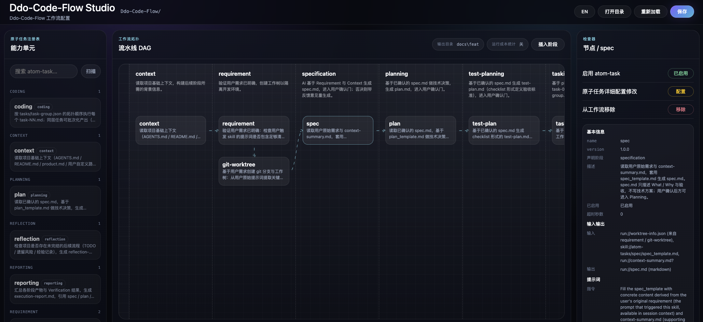

# ddo-code-flow

> **ddo-code-flow** 是一款**可定制化的 AI 编程流水线 skill**：把「AI 写代码」拆成 12 个有序阶段（context → … → done），每个阶段由可配置的 **atom-task** 承担实际工作；通过编辑 `config.json` 即可重新编排流水线，无需改动 skill 本体。配套 **Ddo-Code-Flow Studio**——纯本地、零依赖的可视化配置页，用于编辑 DAG、管理 atom-task 开关，以及配置 Run 级成本统计。



## ✨ 项目亮点

- **流程标准化**：需求 → 规约 → 方案 → 测试计划 → 任务拆分 → 编码 → 验收 → 复盘，关键阶段强制用户确认（human-in-the-loop）
- **流程与能力解耦**：流水线只编排顺序，「做什么」由 atom-task 提供；新增 / 替换 atom-task **不需要改 skill 本体一行代码**
- **DAG 拓扑编排**：同一 stage 内可挂多个 atom-task，支持依赖图、并行批次与「合并审批」
- **指令型 runtime**：无自研执行器、无后台进程——执行 agent 就是引擎，文件系统 + `.state.json` 就是状态机
- **Run 级 Metrics Plugin**：可选统计整次 Workflow 的真实 Token 消耗与成本估算；**不是 atom-task、不在 DAG 中**，Workflow 前后 snapshot 差分 + 可插拔 Provider（详见 `[docs/metrics.md](docs/metrics.md)`）
- **零依赖 Studio UI**：原生 HTML + CSS + JS，`studio.js` 单文件驱动；File System Access API 直读写 `config.json`，无 node_modules、无打包
- **完全本机**：产物落在 `<target>/YYYY-MM-DD-<desp>/`，可 git track；Metrics 默认关闭，不依赖在线服务

## 🚀 核心能力

- **12 阶段流水线**：Context → Requirement → Specification → Planning → Test-Planning → Tasking → Coding → Verification → Review → Reporting → Reflection → Done
- **4 个内置确认门**：Specification / Planning / Test-Planning / Reflection；否决可带反馈重生
- **两段式 Verification**：`test-plan.md` 中 `cmd:` 由 agent 执行核对 exit code，`human:` 由用户勾选
- **失败自动回退**：Verification 失败回到 Coding 重做；会话中断后续跑读 `.state.json`
- **Studio 三栏编辑器**：左侧 atom-task 注册表、中间 Pipeline DAG 画布、右侧 Inspector；支持 stage 插入、节点注入、连线、合并审批、无环校验
- **顶栏快捷配置**：输出目录（`targetDir`）与 **运行成本统计**（`base.metrics`）pill 一键弹窗编辑
- **Studio 中英切换**：顶栏语言按钮，界面文案与 Metrics 弹窗同步切换
- **原子任务热插拔**：扫描 `atom-tasks/`，ENABLED/DISABLED 走 `atomTaskOverrides`；注册表内可打开 atom-task 详细配置弹窗
- **Metrics Runtime Plugin**（可选）：Run Start / Run Finish 调用 `scripts/metrics/plugin.js`；支持 4 种 Provider；可选生成 `metrics-report.md`

## 🎯 适用场景

- 中大型 AI 编程任务，需要先把 spec / plan 落到文档再开干
- 团队希望过程可审计、可回退、可复盘，并可选追踪单次 run 的 Token / 成本
- 想把 review、测试规划、文档生成等子流程抽成 atom-task 复用
- 需按项目定制流水线（纯文档跳过 Coding、纯重构跳过 Specification 等）

## 📦 发版与文档


| 版本        | 说明                                                                                                                                                                                                                                                                                                                                                          |
| --------- | ----------------------------------------------------------------------------------------------------------------------------------------------------------------------------------------------------------------------------------------------------------------------------------------------------------------------------------------------------------- |
| **1.0.1** | **Metrics Runtime Plugin**：Run 前后 snapshot 差分，写入 `.state.json.metrics.runTotal`；4 种 Provider（tokscale / custom-command / session-counter / sdk-usage）；可选 `metrics-report.md` 与 pricing 成本估算。 **Studio 升级**：三栏 DAG 编辑器取代 1.0.0 三 Tab 布局；顶栏 **输出目录** / **运行成本统计** pill；中英切换。**配置**：`base.metrics` schema；`[docs/metrics.md](docs/metrics.md)` 架构与 Provider 指南 |
| 1.0.0     | 首版；12 阶段流水线、11 个默认 atom-task、Studio UI（`ui/app.js` 三 Tab）、零运行时依赖                                                                                                                                                                                                                                                                                            |


## ⚡ 快速开始

ddo-code-flow 是 **Agent Skill**，无 CLI、无需安装。

### 1. 获取 skill

将本项目 clone 或复制到 agent 可读的 skills 目录，例如：

```text
<skills-root>/ddo-code-flow/
```

具体路径取决于你使用的 IDE / agent 环境；安装后确保 agent 能加载 `SKILL.md` 与 `config.json`。

### 2. 在目标项目里触发

新建 `requirement.md`，或在对话中说：

```
用 ddo-code-flow 跑一遍流水线，需求是：实现一个 reverseString(s: string): string 的纯函数模块。
```

agent 按 `[SKILL.md](SKILL.md)` 执行：

1. 读 `config.json`，校验 schema 与 DAG 无环
2. 在 `targetDir` 下创建 / 恢复 `YYYY-MM-DD-<desp>/` 工作目录
3. （可选）若 `base.metrics.enabled`，Run Start 调用 Metrics Plugin 记录 `snapshotBefore`
4. 依次跑各 stage；确认门处等待 `同意` 或 `修改：<意见>`
5. Coding 后跑 Verification；失败则回到 Coding
6. reflection 确认通过后标记 `done`；若 Metrics 已启用，Run Finish 写入 `runTotal` 与可选 `metrics-report.md`

### 3. 打开 Studio 编辑配置

浏览器（Chromium 系最佳）打开：

```text
<skill-root>/ui/index.html
```

**Open folder** 选中 skill 根目录后：


| 区域              | 作用                                           |
| --------------- | -------------------------------------------- |
| 左栏 Capabilities | 扫描 atom-task，拖入 / 注入 DAG；点击条目打开详细配置弹窗        |
| 中栏 Pipeline DAG | stage 顺序、节点、连线、合并审批；顶栏 **输出目录** / **运行成本统计** |
| 右栏 Inspector    | 选中 stage / 节点 / atom 后的字段编辑                  |


### 4. （可选）启用 Run 级 Metrics

默认 `base.metrics.enabled: false`。在 Studio 顶栏 **运行成本统计** 中开启，或编辑 `config.json`：

```jsonc
"metrics": {
  "enabled": true,
  "provider": "tokscale",
  "failurePolicy": "warn",
  "report": { "enabled": true, "path": "metrics-report.md" },
  "pricing": {
    "model": "",
    "inputPerMillionUsd": 0,
    "outputPerMillionUsd": 0
  }
}
```


| Provider                 | 说明                                      | 额外依赖                                                 |
| ------------------------ | --------------------------------------- | ---------------------------------------------------- |
| `tokscale`               | 读本地 IDE 累积 token 用量                     | [tokscale](https://github.com/junhoyeo/tokscale) CLI |
| `custom-command`         | 自定义 capture 脚本                          | `metrics.customCommand`（支持 `skill://` URI）           |
| `cursor-session-counter` | 读 `<run>/.metrics/session-counter.json` | Hook / 外部计数器写入                                       |
| `cursor-sdk`             | 读 `<run>/.metrics/sdk-usage.json`       | SDK runner 或外部工具写入                                   |


- **tokscale** 非硬依赖；未安装时 Metrics 失败但不影响 Workflow 成功（`failurePolicy: warn`）
- 启用 Metrics 时需要本机 **Node.js**（跑 `plugin.js`）与 **bash**（Provider 脚本）；Workflow 本身仍只依赖执行 agent
- 详见 `[docs/metrics.md](docs/metrics.md)`

### 5. 查看产物

每次 run 落在 `<targetDir>/YYYY-MM-DD-<desp>/`：

```text
<targetDir>/feat/2026-06-06-reverse-string/   # worktree 目录（sibling of project root）
├── docs/
│   └── feat/                # 与分支前缀一致（feat/fix/chore/...）
│       ├── .state.json          # 含 stages、history、type；启用 Metrics 时含 metrics.runTotal
│       ├── worktree-info.json   # 分支信息、worktreePath、type 等
│       ├── context-summary.md
│       ├── spec.md
│       ├── plan.md
│       ├── test-plan.md
│       ├── tasks/
│       │   ├── task-01.md
│       │   └── task-group.json
│       ├── verification.log
│       ├── execution-report.md
│       ├── reflection-report.md
│       └── metrics-report.md   # Metrics 启用且 report.enabled 时（可选）
└── (源代码文件)
```

## ⚙️ 配置说明

### `config.json` — 流水线编排

`[config.json](config.json)` 是唯一真相源：

```jsonc
{
  "version": "1.0.1",
  "base": {
    "targetDir": ".",
    "contextPaths": ["AGENTS.md", "README.md"],
    "contextOptional": true,
    "respGenerator": { "maxLength": 32, "case": "kebab", "stripStopwords": true },
    "confirmationGates": ["specification", "planning", "test-planning", "reflection"],
    "metrics": {
      "enabled": false,
      "provider": "tokscale",
      "failurePolicy": "warn",
      "report": { "enabled": true, "path": "metrics-report.md" },
      "pricing": { "model": "", "inputPerMillionUsd": 0, "outputPerMillionUsd": 0 }
    }
  },
  "pipeline": [ /* 12 stages，每 stage 一个 atomTasks DAG */ ],
  "atomTaskOverrides": { "review": { "enabled": false } }
}
```

完整 schema：`[config.schema.json](config.schema.json)`。

### `atom-tasks/` — 可插拔原子任务

11 个默认 atom-task，每个子目录含 JSON 定义与模板 / checklist：

```text
atom-tasks/
├── _schema/atom-task.schema.json
├── context/           context.json
├── requirement/       requirement.json
├── spec/              spec.json + spec_template.md
├── plan/              plan.json + plan_template.md
├── test-plan/         test-plan.json + test-plan_template.md
├── tasking/           tasking.json + task_template.md
├── coding/            coding.json
├── verification/      verification.json + verification_template.md
├── review/            review.json + check-list.md
├── reporting/         reporting.json + execution-report_template.md
└── reflection/        reflection.json + reflection-report_template.md
```

atom-task schema：`[atom-tasks/_schema/atom-task.schema.json](atom-tasks/_schema/atom-task.schema.json)`。

### 启用 / 禁用 atom-task

改 `atomTaskOverrides`，不要直接改 atom-task JSON 的 `enabled`：

```jsonc
"atomTaskOverrides": {
  "review": { "enabled": true },
  "spec": { "enabled": false }
}
```

### Metrics 与 atom-task 的边界

- Metrics **不是** atom-task，**不会**出现在 `pipeline` / DAG 中
- 不要新增 `metrics-reporting` 等业务 stage；Run 级用量由 `scripts/metrics/plugin.js` 在 Workflow 前后执行
- 当前版本只统计 **Run Total**，不做 per-stage / per-atom-task 归因

## 🤝 贡献

欢迎 Issue 与 PR。提交前请注意：

- 修改 `config.schema.json` / `atom-task.schema.json` 时同步更新默认 `config.json` 与相关文档
- 新增 Metrics Provider 时在 `scripts/metrics/providers/registry.json` 注册并更新 `docs/metrics.md`
- UI 改动请在 Chromium 系浏览器验证 Studio 完整流程（Open folder → 编辑 DAG → Save → Metrics 弹窗）

## 📄 许可证

本项目采用 [MIT License](LINCES) 开源协议。
