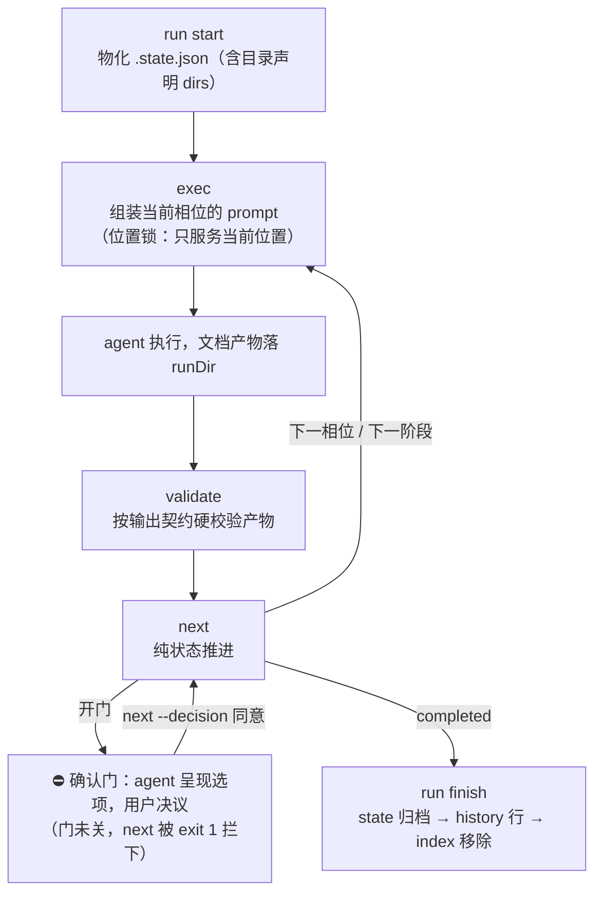

# ddo-code-flow

[](LICENSE)  

**ddo-code-flow** 是一个面向 AI coding agent 的工程化流水线 skill。它不替 agent 写代码，而是把一个开发任务从需求到交付的全过程装配成一条可控流水线：阶段链按需装配——选用内置预设，或在启动引导时按任务性质动态商定。

```text
原子任务 ×17（需求 / 规格 / 方案 / 测试计划 / 任务拆分 / 编码 / 验收 / 复审 / 报告 / 复盘 / worktree / PR …）
        │
        ├── 选用内置预设（workflows/*.json：basic 轻量链 / standard 全链）
        └── 启动引导时动态商定阶段链与依赖（DAG），以临时预设启动、物化后状态自包含
        ▼
装配出的流水线 —— 零依赖 Node 内核驱动：状态推进 / 产物校验 / 门拦截
                  agent 每相位只获取恰好必需的上下文
                  人审确认门未决议，推进被结构性拦截
```

## 为什么需要它

直接使用 AI 编码的典型问题是「一步到位、不可控、无过程」：未经需求澄清即开始实现、方案缺少评审、过程没有留档、中断后无法接续。

多数 agent 工作流的解法是把流程写进 prompt——「先出方案，等我确认再写代码」。但 prompt 是**约定**：模型可能遗忘、绕过或虚报完成。ddo-code-flow 把同一套流程写进**状态机与校验器**，变成结构——这是它与 prompt 级工作流的分界线：

| 约定式（流程写在 prompt 里） | ddo-code-flow（流程长在结构里） |
|---|---|
| 「方案需经我确认后再实现」是 instructions 里的一句话 | 确认门是 state 中的数据：门未关闭，`next` 即被拦截（exit 1），错误输出附带决议选项清单，决议留痕可审计 |
| agent 一次拿到全量指令与全部历史 | 每个相位只组装恰好必需的 prompt：指令切片 + 按 state 现算的动态上下文 + 输出契约 |
| 「做完了」由 agent 自述 | 产物按 output 声明硬校验：文件缺失、必填 section 缺失、残留占位符一律 exit 1 |
| 重做上一步，依赖会话上下文与人工整理 | 阶段级回滚：DAG 路径整体重置，作废产物移入 `_del/` 归档隔离，重做时生成新文件，新旧版本相互隔离 |
| 会话一断就失忆 | `.state.json` 唯一事实源，`resume` 跨会话、跨项目断点接续 |

> **Dogfooding**：本仓库的 v2 就是用这条流水线开发的——`.ddo/runs/feat/ddo-code-flow-v2/` 归档了全部 12 个工作项（00–11）的需求与定版方案，先经门评审、再进入实现。

何时不适用：一次性的小改动、问答、单文件修复不需要流水线——为其启动 run 的流程开销大于收益。

## 安装

前置要求：

- 一个宿主 AI coding agent（Claude Code / Codex 等）
- Node.js ≥ 18（流水线内核是零依赖的 Node CLI，宿主机器需能运行 `node`，无需 `npm install`）

**作为 skill 安装（推荐）**：把本仓库放入宿主 agent 的 skills 目录（Claude Code 为 `~/.claude/skills/` 或项目内 `.claude/skills/`，其他宿主按其规范放置），agent 会依据 [SKILL.md](SKILL.md) 的描述在用户提出多阶段开发任务时自动触发。

**clone 仓库（开发与手动调试）**：`git clone https://github.com/Djhhhhhh/Ddo-Code-Flow.git` 后可直接调用 CLI（见[命令参考](#命令参考agent-驱动机制)）。

## 快速开始

安装后，**用一句话把任务交给 agent 即可**——触发、推进、产物落盘均由 skill 机制驱动，用户只在确认门处做出决议：

> 按 ddo 流程开发：给导出函数补充边界处理

一个 run 大致长这样（本例选缺省预设 basic）：

```text
你      按 ddo 流程开发：给导出函数补充边界处理
agent   目标收到。流水线用内置 basic 预设（requirement → spec → plan → coding → reporting），
         还是从 17 个原子任务中自定义阶段链？类型采用 feat，可以吗？
你      用 basic
agent   （启动 run；澄清几轮后固化 requirement.md，推进到 spec，
         产出 spec.md 后停在评审门）

        ⛔ 确认门 · spec 评审——你决议之前，流程不会推进
          ▸ 同意   批准当前 spec，推进到 plan
          ▸ 驳回   回滚 spec 阶段，按意见重新生成
          ▸ 修改   告诉我要改哪里——停在相位内，改完再送审
          ▸ 提问   只读答疑，不修改文档
你      修改：验收标准里加一条边界值表
agent   （原地改写 spec.md，展示变化摘要，重新送审）
你      同意
agent   （门关闭、决议留痕，进入 plan；按同一节律完成 coding、reporting，收口归档）
```

全程无需记忆任何命令：决议直接使用自然语言选项（同意 / 驳回 / 修改 / 提问），命令由 agent 代为执行；阶段链同样如此——启动引导时说明所需阶段与依赖，装配由 agent 完成。过程产物自动写入项目的 `.ddo/runs/<type>/<runId>/`，run 结束后 state 归档到 `~/.ddo/history/`。

中断接手：新会话里说「继续之前的 ddo run」，agent 从全局索引发现运行中的 run、恢复现场、从断点相位继续。

## 它是怎么工作的

运行形态是**寄生式 skill**：没有独立进程，寄生于宿主 agent，通过 [SKILL.md](SKILL.md) 指令与 CLI 调用驱动。核心概念只有四个：

| 概念 | 是什么 |
|---|---|
| **原子任务**（`atom-tasks/<name>/`） | 最小构建单元，当前 17 个。每个任务包含指令（`prompt.md`）、相位与产物声明（`config.json`）、可选的动态上下文钩子（`<name>.js`）与输出契约（`<name>.output.schema.json`） |
| **workflow 预设**（`workflows/*.json`） | 把原子任务装配成流水线的预设（阶段顺序 + DAG 依赖）。启动时物化进 state，此后状态自包含，不再回指预设 |
| **`.state.json`** | 唯一事实源：当前执行位置（精确到相位）、阶段状态、run 级配置、目录声明全部在此。命令现读现写，不手工编辑 |
| **确认门** | 任务里 `type: human` 的相位就是门。推进到该相位时门注册进 state，CLI 拦截「未决议就推进」，agent 只负责呈现选项与代跑决议命令，**决策权保留在用户** |

一个 run 的内部驱动循环（由 agent 自动执行）：



三方分工：

| 角色 | 职责 | 边界 |
|---|---|---|
| CLI（`tools/cli.js`） | 推进、校验、门拦截、归档簿记 | 不做业务判断 |
| Agent | 执行组装出的 prompt；呈现门选项；代跑决议命令 | 不修改 state、不代用户决议、不跳过相位 |
| 用户 | 在确认门处决议（同意 / 驳回 / 修改 / 提问） | 无需接触 state 文件 |

## 命令参考（agent 驱动机制）

日常使用无需记忆本节——以下命令是 agent 依据 SKILL.md 自动调用的内部机制，供手动调试、CI 集成或二次开发参考。

| 命令 | 作用 |
|---|---|
| `run start` | 按预设装配启动 run：物化 `.state.json`（含 `dirs` 目录声明）+ 注册全局索引；runId 形如 `YYYYMMDD-HHMMSS-xxxx` |
| `exec` | 组装原子任务当前相位的 prompt（裸文本输出，渐进式加载；含输出契约与交互硬约束注入）；**位置锁**：只服务当前执行位置 |
| `validate` | 按任务 output 声明硬校验产物（存在性 / 必填 section / 列 / idPattern / 占位符 / jsonFields）；相位缺省 = 当前位置 |
| `next` | 纯状态推进：相位内前进（human 相位写门置 `waiting-human`）→ 阶段 done → DAG 就绪点亮；**门未关闭必须 `--decision <用户词汇>`**（如 同意；决议留痕） |
| `rollback` | 回滚一个阶段（每次一个）：目标及其 DAG 路径上的节点重置为 pending、清除未关闭的门；重置集合内已声明的产物**移动**归档到 `<runDir>/_del/rollback-<n>/`（输出 `archivedTo`/`archived`） |
| `run finish` | 生命周期收口：state 副本归档 `~/.ddo/history/<runId>/` → history 追加一行 → index 移除 → 清 currentStage（原 state 文件保留在项目中，随版本控制管理）；幂等可重入 |
| `status` | 已知 statePath 时的定位：当前位置 + 未关闭的门选项（gateOptions，含 in-phase）+ 派生的可执行命令（availableCommands） |
| `resume` | 断点重续入口（发现层，读全局 index）：无参列运行中 run 概要（多项目可见），`--run-id` 加载完整状态视图 |
| `list tasks` | 原子任务注册表（冷启动引导与自定义链的数据面） |
| `list workflows` | 预设清单：描述 + 阶段链 |

输出契约：stdout 输出 JSON（`exec` 为裸文本例外），stderr 输出人类可读的提示；退出码 `0` 成功 · `1` 硬失败（门拦截、校验失败等，错误信息附带后续操作指引）· `2` 用法错误。命令的 agent 侧协议（何时调用、门呈现、修正循环）见 [SKILL.md](SKILL.md)。

## 目录语义与产物生命周期

三个目录各有明确定义：run 启动时以 `dirs` 字段写入 state，从结构上避免产物写入错误目录。

| 术语 | 定义 | 判定 |
|---|---|---|
| **projectRoot**（项目根） | 版本控制根目录，代码与 `.ddo/` 均位于此 | `run start --project`（缺省 cwd） |
| **代码工作目录** | 代码改动发生地 | git worktree 场景为 `git.worktreePath`，否则 projectRoot |
| **runDir**（run 工作目录 = 流水线产物目录，二者同址） | `.state.json` 与流水线文档产物的唯一合法存放位置 | `<projectRoot>/.ddo/runs/<type>/<dirName>/`，state 的 `dirs` 字段显式携带 |

```text
<projectRoot>/                        项目根（版本控制根）
├── .ddo/runs/<type>/<dirName>/      ← runDir
│   ├── .state.json                  ← 唯一事实源（活文件）
│   ├── requirement.md / spec.md / plan.md / …   文档产物，随项目版本控制
│   └── _del/rollback-<n>/           ← 回滚/作废产物归档（移动语义，重做时生成新文件）
└── （代码改动发生于此或 worktree）

~/.ddo/（DDO_HOME，环境变量可覆写）    全局索引，跨项目
├── index.json                       运行中 run 指针
└── history/
    ├── runs.jsonl                   结束摘要（追加式）
    └── <runId>/.state.json          run 结束时的 state 归档副本
```

产物生命周期：

- **执行中**：state 是活文件，现读现写；文档产物只允许写入 runDir（output 声明禁止绝对路径与 `..` 逃逸，validate/归档直接拒绝）。
- **回滚**：重置集合内各阶段声明的产物**移动**到 `_del/rollback-<n>/`（一次 rollback 汇总同一编号目录），重做时重新生成，失效产物与新产物相互隔离。
- **结束**：`run finish` 把 state **复制**一份到 `~/.ddo/history/<runId>/.state.json`（原文件保留在项目中，随版本控制管理），供跨项目追溯与后续「预设自我进化」分析。

## 配置分层

原子任务的可配置项按三层取值，标量覆盖、`rules` 数组逐层拼接：

```text
任务默认（atom-tasks/<name>/config.json 的 defaults）
  < 用户级（~/.ddo/atom-tasks.json）
  < run 级（state.atomTasks，run start 时预填可配置项）
```

## 扩展

**新增原子任务**：在 `atom-tasks/<name>/` 下创建：

| 文件 | 必选 | 说明 |
|---|---|---|
| `prompt.md` | ✅ | 任务指令；`<!-- @phase:NN -->` 切分相位，`@interact` 标记交互点 |
| `config.json` | ✅ | 相位声明（`type: action\|human`、可选 `gate.options` 决议选项集）、output 定位符、defaults；受 `_schema/task-config.schema.json` 管控 |
| `<name>.js` | — | 上下文钩子：执行时基于 state 现算动态上下文 |
| `<name>.output.schema.json` | — | 输出契约（受 `_schema/output-schema.schema.json` 管控） |

**装配自定义流水线**：编写一个 JSON（`stages` 数组声明任务与 `dependOn` DAG 边），通过 `run start --workflow`（或 `--workflows-dir` 指向临时目录）启动；也可以在冷启动引导中与 agent 动态商定阶段链。格式分界约定：脚本读的一律 JSON，agent 读的一律 markdown——包括动态组装的 prompt。

## 仓库结构

```text
SKILL.md                 # agent 侧使用说明（skill 入口；本 README 面向使用者）
workflows/basic.json     # 轻量预设：requirement → spec → plan → coding → reporting
workflows/standard.json  # 标准预设（全链）：+ test-plan / tasking / verification / review / reflection
atom-tasks/<name>/       # 17 个原子任务 + _schema/（config 与输出契约的 meta-schema）
tools/cli.js             # 确定性执行内核（命令注册表即文档源）
tools/lib/               # state / index-registry / history / assemble / output-schema …
tools/tests/             # node:test 沙箱隔离测试（10 个文件，78 用例）
.ddo/runs/               # 本项目自身的 run 归档——v2 即由本流水线开发（dogfooding）
```

## 开发与测试

```bash
npm test   # = node --test tools/tests/*.test.js
```

测试在临时目录沙箱内隔离运行，不影响真实项目与 `~/.ddo`。快速迭代期暂不上 CI，提交前本地跑绿即可。

## 设计文档与路线图

v2 的需求与定版方案按工作项归档在 `.ddo/runs/feat/ddo-code-flow-v2/`：00 总览、01 预清理、02 索引结构、03 工具框架、04 命令集、05 原子任务改造、06 工作流预设、07 执行节律与确认门、08 断点重续、10 冷启动引导、11 产物生命周期、12 完整度审计收口（09-coding-worktree 为并行线）。路线图上的后续项（详见各工作项开放问题表）：

- 并行多门决议粒度；严格用户亲跑通道（防 agent 伪造决议，现依赖呈现协议 + 决议留痕审计）
- 用户级预设；预设自我进化（基于 `~/.ddo/history/<runId>/` 归档分析自定义链频次）
- 产物快照归档；非回滚的显式失效标记命令

## 参与贡献

欢迎 Issue 与 PR（模板在 `.github/`：bug / feature 两类 issue 模板 + PR 检查单）。涉及流程语义的改动请走与实现相同的过程：先需求与方案（requirement → spec → plan），评审通过后再进入实现——本项目自身就是用这条流水线开发的。命令行为变化须同步 `tools/cli.js` 命令注册表、本 README 与 SKILL.md。

## 许可证

[MIT](LICENSE) © 2026 Djhhhhhh
