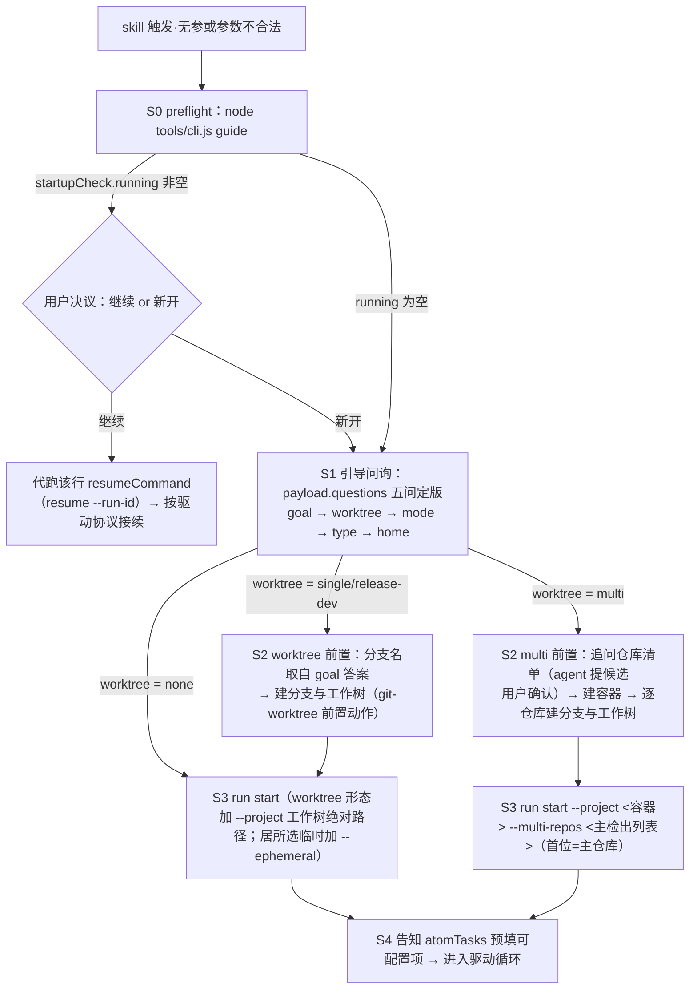

# ddo-code-flow

## 何时使用

用户要求「跑流水线」「按 ddo 流程开发」「use ddo-code-flow」，或明确要走过
需求 → 规格 → 计划 → 编码 → 报告的多阶段流程时激活本 skill。
一次性的小改动、问答、单文件修复不需要流水线，不要激活。

## 运行位置

- `skillRoot`：本 SKILL.md 所在目录（atom-tasks / workflows / tools）。运行期只读，不得写入。
- `projectRoot`（项目根）：用户调用时的项目根，版控根。
- `代码工作目录`：代码改动发生地——`git.multiRepo` 为 true → 多仓库隔离（各仓库改动落
  `state.git.repos` 对应工作树，任务 ctx 注入仓库↔工作目录全映射，容器根见 `git.container`）；
  否则 `git.worktreePath` 非空 → worktree，否则 projectRoot
  （worktree 何时/如何创建见下节「worktree 创建时机」）。
- `runDir`（run 工作目录 = 流水线产物目录，同址不分家）：`<projectRoot>/.ddo/runs/<type>/<dirName>/`。
  `.state.json` 与全部流水线文档产物（spec.md / plan.md…）的唯一合法居所，state 的 `dirs` 字段显式携带。
  **临时模式例外**（`run start --ephemeral`）：runDir 改为 `~/.ddo/tmp/<type>/<runId>/`（项目内零创建，
  居所不变量的显式例外）——适合过程信息无需保留的流程型 run（如 PR 交付链）；与 worktree 组合时产物不入分支。
- `DDO_HOME`：全局索引目录，缺省 `~/.ddo`（`index.json` 运行中指针、`history/runs.jsonl` 历史、
  `history/<runId>.zip` 结束归档（runDir 整目录 zip）。
- CLI 入口：`node <skillRoot>/tools/cli.js <命令>`。

**产物生命周期**：中间产物默认随项目版控走（留在 runDir，不搬不移）；rollback 时重置阶段
声明的产物**移动**到 `<runDir>/_del/rollback-<n>/`（原位消失，重做产新文件）；run finish 时
runId 目录整目录 zip 归档到 `~/.ddo/history/<runId>.zip`（原目录不动，随项目版控走）。output 声明
禁绝对路径与 `..`（防逃逸，CLI 两层校验）。**临时模式**（`state.ephemeral`）：finish 蕴含免归档
（zip 与 runs.jsonl 均不落）并**直接删除** runDir 整目录——项目内外零残留（含 aborted/failed 终态）。

## worktree 创建时机（WTT 机制）

**时序**：worktree（如启用）在**启动引导阶段、`run start` 之前**创建——分支名从引导问得的
需求一句话（title）提取；随后 `run start --project <工作树绝对路径>` 落位，state 与全部产物
落在 worktree 分支内（runDir ⊂ projectRoot 不变量天然满足）：创建在前、物化在后，无中途迁移。

**注册与创建的分工**：

- **注册**：`run start` 时 git-info 推断链自动探测——projectRoot 位于 worktree
  （`--git-dir` 与 `--git-common-dir` 绝对化比较不等）即捕获 `state.git.branch` 与
  `state.git.worktreePath`（= `dirs.projectRoot`；主检出/非 git 不产出新字段）。
  CLI 命令面零新增参数；`branch` 探测失败置空串，不阻断启动。
- **创建**：创建动作（分支名提取 / git 建库 / 审计登记）由 git-worktree 原子任务承载，
  属**启动前置动作**——不入预设链，链内引用属误用。宿主无 worktree 切换工具时，
  绝对路径操作 + `--project` 即等效路径。

**三场景（mode 旋钮，缺省 none）**：

| 场景 | 分支基线 | 启动形态 |
|---|---|---|
| none（缺省） | — | 主检出/当前目录 `run start` |
| single（单分支） | 仓库主分支 | 前置创建 → `run start --project <worktree>` |
| release-dev（发布+开发） | `base_branch` 旋钮 | 同上，基线换为发布分支 |
| multi（多仓库隔离） | 各仓库同名分支 | 前置建容器目录（根含 `.ddo`，内并列各仓库 worktree；分支名同规则逐仓库同名）→ `run start --project <容器> --multi-repos <主检出列表>`（首位=主仓库）；注册校验逐仓库全或无，state.git 物化 `multiRepo`/`container`/`repos`，`dirs.projects` 列全部工作树（同序） |

**旋钮与消费时序**：`mode` / `base_branch` / `worktree_dir` 声明于 git-worktree 任务
configurable。**消费时点在启动引导问询**——选项数据由 `guide` payload 从该 config 现算呈现，
对话表达即定制；`run start` 预填 `state.atomTasks` 仅为事后登记（创建先于 state 存在，
预填值不参与创建）。持久定制走 `--tasks-dir` 覆盖任务目录。

**收尾**：`run finish` 后由 cleanup-worktree 清理——先确认分支合并/去留（未合并分支不得删除），
离开 worktree（切回**主检出**，而非 runDir 上溯的 projectRoot——它就是被清理目录），
再 `git worktree remove`。

## 核心契约

1. **格式分界**：脚本读的写 JSON，agent 读的写 markdown——exec 组装出的 prompt 也是 md。
2. **`.state.json` 是唯一事实源**：读 `currentStage`（形如 `spec:01`）决定当前要做什么；
   一切推进通过语义命令（`next` / `rollback` / `run finish`），不要手改 state。
3. **渐进式加载**：每次只 `exec` 当前相位——指令、恰好必需的上下文（ctx 钩子按 state 现算）、
   Output Contract 会被组装进一个 prompt；不要全量加载任务文件。
4. **确认门与呈现协议**：任务的 `type: human` 相位是确认门的**声明**（注册源，可选
   `gate.options` 选项集定制——用户词汇决议名（如 同意/驳回/修改/提问），action 分推进型/
   转移型/相位内交互 in-phase；per-task `present` 钩子可现算动态选项，如 spec 门的 回答BQ-N）；
   进入该相位的推进命令把门实例（含选项集）注册进 `stages[k].gate`。CLI 拦截「门未关就推进」
   **且拦截「未呈现就决议」**：呈现经 `gate present`（盖 `presentedAt` 留痕）、in-phase 交互经
   `gate interact`（留痕并使呈现过期）——最后交互后未重新呈现，`next --decision` / 转移型
   rollback 会被结构性拒绝。agent 只负责「跑呈现命令 → 转述 payload → 按 dispatch 代跑」，
   不负责放行、不得自造呈现；呈现/交互/决议全程留痕供审计。
5. **节律结构锁**：exec/validate 只服务 `currentStage` 中的位置（相位缺省 = 当前相位，
   不一致即拦）——不 next 就停在原相位，执行节律由结构保证而非指令约定。
6. **四通道**：stdout=JSON（exec 为裸文本例外）/ stderr=人话 / exit 0·1·2 / state 现读不缓存。

## 启动状态机（skill 触发时无参数 / 参数不合法）

触发后若用户没有给出可启动的参数（或 `run start` 报参数/预设不合法），**不要自由发挥**——
按启动状态机走。全部呈现数据出自 `guide` payload（启动检查唯一数据源：`startupCheck` +
五问），本节只描述状态与时序、不自述问题清单——**payload 是唯一呈现源：不得自拼选项、
不得重排或增删问题**（双源描述必然漂移）。



**各状态行为**：

1. **S0 preflight**：跑 `node tools/cli.js guide` 取 payload。`startupCheck.running` 非空 →
   先向用户呈现「继续（各行含位置与门概要，附带 resumeCommand）/ 新开」——选继续即代跑该
   resumeCommand，之后按其 availableCommands 接续驱动（旧 run 不打断、与新开并存）；
   选新开走 S1。`running` 为空 → 直接 S1。
2. **S1 引导问询**：按 `payload.questions` 顺序逐问原样呈现（宿主提问工具）：
   **goal**（freeText 一句话，同时是 worktree 分支名的语义来源）→ **worktree 场景**
   （WTT 旋钮；选项与缺省由 payload 从 git-worktree 任务 configurable 现算，`--tasks-dir`
   定制自动传导；选 release-dev 时按 followUp 追问基线分支名；选 **multi** 时按 followUps
   追问仓库清单——agent 依需求分析提出候选主检出清单，经用户确认/修订后生效，
   首位=主仓库）→ **mode** → **type** →
   **home**（选「临时」→ 启动附加 `--ephemeral`，运行材料落 `~/.ddo/tmp`，项目内不建
   runId 目录，finish 后即删——适合流程型 run）。mode 选**自定义**时：`node tools/cli.js
   list tasks` → 呈现任务清单（desc / 相位与人审位 / 可配置项），与用户商定阶段链（顺序与
   依赖）→ 写临时预设 JSON（os.tmpdir，结构同 workflows/*.json）→ `run start
   --workflows-dir <临时目录> --workflow <名>`（物化进 .state.json 后临时文件即弃）。
3. **S2 worktree 前置**（场景 single / release-dev）：按 git-worktree 前置动作执行——
   title 提取分支名 → 建分支与工作树（机制详见「worktree 创建时机」节）→ S3。
   场景 **multi** 走 S2M：先建隔离容器目录（根含 `.ddo`），再按确认清单逐仓库建同名分支与
   工作树（先容器后 worktree 的顺序不变量；任一仓库 git 失败即暂停报告）→ S3M。
4. **S3 run start**：按答案组装参数启动（`--title` / `--workflow` / `--type`；worktree
   形态 `--project <工作树绝对路径>`；multi 形态 `--project <容器绝对路径> --multi-repos
   <主检出列表>`（首位=主仓库，CLI 逐仓库校验全或无）；居所临时 `--ephemeral`）。报错自带指路：未知预设
   列出现有预设；未知任务指向 list tasks——按提示回到 S1 对应问重问。
5. **S4 启动后告知**：把 `state.atomTasks` 中**预填的可配置项**告知用户（有 default 的已
   填入，如 test-plan 的 tdd；其余可配置项见 list tasks 输出的 configurable）——用户可改
   哪些旋钮一目了然（git-worktree 的 mode 预填值为登记留痕：创建已在启动前完成）。

## 驱动一个 run

```bash
# ① 启动（返回 statePath 与起点；git 信息自动推断，非 git 环境置空）
node tools/cli.js run start --title "<一句话描述>"
#    worktree 形态（WTT）：启动状态机问场景后先建分支与工作树，再 run start --project <工作树绝对路径>
#    ——state.git 自动捕获 branch/worktreePath，state 与产物全部落在 worktree 分支
#    multi 形态（多仓库隔离）：先建容器（根含 .ddo）→ 逐仓库建同名分支与工作树 →
#    run start --project <容器绝对路径> --multi-repos <主检出列表>（首位=主仓库）；
#    state.git 物化 multiRepo/container/repos，任务 ctx 注入仓库↔工作目录全映射
#    临时模式（可选 --ephemeral）：运行材料落 ~/.ddo/tmp/<type>/<runId>/，项目内不建
#    runId 目录；run 期间全部命令照常（state 唯一事实源），finish 后材料直接删除

# ② 逐相位循环，直到 next 返回 completed:true
读 state.currentStage → 得 <stageId>:<phase>
node tools/cli.js exec      --state <statePath> --task <stageId>   # 相位缺省=当前位置
node tools/cli.js validate  --state <statePath> --task <stageId>
node tools/cli.js next      --state <statePath>
#    硬约束：每个相位的执行以【当次 exec 的组装结果】为准——不得跳过 exec、不得以
#    「与之前相位/之前 run 相同」为由凭记忆替代（重放当前相位、中断重开后尤其如此）；
#    exec 输出必须完整消费后再动手，不得只读前段忽略 Context 注入。

# ③ 确认门（next 输出 openedGates，或 status 显示 waiting-human）
#    呈现与交互全部走结构命令——payload 是唯一呈现数据源，不得自造：
node tools/cli.js gate present --state <statePath>   # 取统一 payload + 盖 presentedAt 留痕
#    用宿主提问工具把 payload 的 options（name/desc/dispatch）原样呈现给用户；用户选择后按 dispatch 处理：
node tools/cli.js next --state <statePath> --decision 同意    # 推进型决议（用户词汇）
#    转移型（dispatch 是 rollback / run finish 命令）→ agent 代跑该命令；
#    相位内交互（in-phase，如 修改/提问/回答BQ）→ 先记录再处理，处理后重新呈现：
node tools/cli.js gate interact --state <statePath> --option 提问 --note "<问题>"
#    …按该相位 prompt 的行为定义处理（答疑/写回/归档）→ 重新 gate present 送审
#    （未重新呈现就决议会被结构拦截：next/rollback exit 1 并重发选项清单）

# ④ 中断恢复（新会话接手 run 时——先发现，再加载；启动路径上的优先呈现见「启动状态机」S0）
node tools/cli.js resume                        # 全局列运行中的 run（位置/门概要；stale 惰性淘汰）
node tools/cli.js resume --run-id <runId>       # 加载选定 run 的完整状态（含 statePath 与双清单）
#    已知 statePath 时可直接 status；之后按 availableCommands 继续

# ⑤ 结束（唯一收口入口；runId 目录自动 zip 归档到 ~/.ddo/history/<runId>.zip，原目录随项目版控走）
node tools/cli.js run finish --state <statePath> --status done   # 或 aborted / failed
#    临时模式 run（state.ephemeral）：finish 蕴含免归档并直接删除 ~/.ddo/tmp 下的运行材料
```

**确认门协议（gate present 呈现、用户选择、agent 代跑）**：开门后先 `gate present` 取
payload（静态 ∪ 动态选项，含 dispatch 指引）并转述——这是唯一呈现入口。门未关闭时 `next`
会被拦截（exit 1，stderr 重发选项清单——错误信息本身就是提示）；**呈现留痕后才能决议**：
`next --decision` 与转移型载体（rollback 驳回）在「从未呈现」或「in-phase 交互后未重新呈现」
时被结构性拒绝（`gate interact` 留痕使呈现过期——提问/修改/回答BQ 处理完必须重新
`gate present` 送审，re-ask 由结构强制）。不得替用户决议、不得在 payload 之外自造选项。

**中断恢复协议**：先 `resume` 发现运行中的 run（全局清单，多项目可见），用户选定后
`resume --run-id` 取完整状态；若有开门，跑 `gate present` 取同源 payload（resume 的
`gateOptions` 与之一致）呈现给用户后等选择——提示来自结构化输出，不自行发挥。

`validate` 失败（exit 1）时进入修正循环：按 stderr 指出的缺失/结构问题修正产物后重新校验，
不要带错推进（重放当前相位 exec 是合法的）。

## 硬边界

- 运行期不写 `skillRoot`；不修改 `.gitignore` 或 git exclude。
- 回滚用 `rollback --stage <stageId>`（每次一个阶段），不要手工改 stages 状态；
  回滚会清除该阶段未关闭的确认门（重做后重新送审），并把重置阶段已声明的产物移动到
  `<runDir>/_del/rollback-<n>/`（输出 `archivedTo`/`archived` 告知去向）——不要手工删产物或
  手工往 `_del` 搬文件。
- 需要认证/TTY 的命令（如 `gh auth login`）不得代跑——交给用户在宿主 shell 执行。
