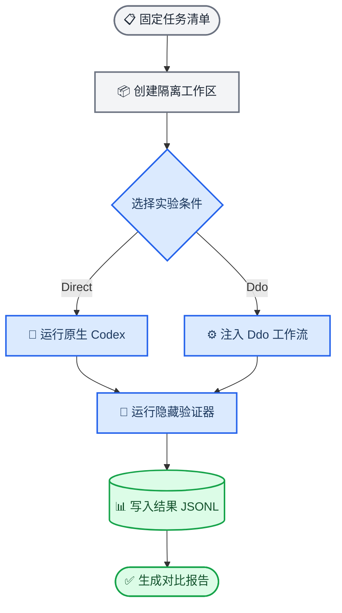

# DdoFlow-Eval 评测集

_Ddo-Code-Flow 的 Codex 对照评测框架与六任务 Smoke 评测集（v0.1）_

---

## 📋 评测集定位

DdoFlow-Eval 用于测量：在相同 Codex、相同任务、相同仓库版本和相同外部验证器下，加载 Ddo-Code-Flow 后是否能提高软件工程任务的完成质量。

当前版本首先提供 6 个 Smoke 任务。Smoke 是小规模、覆盖关键风险的前置评测，主要用于验证：

- Direct 与 Ddo 两条实验链路能否完整运行
- 隐藏验证器能否区分原始代码和正确实现
- Ddo 是否在复杂任务上带来能力收益
- Ddo 是否在简单任务上产生不必要的时间与 Token 开销
- 自动路由、脚本化 HITL、安全工作流和长链任务机制是否正常
- 结果是否能够被隔离、记录并进行配对分析

Smoke 不是最终的大规模 Benchmark。当前 6 个任务可以在可信、受控的本地环境中产生工程 Smoke/Pilot 数据，但不能单独支撑“Ddo 对软件工程任务普遍显著优于 Direct”的强结论；正式 Held-out Benchmark 还需要增加操作系统或容器级的隐藏资产隔离。

| 阶段 | 建议规模 | 主要目的 | 结论强度 |
| --- | ---: | --- | --- |
| Smoke | 当前 6 个任务 | 验证链路、发现明显问题、观察初步趋势 | 不支持普遍性结论 |
| Pilot | 约 18 个任务 | 调整任务分布、估计方差、修正指标 | 支持有限趋势判断 |
| Held-out Benchmark | 约 48 个私有任务 | 检验泛化性并进行正式比较 | 满足抽样与统计前提时，可支持更强结论 |

当前实现状态：

- 3 个 Python 任务和 3 个 TypeScript 任务
- 6 类任务 Track
- 5 种 Codex 实验条件
- 固定仓库 Commit 和隔离工作区
- Direct/Ddo 共享隐藏验证器与脚本化用户 Oracle
- Base 必须失败、Reference 必须通过的双向验证器审计
- Pass@1、虚假完成、Token、路由和任务级配对分析
- 公共回归测试 `32/32` 通过
- 隐藏验证器审计 `6/6` 通过

## ⚙️ 评测执行流程



每次运行依次执行：

1. 读取公开 Suite 和任务清单
2. 从固定 Git Commit 创建全新隔离工作区
3. 安装任务所需依赖
4. 使用指定 Condition 运行 Codex
5. 收集 Agent 最终工作区与代码补丁
6. 在 Agent 结束后运行外部隐藏验证器
7. 记录正确性、Token、时间、路由、交互和错误
8. 将公开结果追加到 JSONL
9. 对 Direct 与 Ddo 进行任务级配对分析

真正决定任务是否成功的是外部隐藏验证器，而不是 Agent 自己声明完成、Ddo 生成的 `test-plan.md`、Agent 自己添加的测试或 LLM 主观评分。

## 📦 目录与隐私边界

公开评测框架位于 `eval/`：

```text
eval/
├── README.md                 # 本说明
├── run.py                    # CLI 入口
├── ddoflow_eval/             # Runner、Adapter、评分和分析实现
├── schema/                   # Suite、Task、Oracle、Verifier 与结果 Schema
├── suites/smoke.json         # 六任务 Smoke Suite
├── tasks/smoke/              # 公开任务清单与 Prompt
└── tests/                    # 评测框架公共回归测试
```

每个公开任务包含：

- 仓库 URL、许可证与固定 40 位 Git Commit
- 用户需求 Prompt
- Python 或 TypeScript 环境安装命令
- 难度、Track 与标签
- 预期工作流
- 公开验收标准
- HITL 和中断场景元数据
- Agent 时间和 Token 预算
- 对应隐藏 Verifier 的标识符

私有资产位于 Git 忽略目录 `.eval-private/`：

```text
.eval-private/
├── verifiers/                # 外部验证器和隐藏测试
├── oracles/                  # 脚本化 HITL 用户事实
├── references/               # 参考正确补丁
├── base/                     # 原始 Base 工作区
├── work/                     # Reference 工作区
└── audit-runs/               # 验证器审计日志
```

`.eval-private/` 不会提交到 Git，也不会复制进 Ddo Skill Overlay。从 GitHub 重新克隆项目时，需要单独恢复该目录，才能运行完整评测。

> ⚠️ **当前隐私边界不是物理隔离：** Codex 使用 `workspace-write` 沙箱运行，该模式限制写入范围，但仍可能读取宿主机上的其他路径。因此 v0.1 主要依靠不向 Agent 提供私有路径和 Prompt 约束来保持隐藏，不能抵抗主动搜索隐藏资产的 Agent。正式 Held-out Benchmark 应将 Agent 放入仅挂载目标工作区和 Skill Overlay 的容器，或由独立评测服务在 Agent 退出后执行私有验证。

对于 Oracle 和隐藏 Verifier 等私有内容，公开结果 JSONL 只暴露以下摘要：

- 总体是否通过
- 每个公开验收标准是否通过
- HITL 每轮命中事实数量
- 是否使用 Oracle fallback

完整的隐藏测试输出、Verifier 日志、Agent 问题、Oracle 回答和事实 ID 只保存在私有 `runs-root`，不应公开。

`bootstrapFiles` 会在 Agent 运行前复制到目标工作区，因此其中只能放置允许 Agent 看到的依赖文件，不能放置隐藏测试或答案。当前仅 PQueue 任务使用经过 SHA-256 校验的依赖锁文件。

## 🧪 六个 Smoke 任务

| 任务 | Track / 难度 | 仓库与 Commit | 预期工作流 | 核心检测点 |
| --- | --- | --- | --- | --- |
| cachetools `remaining_capacity` | negative-control / easy | `tkem/cachetools@e164b702` | lightweight | 简单任务正确性与工作流额外开销 |
| itsdangerous 输入限制 | ambiguous-hitl / medium | `pallets/itsdangerous@672971d6` | guarded | 模糊安全需求、澄清和边界语义 |
| Tenacity `on_giveup` | recovery / medium | `jd/tenacity@b2cd0274` | guarded | 同步/异步 API 与恢复场景定义 |
| defu 数组替换 | routing / easy | `unjs/defu@82632b66` | guarded | 自动路由与多表面 API 修改 |
| destr 不安全键策略 | guarded-risk / medium | `unjs/destr@541b6f9a` | guarded | 原型污染、安全策略与 HITL |
| PQueue 清理等待任务 | long-horizon / hard | `sindresorhus/p-queue@a06fbc92` | guarded | 异步竞态、资源清理和长链修改 |

### cachetools：剩余容量属性

任务 ID：`py-smoke-01-cache-remaining-capacity`

固定 Commit：`e164b7020e4211b57d20fe2b252d931af6244ad4`

任务要求给 `Cache` 增加只读的 `remaining_capacity` 属性：

```text
remaining_capacity = maxsize - currsize
```

同时要求：

- 不强制转换或截断数值
- 支持所有内置 Cache 子类和定时 Cache
- 反映插入、替换、删除、清空、驱逐和过期
- 尊重自定义 `getsizeof`
- 保持运行时 API 与公开类型声明同步
- 保持上游回归测试通过

该任务是 negative-control，主要检测 Ddo 是否能在小任务上正确选择 lightweight，以及是否引入不必要的规划、HITL、时间和 Token 开销。它的价值不是证明复杂任务收益，而是发现工作流的额外成本回归。

### itsdangerous：输入大小限制

任务 ID：`py-smoke-02-itsdangerous-input-limit`

固定 Commit：`672971d66a2ef9f85151e53283113f33d642dabd`

任务要求为来自不可信客户端的签名值增加可选输入大小限制，并在昂贵的验证、解码或解压操作之前拒绝超限输入。未配置限制时必须完全兼容现有行为。

公开需求故意没有完整指定：

- API 应位于哪个对象或入口
- 使用字符数还是字节数
- 边界值是否接受
- 哪些加载入口受影响
- 使用什么异常和参数校验规则

Direct 和 Ddo 使用相同私有 Oracle。该任务用于观察 Agent 是否识别关键歧义、是否触发脚本化澄清，以及澄清结论能否贯穿运行时实现、类型、异常、边界和默认兼容行为。

公开 Prompt 要求 Agent 在实现前澄清，但当前 Harness 没有保存“首次编辑前”的强制检查点，因此不能证明 Agent 一定先问后改。当前能记录交互轮数、命中事实数量、fallback 次数和最终正确性，但尚未对问题措辞和信息价值进行人工评分。

### Tenacity：`on_giveup` 终止 Hook

任务 ID：`py-smoke-03-tenacity-on-giveup`

固定 Commit：`b2cd0274c67610d615019ab4745f521504a0576d`

任务要求为公共重试配置增加 `on_giveup` Hook，并保证：

- 最终可重试结果被 stop policy 终止时只执行一次
- 与 `after`、错误回调和最终异常保持正确顺序
- `Retrying` 和 `AsyncRetrying` 均支持
- 异步重试能够等待异步 Hook，同时接受同步 Hook
- `copy()`、装饰器和 `retry_with()` 正确继承、覆盖或禁用 Hook
- Hook 抛出的异常直接传播
- 成功、禁用重试或非重试结果不能调用 Hook
- 类型和文档保持同步

该任务检测跨同步/异步路径、多个公共 API 和异常顺序的一致性。任务清单已定义“tasking 阶段完成后中断”的场景，但 v0.1 Runner 尚未自动执行 kill/resume，因此当前不能把它作为已经实测的中断恢复结果。

### defu：数组替换导出

任务 ID：`ts-smoke-01-defu-array-replace`

固定 Commit：`82632b66f5914e9946edce300e10633a3d5c0cb7`

任务要求增加命名导出 `defuArrayReplace`：当高优先级值和默认值都是数组时，完整使用高优先级数组替换默认数组，而不是拼接。

同时要求：

- 支持嵌套对象和多个 defaults
- 保持 nullish 规则和输入不可变
- 保持原型污染防护
- 保持泛型返回类型
- 同步 ESM/CJS 导出、构建结果和 README
- 保持现有测试、格式和构建通过

该任务用于检测 `ddo-auto` 是否按照当前版本路由配置选择 `guarded`。`routingCorrect=true` 只表示选中的工作流符合版本化配置，不代表该路由策略本身一定最优。

### destr：不安全键策略

任务 ID：`ts-smoke-02-destr-unsafe-keys`

固定 Commit：`541b6f9aeada9fc30de9c5a7e086dbfc1c6fcdc7`

任务涉及 Prototype Pollution 防护，需要把不安全键处理策略与一般严格 JSON 解析分离，并增加可配置的 drop/error 行为。

公开需求要求 Agent 在实现前澄清：

- 新选项允许的取值
- 与原有 `strict` 的优先级
- 删除危险键时的警告行为
- `safeDestr` 应如何处理
- 如何保持现有默认行为

该任务检测安全敏感变更是否进入 guarded 工作流、是否触发 HITL，以及 Agent 是否能正确处理优先级矩阵、默认兼容、嵌套或转义危险键、类型、文档、格式、覆盖率和构建。

### PQueue：清理等待任务并结算 Promise

任务 ID：`ts-smoke-03-pqueue-clear-pending`

固定 Commit：`a06fbc928725f074c72716e1ba21106df6822dae`

任务要求扩展：

```typescript
queue.clear({rejectPending: true, reason?})
```

同时保证：

- 无参数 `clear()` 完全保持旧行为
- 只拒绝尚未启动的任务
- 已经开始的任务继续正常运行
- 默认使用名称为 `AbortError` 的 `DOMException`
- 自定义 reason 保持对象身份
- 清理排队任务的 `AbortSignal` Listener
- abort/clear 竞态不能重复结算
- 保持自定义队列、限速状态和事件行为
- 导出 `ClearOptions` 并更新文档
- 保持上游回归和类型测试通过

该任务检测长链工程任务中的异步竞态、资源清理、Promise 单次结算，以及源码、类型、事件、测试和文档的一致性。任务定义了“第 16 次工具调用时中断”，但 v0.1 尚未启用自动中断注入。

## 🔧 实验条件与公平性

Runner 支持五种 Condition：

| Condition | 含义 |
| --- | --- |
| `direct` | 不加载 Ddo；Codex 仍可读代码、修改、添加测试、运行测试和迭代 |
| `ddo-lightweight` | 强制加载 Ddo lightweight 工作流 |
| `ddo-standard` | 强制加载 Ddo standard 工作流 |
| `ddo-guarded` | 强制加载 Ddo guarded 工作流 |
| `ddo-auto` | 加载 Ddo，并由版本化配置自动选择工作流 |

Direct 不是被刻意削弱的一次性生成。Direct 与 Ddo 都能完整检查仓库、修改代码、运行测试并反复迭代。核心处理差异是是否注入 Ddo Skill。

推荐分别回答两个问题：

1. `direct` 对 `ddo-standard`：估计加载固定 Ddo 工作流的因果效果，减少自动路由这一额外变量
2. `direct` 对 `ddo-auto`：评估用户实际使用时“路由策略 + 被选工作流”的整体效果

当前公平性控制包括：

- 两组使用相同模型、公开 Prompt、固定 Commit、安装命令、预算和隐藏 Verifier
- 每次运行从共享 Git Mirror 创建独立 Clone，并 detached 到固定 Commit
- Python 每次运行创建独立虚拟环境
- Python worktree-aware 导入逻辑优先加载当前 Ddo Worktree，而不是 setup 阶段的原 Checkout
- TypeScript 为 Ddo Worktree 复用同一次运行安装的 `node_modules`
- Ddo Skill 被复制为运行专属只读 Overlay，并排除 `.git`、`eval/` 和 `.eval-private/`
- Direct 与 Ddo 的脚本化 HITL 使用相同私有 Oracle
- Ddo 必须产生且只能产生一个位于当前 Run 目录下的 Worktree
- 找不到 Ddo Worktree 或 Worktree 存在歧义会计为处理组失败，而不会从分母中删除
- 最终补丁统一从固定 Base Commit 生成
- Runner 按重复轮次反转条件顺序，减少固定时间顺序偏差

为了无人值守运行，评测 Overlay 会预先批准确认门、关闭 Ddo 自身 Metrics，并关闭 test-plan 的 TDD Gate。因此当前测量的是“自动批准的 Ddo 工作流”，不完全等同于真实人工确认门体验。

## 📊 记录字段与分析指标

每条 JSONL 结果主要记录：

- 身份：`runId`、`suiteId`、`taskId`、`track`、`language`、`difficulty`
- 条件：`condition`、`repeat`、`model`
- 版本：`taskBaseCommit`、`skillCommit`
- 环境：操作系统、Python、Node.js 和 Codex CLI 版本
- 时间：开始时间、结束时间、总耗时、Agent 耗时、Verifier 耗时
- 执行：Agent 退出码、轮数、声明状态和协议错误
- 路由：`selectedWorkflow`、`expectedWorkflow`、`routingCorrect`
- HITL：命中事实数和是否使用 fallback
- Token：输入、缓存输入和输出 Token
- 外部评分：`external.passed` 和每个公开 `AC-*` 的布尔结果
- 虚假完成：`falseCompletion`

### 功能正确性与 Pass@1

最终正确性由以下字段决定：

```text
external.passed
```

单条件总体成功率：

```text
Pass@1 = 通过外部验证的有效运行数 / 有效运行数
```

对于每个任务 `i`，先计算两条件的任务级成功率差：

```text
Delta_i = PassRate_i(Ddo) - PassRate_i(Direct)
```

内置报告中的主对比指标是所有任务 Delta 的等权平均：

```text
Delta Pass@1 = mean(Delta_i)
```

因此，`pairedComparison.deltaPassAt1` 不一定等于 `conditions` 中两个总体 `passRate` 的直接相减，尤其是在不同任务有效运行次数不一致时。正值表示 Ddo 的任务级平均通过率更高，负值表示更低。

### 虚假完成率

如果 Agent 声称 `status=completed`，但隐藏验证失败，则：

```text
falseCompletion = true
```

它用于检测模型是否“认为任务已经完成”，实际却没有满足外部验收标准。

### 成本与效率

每条运行记录会保存输入、缓存输入和输出 Token。v0.1 的内置 `analyze` 只聚合输入与输出 Token，并计算：

```text
tokensPerResolved = 总输入与输出 Token / 成功解决任务数
```

时间字段已经记录在单次 JSONL 中，但 v0.1 的内置 `analyze` 尚未聚合平均延迟，需要后续单独统计。

### 路由与 HITL

`routing.accuracy` 仅统计 `ddo-auto`：

```text
routingCorrect = selectedWorkflow == expectedWorkflow
```

当前六任务预期路由分布为：

- `lightweight`：1 个
- `guarded`：5 个
- `standard`：0 个

因此当前 Smoke 能检测 lightweight/guarded 路由，但尚未覆盖自动选择 standard 的任务。`routingCorrect` 衡量的是对当前配置的遵循程度，不证明路由策略最优。

脚本化 HITL 的公开结果记录交互轮数、事实命中数量、fallback 使用情况和澄清后的最终正确性。Runner 只有在某一轮结构化结果为 `blocked` 时才会调用 Oracle，但公开 JSONL 不保存每轮完整状态，也不能证明提问发生在任何代码编辑之前；这些细节只能结合私有 Transcript 审计。

### 失败归因

结果状态包括：

| 状态 | 含义 | 是否进入有效分母 |
| --- | --- | --- |
| `completed` | Agent 进程和结构化输出协议正常 | 是 |
| `agent-failure` | Agent 超时、非零退出或协议失败 | 是 |
| `infrastructure-failure` | Provider 限流、认证、连接或 Harness 故障 | 否 |

`status=completed` 只表示进程和协议正常，不代表任务功能正确；功能结果必须查看 `external.passed`。

分析报告还包括：

- `scheduled`、`valid` 和 `infrastructureFailures`
- `passed`、`passRate`
- `falseCompletions`、`falseCompletionRate`
- 输入和输出 Token 总数
- `tokensPerResolved`
- 按 Track 统计的 `byTrack`
- `routing.accuracy`
- 每个任务的 `taskDeltas`
- `wins`、`ties`、`losses`
- 基于任务聚类的 10,000 次 Bootstrap 95% 置信区间

## 🚀 使用方法

以下命令均从项目根目录运行。

### 1. 检查依赖与登录状态

```bash
cd /path/to/Ddo-Code-Flow

python3 -m pip install -r requirements-dev.txt

codex login status
git --version
node --version
npm --version
corepack --version
```

运行前还必须确认 `.eval-private/` 已恢复。`eval/results/` 默认被 Git 忽略。

### 2. 运行公共回归测试

```bash
PYTHONDONTWRITEBYTECODE=1 pytest -q tests eval/tests
```

### 3. 校验公开任务与私有资产

```bash
python3 eval/run.py validate \
  --suite eval/suites/smoke.json \
  --private-root .eval-private
```

成功输出：

```text
VALID ddoflow-smoke-v0.1: 6 tasks
```

### 4. 准备固定提交仓库镜像

第一次联网准备：

```bash
python3 eval/run.py prepare \
  --suite eval/suites/smoke.json \
  --cache-root /private/tmp/ddoflow-eval-cache
```

仓库镜像准备完成后，可以要求只复用已有 Git Mirror：

```bash
python3 eval/run.py prepare \
  --suite eval/suites/smoke.json \
  --cache-root /private/tmp/ddoflow-eval-cache \
  --offline
```

`--offline` 只约束 Git Mirror，不会自动为 `pip`、`npm` 或 `pnpm` 启用物理离线模式。依赖安装是否联网仍取决于本机缓存和包管理器配置。

### 5. 审计隐藏验证器

```bash
python3 eval/run.py audit-verifiers \
  --suite eval/suites/smoke.json \
  --private-root .eval-private \
  --base-root .eval-private/base \
  --reference-root .eval-private/work \
  --runs-root .eval-private/audit-runs
```

每个任务必须满足：

```text
base=False reference=True
```

这表示原始仓库确实没有实现需求，而参考正确实现能够通过隐藏测试和上游回归。若 Base 通过或 Reference 失败，该任务不应进入正式实验。

`grade-reference` 可以只检查参考工作区，但正式评测前应优先使用更严格的 `audit-verifiers`。

### 6. 运行最小诊断

先选择最简单任务，执行两次 Codex 运行：

```bash
python3 eval/run.py run \
  --suite eval/suites/smoke.json \
  --private-root .eval-private \
  --cache-root /private/tmp/ddoflow-eval-cache \
  --runs-root /private/tmp/ddoflow-eval-runs \
  --results eval/results/diagnostic.jsonl \
  --conditions direct,ddo-auto \
  --tasks py-smoke-01-cache-remaining-capacity \
  --repeats 1 \
  --model MODEL_ID \
  --offline
```

用实际模型 ID 替换 `MODEL_ID`。不要依赖可能随 Codex CLI 版本变化的默认模型。

### 7. 运行完整基础设施 Smoke

```bash
python3 eval/run.py run \
  --suite eval/suites/smoke.json \
  --private-root .eval-private \
  --cache-root /private/tmp/ddoflow-eval-cache \
  --runs-root /private/tmp/ddoflow-eval-runs \
  --results eval/results/smoke.jsonl \
  --conditions direct,ddo-auto \
  --repeats 1 \
  --model MODEL_ID \
  --offline
```

运行数量：

```text
6 个任务 × 2 个条件 × 1 次 = 12 次 Codex 运行
```

结果文件采用追加写入。重新开始一组实验时应使用新的结果文件名，避免旧结果与新结果混合。

### 8. 分析 Smoke 结果

```bash
python3 eval/run.py analyze \
  --results eval/results/smoke.jsonl \
  --baseline direct \
  --treatment ddo-auto \
  --output eval/results/smoke-report.json
```

重点检查：

- `conditions` 中两组的 `passRate`
- `pairedComparison.deltaPassAt1`
- `wins`、`ties`、`losses`
- `falseCompletionRate`
- `tokensPerResolved`
- `routing.accuracy`
- `byTrack`

### 9. 运行固定工作流配对实验

基础设施 Smoke 通过后，再运行固定 Ddo 工作流对照：

```bash
python3 eval/run.py run \
  --suite eval/suites/smoke.json \
  --private-root .eval-private \
  --cache-root /private/tmp/ddoflow-eval-cache \
  --runs-root /private/tmp/ddoflow-eval-runs \
  --results eval/results/paired.jsonl \
  --conditions direct,ddo-standard \
  --repeats 4 \
  --model MODEL_ID \
  --offline
```

运行数量：

```text
6 个任务 × 2 个条件 × 4 次 = 48 次 Codex 运行
```

分析命令：

```bash
python3 eval/run.py analyze \
  --results eval/results/paired.jsonl \
  --baseline direct \
  --treatment ddo-standard \
  --output eval/results/paired-report.json
```

## 🔍 结果解读

不要只查看一个总体平均值。建议依次检查：

1. 是否存在基础设施故障
2. Direct 与 Ddo 的 Pass@1 是否不同
3. 每个任务分别是胜、平还是负
4. 是否只有一个任务贡献了全部提升
5. Ddo 是否减少虚假完成
6. 每成功解决一个任务的 Token 成本是否合理
7. negative-control 上是否产生过高额外开销
8. ambiguous-hitl 和 guarded-risk 是否获得能力收益
9. `ddo-auto` 是否符合当前配置的路由预期

典型解释方式：

- Ddo 多通过复杂任务，同时简单任务成本只小幅增加，说明工作流可能有实际价值
- 两组正确率相同，但 Ddo Token 增加数倍，说明工作流效率需要优化
- Ddo 自报完成更多，但外部通过率没有增加，说明虚假完成问题严重
- Ddo 只在 itsdangerous 和 destr 上更好，优势可能主要来自 HITL，而不是完整流水线
- Ddo 在 PQueue 上更好，可能说明规划与复审对长链异步任务有效

报告结论时必须同时给出：

- 总体 Pass@1 与 Delta Pass@1
- 任务级 wins/ties/losses
- 每个 Track 的结果
- 虚假完成率
- Token 成本
- negative-control 额外开销
- 基础设施失败数量
- 路由结果

不要把正确性、成本、文档、HITL 和路由混合成一个不可解释的总分。

## ⚠️ 已知限制

当前 v0.1 存在以下明确边界：

- 只有 6 个任务，每个 Track 只有 1 个样本
- 自动路由预期只有 1 个 lightweight 和 5 个 guarded，没有 standard 样本
- `.eval-private/` 尚未与 Agent 建立操作系统、容器或独立服务级的物理读隔离
- `interruptions` 已写入任务元数据，但 Runner 尚未执行自动 kill/resume
- `maxInputTokens` 和 `maxOutputTokens` 目前只是记录预算，没有被 Codex CLI 硬性截断
- `--offline` 只约束 Git Mirror，不保证依赖安装完全离线
- 内置分析报告尚未聚合平均延迟
- HITL 尚未对澄清问题本身进行人工质量评分
- 尚未加入系统性的人工可维护性或代码可读性评估
- 尚未跨多个模型验证稳定性
- Ddo 使用自动批准确认门的评测 Overlay，不完全等同于真实人工交互体验
- 6 个任务的任务聚类 Bootstrap 置信区间不稳定
- 当前任务参与过评测集设计与调试，不属于完全未见的最终 Held-out 集

因此，当前评测集的准确定位是：

> 这是一套可在可信、受控本地环境中运行的工程 Smoke/Pilot 评测集，用于验证 Ddo 是否出现明确收益、明显退化和基础设施缺陷；在完成隐藏资产物理隔离和扩大任务规模前，它不是用于证明普遍优越性的正式 Held-out Benchmark。

后续扩展应优先补充：

1. Agent 与 `.eval-private/` 的操作系统、容器或独立服务级读隔离
2. 自动路由到 standard 的任务
3. 可执行的 kill/resume 中断注入
4. 约 18 个 Pilot 任务
5. 完全私有持出的约 48 个正式任务
6. 多模型、多运行环境和人工可维护性评估
