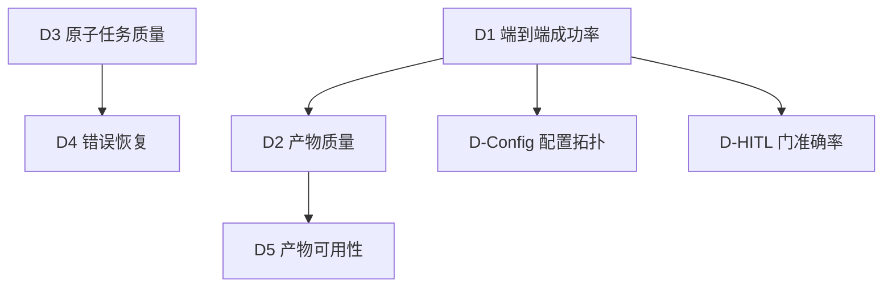

# 01 · 有效性维度方案

> 状态：方案稿（待评审）· 对应 Plan revision 2 · 2026-10-08

## 1. 命题与核心主张

**有效性**回答「这套工作流能不能用？产出质量如何？」，对外价值是证明工作流值得采用。核心主张（用户原文）：Ddo-Code-Flow 能从需求出发，产出可直接使用的代码和文档，且配置灵活、人机交互可靠。

有效性内部按「先整体、再局部、再交互」的顺序证明：先端到端（D1、D2、D5），再节点级（D3、D4），最后配置与交互（D-Config、D-HITL）。

## 2. 用户示例名 → 实际结构映射表

用户需求中的管线节点与阶段名为示例表述；评测落地以下表右列为准。

| 用户表述 | 实际结构 | 证据 |
|---|---|---|
| planner | `requirement` + `spec` + `plan` 任务（需求澄清、方案对齐、计划） | `atom-tasks/{requirement,spec,plan}` |
| doc-writer | `reporting` / `delivery-doc` 任务 | `atom-tasks/{reporting,delivery-doc}` |
| code-writer | `coding` 任务 | `atom-tasks/coding` |
| code-reviewer | `review` 任务 | `atom-tasks/review` |
| dev-ops | `verification` + `cleanup-worktree` / `closeout-worktree`（验证与交付运维） | `atom-tasks/{verification,cleanup-worktree,closeout-worktree}` |
| 完整管线（planner → … → dev-ops） | workflow 预设的 stage DAG：`basic`（5 阶段）/ `standard`（10 阶段）/ `pr-delivery(-issue)` | `workflows/*.json` |
| Specification / Planning / Test-Planning / Reflection 四个确认门 | `spec:02`、`plan:02`、`test-plan:02`、`reflection:02` 四个人工门相位，选项结构一致（同意/驳回/修改/提问[+动态项]） | 各任务 `config.json`；本 run 实况 |
| config.json 增删 stage / 调整 DAG 依赖 / 禁用 atom-task | workflow 预设 JSON（`stages[].task` / `dependOn`）+ `--workflows-dir` 自定义预设；「禁用节点」= 从 stages 移除；「并行」= 同层多任务同时就绪 | `workflows/basic.json`；CLI `--help` |
| .state.json 状态 | run 状态：`runId` / `currentStage` / `stages` / `dirs` / `git` 等 | CLI v2 内核 |
| Stage 5（Coding）/ Stage 8（Verification）/ Stage 10 | standard 链实际序号：coding=6、verification=7、reflection=10。用户编号存在偏移；评测以**任务名**为锚，不依赖序号 | `workflows/standard.json` |

## 3. 维度定义（7 个，字段沿用用户原文口径）

> 每个维度保留用户定义的九字段；「落地」小节给出对象映射与采集点指引（详见 03/04 分册）。判定标准为用户硬性口径，**不得放宽**。

### D1 · 端到端成功率（确定性）

| 字段 | 内容 |
|---|---|
| 核心问题 | 需求输入 → 最终产物，全程无错完成的比例？ |
| 评测范围 / 对象 | 端到端全流程；完整管线（basic 与 standard 两条链分别统计） |
| 输入 | 固定评测用例集（user_req 格式，见 02 分册） |
| 输出 | 首次成功率（%）、3 次重试内最终成功率（%）、失败节点分布、错误类型统计 |
| 评测方法 | 跑完整管线，记录每步 exit code 和错误信息；验证失败允许自动回退重跑，最多 3 次 |
| 判定标准 | 首次成功率 ≥ 80%，3 次重试内最终成功率 = 100% |

**落地与行业适配**：口径锚定行业 pass@k 族（HumanEval/SWE-bench 惯例：pass@1 为单次通过率）——首次成功率 ≈ **pass@1**；3 次重试内成功率 ≈ **pass@3**。**转化点**：ddo 的重试是「验证失败 → `rollback` → 重跑」，非独立重采样，方差语义与 HumanEval 的独立采样估计量不同；报告须标注「重试型 pass@3（rollback 语义）」。行业对标：% resolved（SWE-bench Verified）为同族指标。[参考：HumanEval pass@k 定义、SWE-bench 官方评测](https://www.swebench.com)。

### D2 · 产物质量（端到端）（LLM-as-judge + 确定性）

| 字段 | 内容 |
|---|---|
| 核心问题 | 完整管线产出的代码和文档，质量有多高？ |
| 评测范围 / 对象 | 端到端最终产物（代码产物与文档产物分别计分） |
| 输入 | 固定评测用例集 |
| 输出 | 各维度质量评分（1–5）、总分、质量分布、单元测试通过率 |
| 评测方法 | ① LLM-as-judge 按 rubric 多维度打分；② 为生成的代码编写单元测试（或执行用例预置验收命令），统计通过率 |
| 判定标准 | 平均评分 ≥ 3.5，无维度低于 2.0；单元测试通过率 ≥ 90% |

**落地与行业适配**：judge 方法遵循 MT-Bench 共识（rubric 进 prompt、盲评、换序消偏、对照人工校准）——**转化采用**（行业多为成对比较，ddo 为单产物场景，以 rubric 绝对评分为主，详见 04 分册）。单元测试通过率**直接采用**行业 functional correctness 思路：验收命令在 02 分册随用例预置，避免「评测时现写测试」引入的偏差。[参考：MT-Bench（Zheng et al., NeurIPS 2023）](https://papers.nips.cc/paper_files/paper/2023/hash/91f18a1287b39be3523d0394e651e7c2-Abstract-Conference.html)。

### D3 · 原子任务质量（隔离）（确定性 + LLM-as-judge）

| 字段 | 内容 |
|---|---|
| 核心问题 | 单个 atom-task 独立运行时，输出质量如何？ |
| 评测范围 / 对象 | 被测的 atom-task（实际对象如 coding、spec、reporting） |
| 输入 | 固定的 mock 上游输入（理想化的上游产物） |
| 输出 | 该节点的质量评分 |
| 评测方法 | mock 上游输出，隔离跑单个节点（`exec` 单相位），LLM-as-judge 打分 |
| 判定标准 | 该节点质量评分不下降（与历史基线比较，回归语义） |

**落地与行业适配**：行业少有「工作流节点级」基准（主流为任务级/模型级），属**自建**维度；mock 上游=取自 D2 高分 run 的真实产物或人工精修样本，按任务固化为 fixture。判定沿用用户「不下降」回归口径，基线值随首个基线轮建立。

### D4 · 错误恢复能力（LLM-as-judge）

| 字段 | 内容 |
|---|---|
| 核心问题 | 上游输出质量差时，下游节点能否自愈？ |
| 评测范围 / 对象 | 两两相邻节点（实际如 review → coding 的真实相邻对） |
| 输入 | 注入缺陷的上游输出（故意注入错误 / 缺失） |
| 输出 | 下游节点修复后的质量评分 |
| 评测方法 | 向上游输出注入预定义缺陷，跑下游节点，评估修复效果 |
| 判定标准 | 修复后质量评分 ≥ 无缺陷场景的 80% |

**落地与行业适配**：缺陷注入**直接采用**混沌/鲁棒性测试思想（预定义缺陷库：信息缺失、自相矛盾、格式破坏、过时约束四类，每类按任务定制注入点）；80% 保持率口径沿用用户定义。

### D5 · 产物可用性（人工）

| 字段 | 内容 |
|---|---|
| 核心问题 | 最终产物人工 review 后能否直接使用？ |
| 评测范围 / 对象 | 端到端最终产物（代码 + 文档） |
| 输入 | D1 评测轮的产物抽样 |
| 输出 | 人工评分（1–5）、可用 / 需修改 / 不可用 分类 |
| 评测方法 | 人工 review 随机抽样产物，与 LLM-as-judge 评分做校准 |
| 判定标准 | 人工评分 ≥ 4.0 的比例 ≥ 80% |

**落地与行业适配**：人工抽检同时承担 judge 校准职能（行业共识：judge 与人工一致率约 80% 为可用水平，偏离超阈值须人工复核）。抽样率、盲评流程见 04 分册校准机制。

### D-Config · 配置与拓扑有效性（确定性）

| 字段 | 内容 |
|---|---|
| 核心问题 | 修改配置（增删 stage / 调整 DAG 依赖 / 禁用 atom-task）后，流水线能否按预期拓扑执行？ |
| 评测范围 / 对象 | 配置解析、DAG 调度（实际机制：workflow 预设 JSON + `--workflows-dir` 自定义预设） |
| 输入 | 3 类配置变体：① 禁用中间节点 ② 同一 stage 层挂 3 个并行任务 ③ 设置依赖链 A→B→C |
| 输出 | 执行顺序日志、并行批次时间戳、被禁用节点是否真正跳过 |
| 评测方法 | 解析执行日志中的时间线和依赖 ID，与 DAG 定义做拓扑比对 |
| 判定标准 | 执行顺序严格满足 DAG 依赖；并行批次无串行等待；禁用节点无任何 LLM 调用 |

**落地与行业适配**：**自建**维度（行业无现成对应；最接近的是 workflow 引擎正确性测试）。**转化**：「禁用」实现为自定义预设中移除 stage；「并行」为同层多 stage（共享 dependOn 前驱）；「无 LLM 调用」以执行日志中该任务无 `exec` 记录为证。

### D-HITL · 人机确认门准确率（确定性）

| 字段 | 内容 |
|---|---|
| 核心问题 | 在四个确认门（spec:02 / plan:02 / test-plan:02 / reflection:02），对用户输入的分流（同意 vs 修改意见）是否准确？ |
| 评测范围 / 对象 | 确认门拦截器（门选项解析与决议路由） |
| 输入 | 预设 20 条用户反馈：10 条纯「同意」（含变体措辞）、10 条含「修改：xxx」（含多种措辞变体） |
| 输出 | 分流准确率（%）、误判类型（假阳性 / 假阴性） |
| 评测方法 | 模拟用户输入，检查状态机跳转（进入下一阶段 vs 回退重做） |
| 判定标准 | 分流准确率 = 100%（此处不容错，否则会静默偏离用户意图） |

**落地与行业适配**：**自建**维度——行业 HITL 文献覆盖「门放在哪」（高风险/低置信点设门），不提供门分流准确率基准。**转化**：ddo 门交互协议（`gate present` 选项 + `next --decision`）即为被测状态机；20 条反馈集按门选项语义构造，预期跳转唯一可判（同意 → 推进；修改 → in-phase 重做），假阳性=该回退却推进，假阴性=该推进却回退。此维度测**协议路由**而非 LLM 理解，故为确定性指标。

## 4. 维度依赖图

执行顺序：D1 → D2 → D5 为主线；D3 → D4 可与主线并行；D-Config、D-HITL 独立于产物质量，可随时插入。

## 5. Deferred：优越性与稳定性（本轮不设计）

用户明确「暂时仅验证有效性」。以下维度**保留编号、不展开**，后续轮次按用户原文定义补设计：

- 命题二·优越性：D6（vs 单次生成）、D7（vs Cursor Composer / Aider architect）、D8（成本效率）、D9（工作流迭代回归）。
- 命题三·稳定性：D10（跨模型一致性）、D11（单模型可靠性）、D-Recovery（状态恢复一致性）。

其中 D8（token/成本）的采集通道已在 04 分册顺带设计（成本记录与有效性共用采集点），后续轮次可直接复用。

## 变更记录

| 日期 | 变更 | 依据 |
|---|---|---|
| 2026-10-08 | 初版：7 维度方案化 + 映射表 + deferred 标注 | Plan revision 2（FC-2） |
