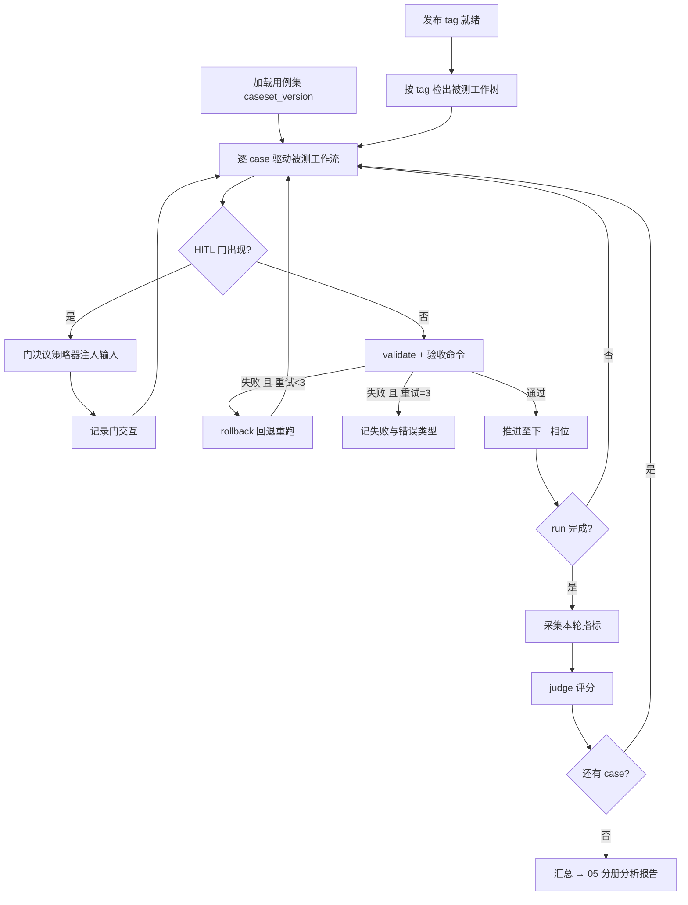

# 03 · 自动化评测流程

> 状态：方案稿（待评审）· 对应 Plan revision 2 · 2026-10-08

## 1. 总体流程

被测对象是「宿主代理 + ddo 工作流 + 模型」整体（与 SWE-bench 的 harness/model 双重性一致，报告须注明宿主与模型配置）。

## 2. 沙箱隔离

- **每 case 独立沙箱**：延续 `eval/README.md` 沙箱规范——`runs/YYYYMMDD-<slug>` 命名、沙箱即 projectRoot、`run start --project <沙箱>`；评测期使用 `DDO_HOME=<临时目录>` 覆写，避免污染全局 history/index。
- **被测版本隔离**：评测执行前按发布 tag 建临时 worktree（`git worktree add <沙箱>/repo <tag>`），被测代码与主检出物理隔离；沙箱整体不入库（06 分册）。
- **并发**：同层 case 可并行（各自沙箱 + 各自 DDO_HOME）；默认并发度 2–4，避免宿主资源争抢影响时长指标。

## 3. 无头执行与驱动

ddo 依赖宿主（如 Claude Code）执行各相位的实际工作。自动化评测由**评测 runner**（实现轮次交付）驱动：

1. 对每个相位：向宿主代理下发 `exec --task <task> --phase <id>` 指令；
2. 代理完成工作后，runner 执行 `validate`，按其结果分支（通过 → `next`；失败 → 重试策略）；
3. 出现人工门（`gate present` 返回门 payload）时，交给门决议策略器（§4）。

行业参照与适配结论：

| 行业实践 | 适配结论 | 转化/不适用说明 |
|---|---|---|
| SWE-bench harness：容器隔离 + 隐藏测试 + 自动判分 | **转化采用** | 容器 → ddo 沙箱 worktree + DDO_HOME 覆写；隐藏测试 → 用例预置验收命令（02 分册）；自动判分 → validate + 验收 + judge |
| Braintrust/CI-gate 式「harness + metrics + 回归门」 | **直接采用**结构 | runner 按「执行层 / 采集层 / 判定层」组织（04、05 分册即对应后两层） |
| promptfoo / DeepEval 等单次调用评测框架 | **不适用** | 面向单次 LLM 调用/LLM-app 评测，无法驱动 ddo 多阶段 HITL 会话与门交互；仅借鉴其指标定义与报告概念 |

## 4. HITL 门自动化决议（门决议策略器）

被测维度不同，注入策略不同：

| 评测维度 | 门输入策略 |
|---|---|
| D1/D2（端到端） | 一律注入「同意」，使链路走最短正当路径；门交互日志照常记录 |
| D-HITL（专项） | 按 20 条反馈集逐条注入（同意变体 / 修改变体），校验状态机跳转是否符合预期（推进 vs in-phase 重做）；此维度不用「一律同意」 |
| 含 BQ 的门 | 预置每题的标准答案（来自用例 `notes` 或既定口径），以「回答 BQ-N：<答案>」注入 |

策略器实现要点：解析 `gate present` JSON → 按策略选择选项 → 执行其 dispatch → 全程落门交互日志（时间戳、门位置、注入文本、结果跳转）。D-HITL 的判定即「注入文本 → 实际跳转」与「预期跳转」的一致率（01 分册判定标准）。

## 5. D1 重试策略与口径

- 触发：`validate` 失败或验收命令失败。
- 动作：`rollback --stage <失败阶段>` → 重新驱动该阶段 → 再 validate。
- 上限：同一 run 最多 3 次重试；仍失败记为该 case 失败，记录失败节点与错误类型（错误类型枚举：validate 拦截 / 验收命令失败 / 门策略无解 / 宿主异常 / 超时）。
- **口径声明（必随报告）**：本指标为「rollback 重试型 pass@3」，与 HumanEval 独立采样 pass@k 的估计量不同——重试复用前次上下文、方差更低但可能继承系统性偏差；不得在报告中与行业 pass@k 直接数值对比。

## 6. 数据捕获点（采集层清单）

| 采集点 | 内容 | 消费方 |
|---|---|---|
| CLI 退出码与输出 | 每个 exec/validate/next/rollback 的 exit code、stderr 摘要 | D1、D-Config |
| .state.json 快照 | 每相位推进后快照（currentStage、stages 状态） | D1 失败归因、D-Config 拓扑比对 |
| 产物文件 | 每相位声明产物的路径 + 内容 hash | D2/D3 judge 输入、防篡改比对 |
| 验收命令输出 | cmd 项执行结果与通过率 | D2 |
| 门交互日志 | §4 全量记录 | D-HITL |
| 时间戳 | run 起止与每相位起止（单调时钟） | 时长类指标（有效性本轮仅记录不判定） |
| token/成本 | 见 04 分册采集通道 | 本轮仅记录（D8 deferred） |

原始采集数据统一落沙箱目录（不入库，06 分册）；报告只引用其聚合结果与必要样本。

## 7. 失败与异常处理

- runner 自身异常：记录并终止当前 case，不吞错误；连续 3 个 case 因 runner 缺陷终止则整轮停止，修复后重跑整轮（避免半轮数据混入）。
- 宿主异常（会话中断、超时）：按 D1 错误类型记录，允许一次整 run 重启；重启后从 `.state.json` 断点续跑（resume 命令），重启事实记入报告可复现附录。
- 全轮有效性门槛：有效 case 数 < 用例集 80% 时，本轮结果不作为有效性结论，仅作调试参考。

## 8. 变更记录

| 日期 | 变更 | 依据 |
|---|---|---|
| 2026-10-08 | 初版：流程、沙箱、无头驱动、门策略器、重试口径、采集点 | Plan revision 2（FC-4、DEC-8） |
