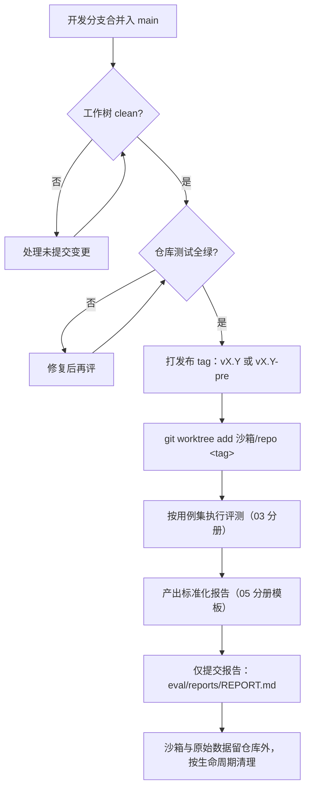

# 06 · 产物隔离与版本评测流程

> 状态：方案稿（待评审）· 对应 Plan revision 2 · 2026-10-08

## 1. 目标（用户约束，已确认）

1. 评测运行的**中间产物不进主分支/项目**——不因评测频次增长而在仓库内堆积中间产物。
2. 每次评测在项目内仅保留**一份标准化评测报告**（发布介绍用途；旧报告靠 git 历史追溯）。
3. 每次评测的版本**先打 git 发布版本 tag，再评测**。

## 2. 评测资产分层与存放策略

| 资产 | 性质 | 是否入库 | 位置 |
|---|---|---|---|
| 设计文档（本目录） | 长期设计资产 | ✅ 入库 | `eval/design/` |
| 评测用例集 | 长期测试资产（需版本化、与报告绑定） | ✅ 入库（建议） | `eval/cases/`（实现轮次确定） |
| 运行沙箱（被测 worktree、run 材料、.ddo 状态） | 中间产物 | ❌ 不入库 | 仓库外评测工作区（§3 推荐） |
| 原始采集数据（日志、judge 记录、门交互） | 中间产物 | ❌ 不入库 | 沙箱同址，随沙箱生命周期清理 |
| 标准化评测报告 | 对外发布物 | ✅ 入库，仅留最新一份 | `eval/reports/REPORT.md`（建议） |

## 3. 中间产物隔离机制对比与推荐

现状冲突：`eval/runs` 下沙箱（含 `.ddo` 材料，39 个文件）当前随 git 追踪（RB-5），与「中间产物不入库」目标冲突，须收敛。

| 机制 | 做法 | 优点 | 缺点 | 状态 |
|---|---|---|---|---|
| A · 沙箱出库 | 沙箱目录移出仓库（如 `~/ddo-eval/runs/`），`eval/README.md` 沙箱规范同步改指向 | 仓库零噪音；不需动 gitignore；与「showcase 定稿后才入库」的既有生命周期天然衔接 | 评测材料离开仓库，跨机迁移需自带脚本 | **推荐** |
| B · gitignore 沙箱 | `.gitignore` 增加 `eval/runs/`（未追踪部分），存量 39 文件 `git rm --cached` 迁移 | 保留 eval/ 集中管理；沙箱路径不变 | 需一次存量清理；eval/ 目录长期混有「入库资产 + 本地噪音」 | 备选 |
| C · 独立评测仓库 | 新建 `ddo-eval` 仓库承载沙箱、原始数据、（可选）用例集 | 隔离最彻底；主仓最干净 | 跨仓库联动成本（tag 同步、报告回链）；单机维护两仓 | 长期可选 |

**推荐：A（沙箱出库到仓库外评测工作区）**。理由：与既有「runs 可整体删除、showcase 才定稿入库」的生命周期一致，改动最小且立即达成「主分支零中间产物」；若未来评测频次与协作需求增长，再升级到 C。本设计轮**不执行**任何迁移/清理动作，落地属实现轮次。

## 4. 发布 tag 先行的版本评测流程

**tag–版本对应规则**：一份报告 ↔ 恰一个 tag ↔ 恰一个用例集版本。同一 tag 重跑：报告覆盖更新（git 历史留旧版），报告中标注轮次号与差异。tag 命名延续既有纪元惯例（`v1` / `v2-pre` / `v2.1` → 新评测轮建议 `vX.Y` 或 `vX.Y-pre`），不引入平行命名体系。

**前置门（G1/G2）**：tag 是发布承诺，打 tag 前必须 clean + 测试绿；评测只对 tag 负责，不对未发布的分支头部负责（若需评测开发中版本，用 `vX.Y-pre` 明示预发布性质）。

## 5. 与「新增仓库 vs git 迁出」原始问题的关系

用户原始问题（新增独立仓库 vs git 特殊能力迁出待评测版本）在本方案中的落点：

- **被测版本获取**：采用 git 能力（tag + worktree 检出，§4）——**git 迁出路线胜出**，因为被测对象必须与主检出隔离且可精确复现，独立仓库无法保证「同一 tag 的逐字节一致」。
- **评测内容开发**：设计文档与用例集留在本仓库（`eval/`），理由：与被测对象同仓演进、PR 可评审、与既有 eval/ 约定一致；独立仓库仅在未来评测工程化（runner 成为独立产品）时再评估。

## 6. 变更记录

| 日期 | 变更 | 依据 |
|---|---|---|
| 2026-10-08 | 初版：资产分层、机制对比（推荐 A）、tag 先行流程与对应规则 | Plan revision 2（FC-7、DEC-4、RB-1/2/5） |
