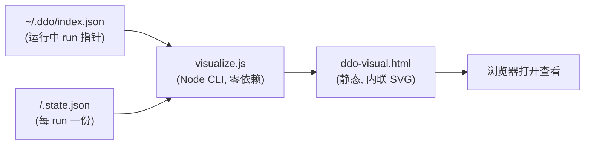

# ddo-code-flow 可视化工具 技术 Plan

## 执行摘要

目标：实现本地 Node CLI 工具 `visualize.js`，读取 `~/.ddo/index.json` 发现运行中 run，解析各 run 的 `.state.json`，生成静态 `ddo-visual.html`，以 SVG 绘制执行流程图且连线零相交。范围仅当前沙箱内新增两个文件；关键结论：布局采用「阶段主链水平排布 + 相位子节点泳道 + 正交通道路由」，以确定性规则避免相交，并以内置自检计数兜底。文档模式：single（本文档 < 12000 字符），revision 1。

## 范围与非目标

| 事项 | 说明 | AI 索引 |
|---|---|---|
| 数据读取 | `~/.ddo/index.json`（运行中指针）+ 其指向的 `.state.json`；只读 | FR-1, FR-2 |
| 渲染产出 | 单个静态 HTML 文件（内联 SVG），浏览器打开即看 | FR-3 |
| 无相交连线 | 流程图节点连线不得相交 | FR-4 |
| 非目标 | 不改流水线状态、不做常驻/HTTP 服务、不做历史 run 可视化 | Non-goals |

## 现有设计与复用基线

| 能力 | 文件路径 | 符号 | 证据类型 | 采用方式 | 适用边界 | AI 索引 |
|---|---|---|---|---|---|---|
| 沙箱内无任何现有实现 | （沙箱为空目录） | — | Repository Fact | 新增实现 | 全部能力均为新增；无历史包袱 | DEC-1 |
| state.json 结构知识 | tools/lib/state.js（被测仓库，只读参考） | state 读写约定 | Repository Fact | 不适用 | 仅作为数据格式参考，不 import、不修改 | DEC-2 |

说明：被测仓库 `tools/lib/state.js` 证实 `.state.json` 含 `runId / title / currentStage / stages / startedAt / dirs` 等字段；工具按容错方式读取（字段缺失不崩溃）。

## 整体架构与流程

主流程：读索引 → 逐 run 读 state → 构建图模型 → 布局计算（含防交叉路由）→ 生成 SVG → 写 HTML。异常流程：索引文件不存在 → 输出空态 HTML；某 run 的 state 缺失或损坏 → 该 run 渲染为错误占位节点，不阻断整体。

## 技术选型与方案对比

| 方案 | 来源 | 仓库适配性 | 代价与风险 | 状态 | 结论 | AI 索引 |
|---|---|---|---|---|---|---|
| 单文件 Node CLI + 字符串拼接 SVG | 初始 Plan | 零依赖、Node 原生能力足够；沙箱无 npm 假设 | 低；SVG 拼接需注意转义 | accepted | 采纳 | DEC-1 |
| 无相交布局：分层主链 + 正交通道路由 | 初始 Plan（PD-1） | 阶段链为线性序列，线性主链 + 子节点泳道可确定性避免相交 | 中；路由规则需自检兜底 | accepted | 采纳；内置交叉计数自检 | DEC-2 |
| 引入图形库（如 graphviz/d3） | 初始 Plan | 沙箱零 npm 假设，外部依赖不可用 | 高；违背零依赖边界 | rejected | 拒绝 | DEC-2 |
| 通用 Sugiyama 全量布局 | 初始 Plan | 对线性阶段链过度设计 | 高；不必要复杂度 | rejected | 拒绝，用简化分层 | DEC-2 |

## 数据模型设计

### 实体与字段

内存模型（渲染用，非持久化）：`RunEntry { runId, statePath, title, currentStage, stages: StageView[], error? }`；`StageView { name, status, currentPhase, gate: { opened, decision?, closedAt? } }`；`Graph { nodes: Node[], edges: Edge[] }`，`Node { id, label, kind: stage|phase|gate, lane, row }`，`Edge { from, to, channel }`。

### schema 与 DDL（如适用）

不适用——无数据库，全部数据来自只读 JSON。

### 状态与不变量

不变量 1：任意两条边在画布上不相交（由布局规则保证，自检计数必须为 0，对抗样例如实报告）。不变量 2：`currentStage` 对应节点高亮且唯一。不变量 3：门节点仅在 `gate.opened` 时渲染。

### 迁移、兼容与回滚

不适用数据库迁移。产物为单文件静态 HTML，重新运行工具即完整覆盖再生；无状态残留，天然可回滚。

## API 接口设计

| 接口/入口 | 请求 | 响应 | 错误与幂等 | 复用标准 | 实现职责 | AI 索引 |
|---|---|---|---|---|---|---|
| `node visualize.js` | 无参数（可选 `--out <path>`、`--home <ddoHome>`） | stdout 摘要（run 数、输出路径）；生成 `ddo-visual.html` | 索引缺失→空态 HTML exit 0；state 损坏→占位节点 exit 0；重复运行覆盖旧文件（幂等） | 无外部标准可复用（新增实现） | 全部逻辑 | DEC-3 |

## 算法设计

防交叉布局（PD-1 唯一答案）：

- 输入：`Graph`（阶段主链 + 每阶段相位/门子节点）。输出：每个节点的画布坐标。
- 步骤：① 阶段主链按工作流顺序水平排布（等距列），主链边为相邻直线段，天然无交叉；② 每阶段的相位子节点放入该阶段列下方的垂直泳道，列间留隔离带；③ 跨列边（仅「回退/门转移」类）统一走顶部或底部正交通道：先垂直上引到专属通道行，水平直行，再垂直下引——每条跨列边分配互不重叠的通道行号，水平段所在 y 互异，故不相交；④ 自检：对全部边两两做线段相交判定（不含共享端点），计数非 0 则报告并在错误样本上调整通道行号重排（≤3 轮）。
- 复杂度：O(V + E + E²) 自检，规模（数十节点）下可忽略。
- 边界：单 run 无门、单阶段、空索引均退化为平凡布局；通道行不足时按边数动态扩行。

## 文件变更计划

| 文件/目录 | 变更职责 | 复用或依赖 | AI 索引 |
|---|---|---|---|
| `visualize.js` | 新增：CLI 入口，读索引与 state，布局计算，生成 HTML | 仅 Node 内置模块 | DEC-1 |
| `ddo-visual.html` | 产出物（运行生成）：静态可视化页面 | 由 visualize.js 生成 | FR-3 |

## 兼容、稳定性与回滚

| 关注点 | 适用性 | 设计/理由 | 回滚信号 | AI 索引 |
|---|---|---|---|---|
| state 字段演进 | 适用 | 读取按字段容错，缺失渲染「未知」占位 | 渲染出现大量未知占位 | DEC-2 |
| 索引格式变化 | 适用 | 仅依赖 index.json 的「键→statePath」映射 | run 全部无法发现 | DEC-2 |
| 产物污染 | 适用 | 只写 `--out` 指定/缺省单文件，不触碰其他文件 | — | DEC-1 |

## Verification Anchor

| 需验证契约 | 可观察结果 | 证据位置 | AI 索引 |
|---|---|---|---|
| 发现运行中 run | 输出摘要含本 run 的 runId | visualize.js stdout | FR-1 |
| 流程呈现 | HTML 含阶段链、当前位置高亮、门标记 | ddo-visual.html | FR-2 |
| SVG 渲染 | HTML 内联 `<svg>` 元素 | ddo-visual.html | FR-3 |
| 连线无相交 | 内置自检交叉计数=0 | visualize.js stdout | FR-4 |

## 开放问题与 Spec 对应

| 问题 | 确定答案或阻塞原因 | 解决位置 | AI 索引 |
|---|---|---|---|
| PD-1 无相交布局算法 | 分层主链 + 正交通道路由 + 自检计数 | 本文「算法设计」 | DEC-2 |
| PD-2 CLI 调用方式 | `node visualize.js [--out <path>] [--home <ddoHome>]` | 本文「API 接口设计」 | DEC-3 |

## 风险与下游交接

- 风险：state 结构与预期不符 → 缓解：容错读取 + 占位节点；路由自检 3 轮后仍相交 → 如实报告计数（诚实边界），不静默。
- Tasking/Coding 读取范围：本文档全部；无需 split 分册。事实失效处理：若 `.state.json` 实际字段与「现有设计与复用基线」记录不符，Coding 停止并报告，不得擅自改已批准契约。

## 用户确认

- 同意：批准当前 Plan，进入 Test-Planning。
- 修改：<反馈>
- 提问：<问题>
- 归档
- 归档：<模板名>
