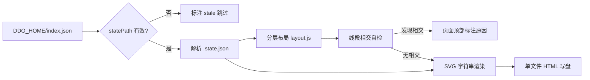

# ddo-code-flow 工作流可视化工具 — 技术方案

> revision：r1（single 模式）｜依据：spec.md（BQ 已写回版，2026-09-24 批准）

## 执行摘要

目标：Node 单命令本地工具，读取 `DDO_HOME`（缺省 `~/.ddo`）下 `index.json` 发现运行中 run，解析各 `.state.json`，为每个 run 生成一个自包含静态 HTML（内联 SVG 流程图）。核心结论：采用**最长路径分层 + 层内 barycenter 排序 + 层间走廊走线**的布局算法保证连线不相交；零第三方依赖（字符串模板生成 SVG）；对数学上非平面的输入图，工具在页面顶部如实标注而非伪装成功。文档模式 single（约 9k 字符 ≤ 12000 阈值）。

## 范围与非目标

| 事项 | 说明 | AI 索引 |
|---|---|---|
| 数据源 | `DDO_HOME/index.json`（运行中 run 指针）→ 各 `statePath` 的 `.state.json` | SCOPE-1 |
| 渲染 | 每个 run 一节：阶段 DAG + 状态着色 + 当前执行位置（相位级）+ 开着的确认门 | SCOPE-2 |
| 非目标 | 历史 run 复盘（`history/`）、多机聚合、对 run 的任何写操作 | SCOPE-3 |
| 非目标 | 交互式操作（图上决议/推进）——只读 | SCOPE-4 |

## 现有设计与复用基线

| 能力 | 文件路径 | 符号 | 证据类型 | 采用方式 | 适用边界 | AI 索引 |
|---|---|---|---|---|---|---|
| DDO_HOME 解析约定 | tools/lib/index-registry.js | `ddoHome()`（读 `DDO_HOME` 环境变量，缺省 `~/.ddo`） | Repository Fact | 复用现有实现（同语义实现：env 优先，缺省 `~/.ddo`） | 只复用约定，不 import 该模块（沙箱工具独立于 ddo 仓库运行） | BASE-1 |
| state 字段结构 | 本仓库 02 基线 plan §5 | `currentStage`/`stages[k]`/`stages[k].gate` | Repository Fact | 复用现有实现（按契约只读解析） | 字段缺失容错（历史 state 无 `dirs` 等） | BASE-2 |
| 惰性校验思路 | tools/cli.js `resume` | stale 条目跳过不阻断 | Repository Fact | 复用现有实现（同款策略：statePath 失效 → 页面标注 stale，不崩溃） | 仅展示层 | BASE-3 |

## 整体架构与流程

单文件主程序 + 纯函数布局模块；无 server、无 watcher。

## 技术选型与方案对比

| 方案 | 来源 | 仓库适配性 | 代价与风险 | 状态 | 结论 | AI 索引 |
|---|---|---|---|---|---|---|
| 分层布局（Sugiyama 简化：最长路径分层 + barycenter + 走廊走线） | 初始 Plan | ddo 预设为近线性 DAG（≤20 节点、少量并行分支），分层是自然形态 | 实现约 120 行；非平面输入图无法完全消交叉（见 DEC-1 诚实边界） | accepted | 采用 | DEC-1 |
| 力导向布局 | 初始 Plan | 不保证平面性 | 交叉随机出现，违背 FR-4 | rejected | 不采用 | DEC-2 |
| graphviz / mermaid 前端渲染 | 初始 Plan | 引外部二进制或大体积 JS 库 | 违背零依赖哲学与「都用 SVG 画」的最小实现 | rejected | 不采用 | DEC-3 |
| 字符串模板生成 SVG（非 DOM 库） | 初始 Plan | 零依赖、完全可控 | 无（图元素简单：rect/text/path） | accepted | 采用 | DEC-4 |

**DEC-1（边不相交的保证与边界）**：①分层后**相邻层间**的边走层间走廊，同走廊内边按 source 层内序单调排列即无交叉（见算法设计不变量）；②**跨层边**（跳过中间层）通过在该走廊内走「绕开中间层节点占位区」的正交折线；③布局完成后做一次**线段相交几何自检**，逐对 O(E²) 判断（E ≤ 数十条，可忽略）；④若输入图本身非平面（如含 K₅/K₃,₃ 同胚子图），数学上不可能无交叉——工具在页面顶部标注「该 workflow 存在非平面子结构，N 处交叉无法消除」，不伪造成功。ddo 实际预设（线性链）不会触发此分支。

## 数据模型设计

### 实体与字段

`RunView`：`{ runId, title, startedAt, statePath, stale?: true, stages: StageNode[], positions: Map<stageId, {x, y, layer}>, edges: Edge[] }`；`StageNode`：`{ id, status, dependOn[], gate?: {phase, decision?}, currentPosition?: string }`；`Edge`：`{ from, to, polyline: {x,y}[] }`（折线点序列）。

### schema 与 DDL（如适用）

不适用——无持久化存储，数据全部为内存对象，产物是 HTML 文件。

### 状态与不变量

阶段状态枚举沿用 state 契约（`pending/running/done/failed/waiting-human`），渲染映射为固定配色；不变量：`positions` 覆盖全部 stage 节点、`edges` 与 `dependOn` 集合一一对应（含 staging 完整性断言，缺失即抛错）。

### 迁移、兼容与回滚

不适用——无存量数据。state 解析对未知字段（未来 schema 扩展）向前兼容：只取已知字段，未知字段忽略。

## API 接口设计

| 接口/入口 | 请求 | 响应 | 错误与幂等 | 复用标准 | 实现职责 | AI 索引 |
|---|---|---|---|---|---|---|
| CLI：`node visualize.js [--home <dir>] [--out <file>]` | `--home` 覆写 DDO_HOME；`--out` 输出路径（缺省 `./ddo-visual.html`） | stdout JSON 摘要 `{runs, stale, output, crossings}`；写出单文件 HTML | exit 0 成功；index 不存在 → stderr 提示并 exit 1；重复运行覆盖输出文件（幂等） | 四通道契约（stdout JSON / stderr 人话 / exit 0·1） | 入口：读 index → 逐 run 解析 → 布局 → 渲染 → 写盘 | API-1 |
| `layout(stages) → positions/edges` | 阶段 DAG（纯数据） | 坐标与折线 | 非法输入（环/空）抛错 | 纯函数，无 IO | 见算法设计 | API-2 |

## 算法设计

（分层布局——本方案唯一非平凡算法）

- **输入**：`stages: {id, dependOn[]}[]`（DAG）；**输出**：每节点 `{layer, x, y}`、每边折线点列。
- **不变量**：① 任一边的两端点满足 `layer(to) > layer(from)`；② 同一走廊（相邻两层 k 与 k+1 之间的水平带）内，边按 source 在层 k 的序号排序后，其 target 在层 k+1 中的序号严格单调递增 ⇒ 走廊内无交叉；③ 任意两段线段（含折线各段）几何不相交（自检断言）。
- **步骤**：
  1. **分层**：`layer(v) = 1 + max(layer(pred(v)))`（最长路径），入度为 0 的源点在第 1 层——O(V+E)；
  2. **层内排序**：自顶向下 + 自底向上各 2 轮 barycenter（节点序 = 邻接层邻居序的均值排序）——O(k·(V+E))，k 为常数 4；
  3. **坐标**：层内按序均分 x（层宽 = 节点数 × 节点宽 + 间距），层间固定 y 步距；
  4. **边路由**：相邻层边 = 走廊内直线段，同走廊多条边按 source 序横向错开 ±偏移，保证不重叠；跨层边 = 沿走廊正交折线（垂直下行至目标层上方 → 水平 → 垂直入点）；
  5. **相交自检**：全部线段两两判断（O(E²)），相交数记入输出摘要。
- **复杂度**：总体 O(V+E) 主导（E ≤ 数十时自检可忽略）。**边界**：单节点图（无依赖，如自定义单任务链）直接居中渲染；空 stages → 抛错提示。
- **失败语义**：自检发现交叉且分层重排后仍存在 → 不重试无限循环（上限：barycenter 轮次固定），按 DEC-1-④ 如实标注。

## 文件变更计划

| 文件/目录 | 变更职责 | 复用或依赖 | AI 索引 |
|---|---|---|---|
| `visualize.js` | 入口 + index/state 解析 + SVG/HTML 渲染 + 写盘 | 依赖 layout.js；仅 Node 标准库 | FILE-1 |
| `layout.js` | 分层布局纯函数（算法设计的完整实现） | 无依赖，无 IO | FILE-2 |
| `ddo-visual.html`（产物） | 单文件输出：内联 CSS + SVG，不落其他文件 | — | FILE-3 |

## 兼容、稳定性与回滚

| 关注点 | 适用性 | 设计/理由 | 回滚信号 | AI 索引 |
|---|---|---|---|---|
| stale index 条目 | 适用 | statePath 失效 → 该 run 标注 stale 跳过，工具不崩溃（BASE-3 同策略） | 无（只读工具无回滚概念，删除产物即回退） | COMPAT-1 |
| state schema 演进 | 适用 | 只读已知字段，未知字段忽略（向前兼容） | 解析失败率异常 | COMPAT-2 |
| 性能/安全/灰度 | 不适用 | 本地只读单次运行，无服务面 | — | COMPAT-3 |

## Verification Anchor

| 需验证契约 | 可观察结果 | 证据位置 | AI 索引 |
|---|---|---|---|
| AC-1：发现并渲染运行中 run | 本 run 自身出现在产物中（吃自己的狗粮） | `ddo-visual.html` + stdout 摘要 `runs ≥ 1` | VA-1 |
| AC-2：SVG 且无相交连线 | stdout `crossings: 0`；浏览器目检 | stdout 摘要 + HTML 内自检标注区 | VA-2 |
| stale 容错 | 含失效条目时 `stale ≥ 1` 且 exit 0 | stdout 摘要 | VA-3 |

## 开放问题与 Spec 对应

| 问题 | 确定答案或阻塞原因 | 解决位置 | AI 索引 |
|---|---|---|---|
| spec BQ-1（数据范围） | 已定版：仅运行中 run | spec.md 对齐变化摘要 | OQ-1 |
| spec BQ-2（呈现形态） | 已定版：静态 HTML 文件 | spec.md 对齐变化摘要 | OQ-2 |
| spec Assumption（只读） | 维持：不提供操作能力 | spec.md 解释与假设 | OQ-3 |
| 非平面输入图的处理 | DEC-1-④：如实标注，不伪造 | 本 plan 技术选型 | OQ-4 |

## 风险与下游交接

- **风险**：barycenter 是启发式，极端 DAG（宽层 + 密集跨层边）可能残留交叉——已用自检 + 标注兜底，ddo 实际预设不触发。
- **缓解**：布局纯函数与 IO 分离（layout.js），后续可单独替换算法不动主程序。
- **Tasking/Coding 读取范围**：本 plan 全文 + spec.md；layout.js 实现严格按算法设计不变量。
- **事实失效处理**：若 state 字段与 02 基线不符（运行时解析报错），停止并报告，不得自行猜测字段语义。

## 用户确认

- ✅ **同意**：批准本 Plan，进入测试计划与编排。
- ❌ **修改：<反馈>**：按反馈修订，展示变化后重新确认。
- ❓ **提问：<问题>**：仅答疑，不改动本 Plan。
- 📦 **归档**：列出可用模板名；**归档：<模板名>** 生成对应 tech-design 产物。
